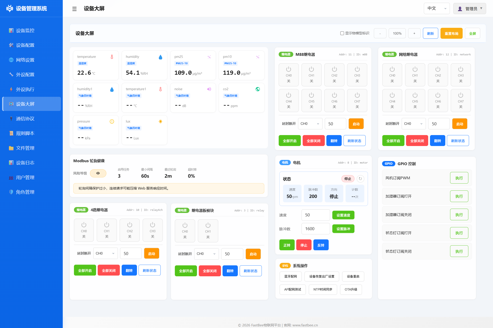

[简体中文](./README.md) | [English](./README.en.md)

<h1 align="center">FastBee-Arduino</h1>

<p align="center">
  <strong>Zero-Code, Visual Configuration — Turn Your ESP32 into a Versatile IoT Device in Minutes.</strong>
</p>

<p align="center">
  
  
  
  
  
</p>

<p align="center">
  Flash &amp; Go · No Programming Required · Visual Web Configuration · AP+STA Auto-Switching
</p>

---

FastBee-Arduino is an **open-source IoT firmware framework** for the ESP32 chip family. Without writing a single line of code, the built-in Web management UI lets you configure peripherals, connect protocols, orchestrate rules, and maintain devices remotely — **a true "flash and go" experience**.

Whether you're a maker rapidly prototyping a hardware idea or a product team deploying at scale, just flash the firmware, open a browser, and turn any ESP32 dev board into a fully functional IoT endpoint.

---

## ✨ Four Core Advantages

### 🎛️ Zero-Code Configuration — No Programming, Everything Visual

- **Web-Based Visual Setup**: Configure all hardware peripherals, communication protocols, and automation rules right from the browser
- **35+ Peripheral Types**: GPIO / PWM / ADC / I2C / SPI / RS485 / UART and more — point, click, done
- **Rule Engine**: 5 trigger types × 20+ actions, build conditional automations without code
- **Full Pin Mapping**: Auto-adapted for ESP32 / S3 / C3, with built-in pin conflict detection

### 🌐 Visual Management Dashboard — 8 Pages, 80+ APIs, Ready Out of the Box

- **8 Functional Pages**: Dashboard, Device Control, Network Config, Protocol Manager, Peripheral Setup, Peripheral Execution, Rule Scripts, System Admin
- **Device Dashboard**: Integrates data acquisition and device control — view sensor data, GPIO states, Modbus registers in real time, and remotely control relays, PWM, motors and more
- **80+ REST APIs**: Complete device management interface for third-party integration
- **Bilingual (CN/EN)**: 2,500+ translation keys with instant language switching
- **Responsive UI**: Dark / light themes, mobile-friendly layout, SSE real-time push, Service Worker offline cache

### 📡 Full ESP32 Family Support — Multi-Chip, Multi-Peripheral, Smart Network Switching

- **Three Chip Variants**: ESP32 (dual-core 240 MHz), ESP32-S3 (AI acceleration), ESP32-C3 (low-cost RISC-V)
- **AP+STA Dual-Mode Auto-Switching**: On first boot or when STA connection fails, the device automatically falls back to AP mode; after configuring WiFi via Web UI, it switches to STA automatically; if STA fails again, it falls back to AP — guaranteeing the device is always reachable
- **3-Layer IP Conflict Detection**: Ensures reliable network connectivity
- **mDNS Local Discovery**: No IP scanning needed — reach the device via `fastbee.local`
- **35+ Compile Switches**: 3 build presets (standard / minimal / full) — enable only what you need

### 🔌 Versatile IoT Device — Multi-Protocol, Rule Engine, Remote Maintenance

- **5 Communication Protocols**: MQTT (dual auth / QoS 0-2 / TLS), Modbus RTU master-slave, TCP / CoAP / HTTP
- **Modbus RTU Passthrough Mode**: Platform sends raw HEX frames → automatic CRC verification & stripping → forwarded to RS485 unchanged → raw HEX response reported directly to the cloud, compatible with any non-standard slave protocol
- **Enterprise Security**: RBAC with 3 roles & 24 permissions, cookie sessions, MD5+Salt passwords, AES-CBC-128 MQTT auth
- **Scriptable Rule Engine**: Built-in JavaScript engine for custom rule scripts (`FASTBEE_ENABLE_RULE_SCRIPT`) — dynamically loadable without re-flashing firmware
- **OTA Remote Updates**: Dual-channel firmware upgrade, no on-site access needed
- **Four-Level Memory Guard**: MemGuard (NORMAL / WARN / SEVERE / CRITICAL), ring-buffer logging
- **End-to-End Debug Logging**: Unified `[MQTT] RX ▼ / TX ▲` I/O logs + `[Modbus] RawSend` passthrough logs — zero-cost issue diagnosis

---

## 🏗️ Architecture

```
┌─────────────────────────────────────────────────────────────┐
│                   Web Management Layer (8 pages)             │
│  Dashboard │ Devices │ Network │ Protocol │ Periph │ Admin  │
├─────────────────────────────────────────────────────────────┤
│                   Application Services                       │
│  80+ REST APIs │ SSE Push │ OTA │ Logger │ Health │ Tasks   │
├─────────────────────────────────────────────────────────────┤
│                   Protocol Engine                            │
│     MQTT      │  Modbus RTU  │   TCP   │  CoAP  │   HTTP   │
├─────────────────────────────────────────────────────────────┤
│                   Security Layer                             │
│    RBAC       │  Sessions    │  AES Crypto  │  MD5+Salt    │
├─────────────────────────────────────────────────────────────┤
│                   Storage Layer                              │
│        LittleFS (JSON configs)    │    NVS Preferences      │
├─────────────────────────────────────────────────────────────┤
│                   Hardware Abstraction                       │
│  GPIO │ RS485 │ I2C │ SPI │ PWM │ ADC │ WiFi │ BLE │ UART │
├─────────────────────────────────────────────────────────────┤
│               ESP32 / ESP32-S3 / ESP32-C3                    │
└─────────────────────────────────────────────────────────────┘
```

---

## 📦 Hardware Product

<p align="center">
  
</p>

### Core Specifications

| Parameter | Details |
|-----------|---------|
| Chip | ESP32-WROOM-32U |
| CPU | Dual-core Xtensa LX6 @ 240 MHz |
| Flash | 4 MB SPI Flash |
| SRAM | 520 KB |
| Wireless | WiFi 802.11 b/g/n + Bluetooth 4.2 + BLE |
| Power Supply | DC 9-36V |
| Features | External antenna, USB programming port, config button |

### Terminal Block Pinout

| Terminal | Function | GPIO |
|----------|----------|------|
| A/L | RS485-A (TX) | GPIO17 |
| B/H | RS485-B (RX) | GPIO16 |
| VCC | Power positive | DC 9-36V |
| GND | Power ground | — |
| DGND | Digital ground (isolated GND) | — |
| EGND | Protective earth (device enclosure) | — |
| IO/L | Isolated digital I/O low-side | GPIO21 |
| IO/H | Isolated digital I/O high-side | GPIO22 |

### Indicators & Button

| Name | Type | Description |
|------|------|-------------|
| POWER | LED | Power indicator, steady on when powered |
| STATE | LED (GPIO5) | Status indicator, active low |
| DATA | LED | Communication indicator, blinks on data transfer |
| BOOT | Button (GPIO0) | Long press to enter configuration mode |

---

## 🚀 Quick Start

### 1. Prerequisites

Install [VSCode](https://code.visualstudio.com/) with the [PlatformIO extension](https://platformio.org/install/ide?install=vscode).

### 2. Clone & Build

```bash
# Clone the repository
git clone https://gitee.com/beecue/fastbee-arduino.git
cd fastbee-arduino

# Compress frontend assets (optional — prebuilt files included)
node scripts/gzip-www.js

# Upload filesystem image (default env: esp32dev)
pio run -e esp32dev --target uploadfs

# Compile and flash firmware
pio run -e esp32dev --target upload

# Open serial monitor (115200 baud)
pio device monitor -b 115200
```

### 3. Access the Device

- On first boot (no WiFi configured) the device enters **AP mode** — connect to `fastbee-ap`
- Open `192.168.4.1` or `http://fastbee.local` in your browser
- Default credentials: `admin` / `admin123`
- Fill in the WiFi SSID / password in the Web UI under "Network" — the device automatically switches to STA mode; if STA fails, it falls back to AP mode

> After flashing, zero code needed! Open your browser to visually configure WiFi, peripherals, protocols, rules, and everything else.
> **Note**: The standalone BLE provisioning and AP provisioning wizards have been removed. Network onboarding is now handled uniformly through the AP+STA dual-mode auto-switching mechanism.

---

## 📸 Screenshots

<table>
  <tr>
    <td></td>
    <td></td>
  </tr>
  <tr>
    <td></td>
    <td></td>
  </tr>
  <tr>
    <td></td>
    <td></td>
  </tr>
  <tr>
    <td></td>
    <td></td>
  </tr>
  <tr>
    <td></td>
    <td></td>
  </tr>
  <tr>
    <td></td>
     <td></td>
  </tr>
</table>

---

## 📋 Technical Specifications

### Supported Chips

| Chip | Core | Frequency | PSRAM | Highlights |
|------|------|-----------|-------|------------|
| ESP32 | Dual-core Xtensa LX6 | 240 MHz | 2 MB | Classic & stable, BT 4.2 + BLE |
| ESP32-S3 | Dual-core Xtensa LX7 | 240 MHz | 8 MB | USB-CDC, AI vector acceleration |
| ESP32-C3 | Single-core RISC-V | 160 MHz | 2 MB | Low cost, BLE 5.0 |

### Protocol Support

| Protocol | Features |
|----------|----------|
| MQTT | Dual auth (simple / AES-encrypted), QoS 0/1/2, TLS, exponential-backoff reconnect, ring-buffer queue, unified `RX ▼ / TX ▲` debug logs |
| Modbus RTU | Industrial RS485 bus, master & slave, 8 function codes, 16 sub-devices, 5 device types, **passthrough HEX + CRC auto-handling** (details below) |
| TCP | Server & client, 12 concurrent connections, 64-message queue |
| CoAP | Lightweight IoT protocol, compile-time toggle |
| HTTP | Client wrapper with HTTPS support |

### 🏭 Industrial Modbus RTU Protocol

FastBee-Arduino ships with a full **industrial-grade Modbus RTU** protocol stack. Via the RS485 bus it seamlessly integrates with PLCs, VFDs, temperature/humidity transmitters, power meters, and other industrial equipment.

| Feature | Description |
|---------|-------------|
| Bus | RS485 half-duplex with hardware UART + automatic DE/RE flow control |
| Operating Modes | **Master** (active polling) + **Slave** (passive response), each independently toggled via compile switches |
| Standard Function Codes | FC01 Read Coils, FC02 Read Discrete Inputs, FC03 Read Holding Registers, FC04 Read Input Registers, FC05 Write Single Coil, FC06 Write Single Register, FC0F Write Multiple Coils, FC10 Write Multiple Registers |
| Sub-Device Management | Up to **16 slave nodes**, 5 device types: Relay, PWM, PID Controller, Motor, Sensor |
| Register Mapping | JSON-configured register offset → sensor ID, supports uint16/int16/uint32/int32/float32 data types with configurable scale factor & decimal places |
| OneShot Priority Control | One-time read/write requests independent of periodic polling, with higher priority than regular poll tasks |
| Continuous Timeout Protection | Auto frequency reduction or skip when a slave is unresponsive, preventing bus congestion |
| Data Change Detection | Hash-based change detection — reports only when data changes, reducing unnecessary communication |
| Dead Zone & Dynamic Frequency | Register value changes below the dead-zone threshold are suppressed; polling frequency adjusts dynamically based on communication quality |
| Passthrough Mode | **`transferType=1`** when enabled: platform sends raw HEX → auto-detect & strip trailing CRC → `sendRawFrameOnce` re-appends CRC and transmits → raw response frame reported directly as HEX via `/property/post`, compatible with non-standard slaves (requires platform-side JS script for parsing) |
| Compile Switches | `FASTBEE_ENABLE_MODBUS` (master), `FASTBEE_MODBUS_SLAVE_ENABLE` (slave) — enable as needed |

### Key Metrics

| Metric | Value |
|--------|-------|
| REST API Endpoints | 80+ |
| Web Route Handlers | 18+ |
| Peripheral Types | 35+ |
| Compile Switches | 35+ |
| Build Environments | 9 (3 chips × 3 presets) |
| RBAC Permissions | 24 |
| i18n Translation Keys | 2,500+ |
| Frontend Gzip Size | 260 KB (compression 77.5%) |
| LittleFS Capacity | 1.6 MB |
| SSE Concurrent Clients | 3 |

---

## ⚙️ Build Configurations

The project ships with **3 chips × 3 presets = 9 build environments**. Pick an environment and flash directly, no build flag tweaks needed.

### Feature Presets

| Preset | Description | Use Case | Flash Footprint |
|--------|-------------|----------|-----------------|
| `standard` (default) | Core features: MQTT + Modbus + Web + OTA + BLE | Recommended for most scenarios | ~920 KB |
| `minimal` | Minimum features: MQTT + Web only, disables CoAP / TCP / rule engine / Modbus slave / slave mode | Resource-constrained devices | ~850 KB |
| `full` | All features: standard + CoAP + HTTP client + rule script engine + Modbus slave mode | Development, evaluation, full testing | ~970 KB |

### All 9 Environments

| Chip | Standard | Minimal | Full |
|------|----------|---------|------|
| ESP32 | `esp32dev` | `esp32dev-minimal` | `esp32dev-full` |
| ESP32-S3 | `esp32s3` | `esp32s3-minimal` | `esp32s3-full` |
| ESP32-C3 | `esp32c3` | `esp32c3-minimal` | `esp32c3-full` |

```bash
# Example: build & flash the ESP32-S3 full-feature environment
pio run -e esp32s3-full --target upload

# Example: flash the ESP32-C3 minimal environment to save flash
pio run -e esp32c3-minimal --target upload
```

---

## 📁 Project Structure

```
FastBee-Arduino/
├── include/                  # Header files
│   ├── core/                 # Core framework (FastBeeFramework, peripherals, rule engine)
│   ├── network/              # Networking (WiFi, web server, OTA, 12 route handlers)
│   ├── protocols/            # Protocol engine (MQTT, Modbus, TCP, CoAP, HTTP)
│   ├── security/             # Security (user / role / auth / crypto)
│   ├── systems/              # System services (logger, scheduler, health, config storage)
│   └── utils/                # Utilities
├── src/                      # Source implementation (~15K lines C++)
├── data/                     # Filesystem image
│   ├── www/                  # Web frontend (~260 KB gzip, 8 functional pages)
│   ├── config/               # JSON configuration files
│   └── logs/                 # Log directory
├── web-src/                  # Web frontend source (development)
├── lib/                      # Local libraries (ESPAsyncWebServer)
├── scripts/                  # Build scripts (compress, bundle, i18n validation)
├── test/                     # Unit tests + mocks
├── docs/                     # Technical documentation
├── platformio.ini            # PlatformIO multi-env config
└── fastbee.csv               # Custom partition table
```

---

## 🤝 Contributing

Contributions are welcome! Here's how to get started:

1. **Fork** the repository
2. Create a feature branch: `git checkout -b feature/your-feature`
3. Commit your changes: `git commit -m 'Add your feature'`
4. Push to the branch: `git push origin feature/your-feature`
5. Open a **Pull Request**

> **Bug reports & feature requests**: [Open an Issue](https://gitee.com/beecue/fastbee-arduino/issues)

---

## 💬 Community

Hardware discussion QQ group: **875651514**


---

## 📜 License

This project is licensed under the **AGPL-3.0** License — see the [LICENSE](./LICENSE) file for details.

---

## 🔗 Links

- 📖 [Wiki & Docs](https://gitee.com/beecue/fastbee-arduino/wikis)
- 🐛 [Issue Tracker](https://gitee.com/beecue/fastbee-arduino/issues)
- 🏠 [Gitee Repository](https://gitee.com/beecue/fastbee-arduino)

---

<p align="center">
  <sub>If you find this project useful, please give it a ⭐ Star!</sub>
</p>
