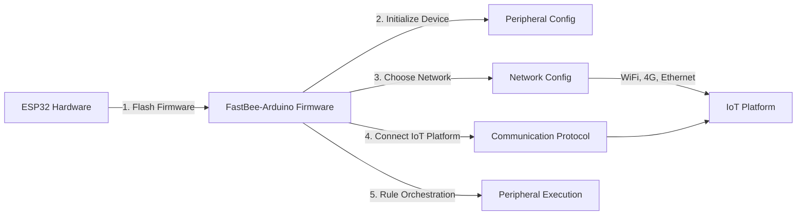

[简体中文](./README.md) | [English](./README.en.md)

<h1 align="center">FastBee-Arduino</h1>

<p align="center">
  <strong>Zero-code, visual configuration — turn ESP32 into a full-featured IoT device in seconds.</strong>
</p>

<p align="center">
  
  
  
  
</p>

FastBee-Arduino is a zero-code Web IoT firmware for the ESP32 full series. After flashing, configure networking, devices, protocols, peripherals, and rules entirely from a browser. Suitable for ESP32 nodes, lightweight gateways, and field data-acquisition & control terminals. Whether you're a beginner or a professional developer, FastBee-Arduino helps you develop and mass-produce IoT devices quickly and easily.

Supported chips: `ESP32`, `ESP32-S3`, `ESP32-C3`, `ESP32-C6`.

## Pre-defined Environments

| PlatformIO Environment | Edition | Chip | Flash | PSRAM | Key Capabilities |
| --- | --- | --- | --- | --- | --- |
| `esp32c3-F4R0` | Lite | ESP32-C3 | 4MB | None | WiFi, MQTT, basic peripherals, execution rules, NeoPixel |
| `esp32c6-F4R0` | Lite | ESP32-C6 | 4MB | None | Same as above, WiFi 6 support |
| `esp32-F4R0` | Standard | ESP32 | 4MB | None | Lite + command script, Modbus, I2C sensors, RFID, IR, Ethernet, 4G |
| `esp32s3-F8R0` | Standard | ESP32-S3 | 8MB | None | Same as esp32 Standard + **OTA**, dual-core higher performance |
| `esp32-F8R4` | Full | ESP32 | 8MB | 4MB | Standard + OTA, rule script, file management, logs, multi-user, BLE |
| `esp32s3-F8R4` | Full | ESP32-S3 | 8MB | 4MB | Same as above, dual-core higher performance |
| `esp32s3-F16R8` | Full | ESP32-S3 | 16MB | 8MB | Same as above, larger storage and memory headroom |

> Edition selection is primarily based on **Flash capacity** and **PSRAM availability**. Environments with Flash ≥ 8MB support OTA upgrades (4MB environments cannot due to space constraints). Modules with PSRAM (e.g., ESP32-WROVER, ESP32-S3-N8R2/N16R8) can use the Full edition.

> For detailed feature comparison and partition tables, see [Edition Comparison](https://fastbee.cn/doc/device/getting-started/edition-comparison.html).

## Quick Flash

### Online Flash (Recommended for Quick Try)

No tools required — open your browser and flash the firmware instantly to try the system: 👉 **[Online Flash Tool](https://fastbee.cn/doc/device/esp32-flasher.html)**

### Build and Flash from Source

1. Install VSCode + PlatformIO, or install PlatformIO CLI.
2. Connect the development board and confirm the serial port, e.g., `COM6`.
3. Run from the project root:

```powershell
cd D:\project\gitee\FastBee-Arduino
powershell -ExecutionPolicy Bypass -File scripts\doctor.ps1 -Port COM6
powershell -ExecutionPolicy Bypass -File scripts\deploy.ps1 -Env esp32-F4R0 -Port COM6
```

**doctor.ps1 parameters** (environment diagnostics):

| Parameter | Description |
|-----------|-------------|
| `-Port` | Serial port, e.g. `COM6` |

**deploy.ps1 parameters** (build + flash):

| Parameter | Description |
|-----------|-------------|
| `-Env` | PlatformIO build environment, e.g. `esp32-F4R0`, see predefined environments above |
| `-Port` | Serial port, e.g. `COM6` |
| `-Monitor` | Open serial monitor automatically after flashing |
| `-BuildOnly` | Compile only without flashing, for CI or quick verification |
| `-SkipFs` | Skip filesystem (LittleFS) upload |
| `-SkipFirmware` | Skip firmware flash, only upload filesystem |
| `-SkipDoctor` | Skip environment diagnostics check |
| `-SkipWeb` | Skip automatic Web asset generation (has no effect if `.gz` files already exist) |

## Quick Start

The device enters AP mode on first boot or when WiFi is not configured:

| Item | Default |
| --- | --- |
| WiFi Hotspot | `FastBee-XXXX` |
| Browser Address | `http://192.168.4.1` or `http://fastbee.local` |
| Username | `admin` |
| Password | `admin123` |



| Step | Phase | What to Do | Page |
|------|-------|------------|------|
| 1 | **Flash Firmware** | Flash FastBee-Arduino firmware to ESP32 using PlatformIO | [Online Flash Tool](https://fastbee.cn/doc/device/esp32-flasher.html) |
| 2 | **Peripheral Config** | Select peripheral types and assign pins in the Web UI to initialize hardware | Peripheral Config |
| 3 | **Network Config** | Choose connectivity (WiFi / Ethernet / 4G), enter parameters and save | Network Config |
| 4 | **Communication Protocol** | Configure MQTT / Modbus RTU protocols to connect to IoT platform | Communication Protocol |
| 5 | **Peripheral Execution** | Set trigger conditions and actions for button-controlled lights, timed linkage, sensor-driven control, etc. | Peripheral Execution |

> Entirely code-free: Flash firmware → Open browser → Click to configure → Device is ready to use.

## Screenshots

<table>
  <tr>
    <td></td>
    <td></td>
  </tr>
  <tr>
    <td></td>
    <td></td>
  </tr>
</table>

## Project Structure

```text
src/              Firmware source code
include/          Headers and feature switches
data/             LittleFS default config and Web artifacts
web-src/          Web frontend source
scripts/          Build, flash, test, and release scripts
test/             PlatformIO native tests
test/browser/     Playwright browser automation (18 suites / 625 cases)
docs/             Test plans and design documents
```

## Documentation

📖 **Full online documentation**: https://fastbee.cn/doc/device/

| Document | Content |
| --- | --- |
| Quick Start | From flashing to creating your first rule |
| Deployment | Firmware, LittleFS, release packages, and device verification |
| Testing | Static checks, native, all-chip build, smoke, and stability tests |
| Edition Comparison | Lite, Standard, Full feature differences |
| Project Structure | Directory, module, and build artifact description |
| User Manual | Web page and feature operation guide |
| Supported Modules | Modules, sensors, and access methods by edition |
| Peripheral Docs | GPIO, sensors, displays, RFID, Modbus peripherals |
| Peripheral Execution | Triggers, actions, and linkage rules |
| Example Tutorials | LED, relay, sensor, display, and Modbus examples |

## License

This project is licensed under [AGPL-3.0](LICENSE).
