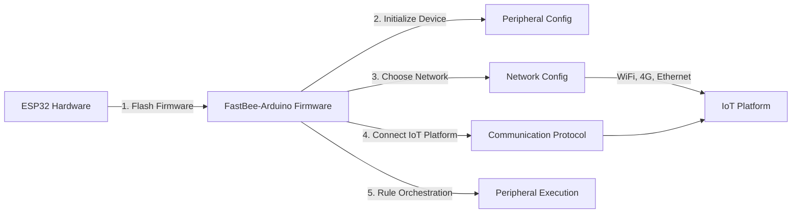

[简体中文](./README.md) | [English](./README.en.md)

<h1 align="center">FastBee-Arduino</h1>

<p align="center">
  <strong>Zero-code, visual configuration — turn ESP32 into a full-featured IoT device in seconds.</strong>
</p>

<p align="center">
  
  
  
  
</p>

FastBee-Arduino is a zero-code Web IoT firmware for the ESP32 full series. After flashing, configure networking, devices, protocols, peripherals, and rules entirely from a browser. Suitable for ESP32 nodes, lightweight gateways, and field data-acquisition & control terminals. Whether you're a beginner or a professional developer, FastBee-Arduino helps you develop and mass-produce IoT devices quickly and easily.

Supported chips: `ESP32`, `ESP32-S3`, `ESP32-C3`, `ESP32-C6`.

## Pre-defined Environments

| PlatformIO Environment | Edition | Chip | Flash | PSRAM | Key Capabilities |
| --- | --- | --- | --- | --- | --- |
| `esp32c3-F4R0` | Lite | ESP32-C3 | 4MB | None | WiFi, MQTT, basic peripherals, execution rules, NeoPixel |
| `esp32c6-F4R0` | Lite | ESP32-C6 | 4MB | None | Same as above, WiFi 6 support |
| `esp32-F4R0` | Standard | ESP32 | 4MB | None | Lite + command script, Modbus, I2C sensors, RFID, IR, Ethernet, 4G |
| `esp32s3-F8R0` | Standard | ESP32-S3 | 8MB | None | Same as esp32 Standard + **OTA**, dual-core higher performance |
| `esp32-F8R4` | Full | ESP32 | 8MB | 4MB | Standard + OTA, rule script, file management, logs, multi-user, BLE, LoRa |
| `esp32s3-F8R4` | Full | ESP32-S3 | 8MB | 4MB | Same as above, dual-core higher performance |
| `esp32s3-F16R8` | Full | ESP32-S3 | 16MB | 8MB | Same as above, larger storage and memory headroom |

> Edition selection is primarily based on **Flash capacity** and **PSRAM availability**. Environments with Flash ≥ 8MB support OTA upgrades (4MB environments cannot due to space constraints). Modules with PSRAM (e.g., ESP32-WROVER, ESP32-S3-N8R2/N16R8) can use the Full edition.

### Lite / Standard / Full Feature Comparison

| Feature Category | Feature | Lite | Standard | Full |
| --- | --- | :---: | :---: | :---: |
| **Network** | WiFi (AP/STA), MQTT, mDNS | Yes | Yes | Yes |
| | Ethernet (W5500), 4G (EC801E) | No | Yes | Yes |
| | LoRa, BLE Provisioning | No | No | Yes |
| **Protocol** | MQTT Protocol | Yes | Yes | Yes |
| | Modbus RTU Master | No | Yes | Yes |
| | Modbus Slave, TCP, HTTP, CoAP | No | No | Yes |
| **Peripheral** | GPIO, DHT11/22, DS18B20 | Yes | Yes | Yes |
| | OLED, TM1637 Display | Yes | Yes | Yes |
| | NeoPixel / WS2812B | Yes | Yes | Yes |
| | Command Script | No | Yes | Yes |
| | I2C Sensors (BMP280/MPU6050) | No | Yes | Yes |
| | RFID (MFRC522), IR Remote | No | Yes | Yes |
| | Rule Script Engine | No | No | Yes |
| **Execution** | Timer / Button / Condition / MQTT Trigger | Yes | Yes | Yes |
| | GPIO / Display / Delay Actions | Yes | Yes | Yes |
| | Modbus Read/Write Actions | No | Yes | Yes |
| **Web** | Dashboard, Peripheral / Protocol / Network Config | Yes | Yes | Yes |
| | SSE Real-time Push, Config Import/Export | Yes | Yes | Yes |
| | Multi-user, File Manager, Log Viewer | No | No | Yes |
| | Multi-language (i18n) | No | No | Yes |
| **System** | Health Monitor, Memory Guard, Task Manager | Yes | Yes | Yes |
| | NTP Time Sync, DNS Service | Yes | Yes | Yes |
| | OTA Firmware / Filesystem Upgrade | No | Optional | Yes |
| | File Logging | No | No | Yes |
| **Limits** | Max Peripherals | 16 | 24 | 32 |
| | Recommended Execution Rules | 12 | 16 | 32 |

> Standard edition OTA is only supported on `esp32s3-F8R0` (8MB Flash); `esp32-F4R0` (4MB Flash) lacks OTA due to space constraints.

### Partition Tables

| Partition File | Flash | App Slot | OTA | FS | Applicable Environments |
| --- | --- | --- | --- | --- | --- |
| `fastbee.csv` | 4MB | 2.88MB × 1 | No | 1MB | `esp32c3-F4R0`, `esp32c6-F4R0`, `esp32-F4R0` |
| `fastbee-8MB.csv` | 8MB | 3.5MB × 2 | Yes | 960KB | `esp32s3-F8R0`, `esp32-F8R4`, `esp32s3-F8R4` |
| `fastbee-16MB.csv` | 16MB | 4MB × 2 | Yes | 7.9MB | `esp32s3-F16R8` |

## Quick Flash

### Build and Flash from Source

1. Install VSCode + PlatformIO, or install PlatformIO CLI.
2. Connect the development board and confirm the serial port, e.g., `COM6`.
3. Run from the project root:

```powershell
cd D:\project\gitee\FastBee-Arduino
powershell -ExecutionPolicy Bypass -File scripts\doctor.ps1 -Port COM6
powershell -ExecutionPolicy Bypass -File scripts\deploy.ps1 -Env esp32-F4R0 -Port COM6
```

Common flash commands:

```powershell
# ESP32 Standard (4MB Flash)
powershell -ExecutionPolicy Bypass -File scripts\deploy.ps1 -Env esp32-F4R0 -Port COM6

# ESP32 Full (8MB Flash + 4MB PSRAM)
powershell -ExecutionPolicy Bypass -File scripts\deploy.ps1 -Env esp32-F8R4 -Port COM6

# ESP32-S3 Standard (8MB Flash)
powershell -ExecutionPolicy Bypass -File scripts\deploy.ps1 -Env esp32s3-F8R0 -Port COM6

# ESP32-S3 Full (16MB Flash + 8MB PSRAM)
powershell -ExecutionPolicy Bypass -File scripts\deploy.ps1 -Env esp32s3-F16R8 -Port COM6

# Auto-open serial monitor after deploy
powershell -ExecutionPolicy Bypass -File scripts\deploy.ps1 -Env esp32s3-F16R8 -Port COM6 -Monitor

# Build only, no flash
powershell -ExecutionPolicy Bypass -File scripts\deploy.ps1 -Env esp32s3-F16R8 -BuildOnly
```

`deploy.ps1` uploads the LittleFS Web filesystem matching the `-Env` first, then flashes the firmware. Add `-Monitor` to auto-open the serial monitor after deployment. The script automatically cleans stale esptool/python processes to avoid "file in use" errors.

### Flash Pre-built Release Images

The repository keeps merged firmware under `dist/firmware/all-latest/`, suitable for users who don't want to compile locally. The merged images include bootloader, partition table, application firmware, and LittleFS Web filesystem; flash address is always `0x0`.

| Firmware File | Target Hardware |
| --- | --- |
| `fastbee-esp32-F4R0.bin` | ESP32 4MB Flash |
| `fastbee-esp32-F8R4.bin` | ESP32 8MB Flash + 4MB PSRAM |
| `fastbee-esp32c3-F4R0.bin` | ESP32-C3 4MB Flash |
| `fastbee-esp32c6-F4R0.bin` | ESP32-C6 4MB Flash |
| `fastbee-esp32s3-F8R0.bin` | ESP32-S3 8MB Flash |
| `fastbee-esp32s3-F8R4.bin` | ESP32-S3 8MB Flash + 4MB PSRAM |
| `fastbee-esp32s3-F16R8.bin` | ESP32-S3 16MB Flash + 8MB PSRAM |

Command-line flash examples:

```powershell
# Optional: erase entire Flash first
esptool.py --chip auto --port COM6 erase_flash

# ESP32 Standard merged image, write from 0x0
esptool.py --chip auto --port COM6 --baud 921600 write_flash -z 0x0 dist\firmware\all-latest\fastbee-esp32-F4R0.bin

# ESP32-S3 Full merged image, requires 16MB Flash + PSRAM hardware
esptool.py --chip auto --port COM6 --baud 921600 write_flash -z 0x0 dist\firmware\all-latest\fastbee-esp32s3-F16R8.bin

# ESP32 Full merged image, requires 8MB Flash + 4MB PSRAM hardware
esptool.py --chip auto --port COM6 --baud 921600 write_flash -z 0x0 dist\firmware\all-latest\fastbee-esp32-F8R4.bin
```

You can also use the Espressif Flash Download Tool: select the `.bin` file, set address to `0x0`, click `ERASE` then `START`. If pages display abnormally after flashing, first verify the firmware file matches the actual chip/Flash/PSRAM specs.

## First Access

The device enters AP mode on first boot or when WiFi is not configured:

| Item | Default |
| --- | --- |
| WiFi Hotspot | `FastBee-XXXX` |
| Browser Address | `http://192.168.4.1` or `http://fastbee.local` |
| Username | `admin` |
| Password | `admin123` |

After login, complete the following in order:

1. Configure WiFi, Ethernet, or 4G in "Network Settings".
2. Confirm device ID, product ID, and time settings in "Device Settings".
3. Configure MQTT, Modbus RTU, and other protocols in "Communication Protocols".
4. Add and enable wired peripherals in "Peripheral Configuration".
5. Configure timer, event, or sensor-linked rules in "Peripheral Execution".

Default peripheral templates and execution rules are safely disabled. After wiring, confirm pins, power supply, and peripheral IDs before enabling each item.

## Usage Flow

From flashing to cloud connection, just 5 steps to turn an ESP32 into a controllable IoT terminal:



| Step | Phase | What to Do | Page |
|------|-------|------------|------|
| 1 | **Flash Firmware** | Flash FastBee-Arduino firmware to ESP32 using PlatformIO | — |
| 2 | **Peripheral Config** | Select peripheral types and assign pins in the Web UI to initialize hardware | Peripheral Config |
| 3 | **Network Config** | Choose connectivity (WiFi / Ethernet / 4G), enter parameters and save; AP+STA dual-mode auto-switches online | Network Config |
| 4 | **Communication Protocol** | Configure MQTT / Modbus RTU protocols to connect to IoT platform | Communication Protocol |
| 5 | **Peripheral Execution** | Set trigger conditions and actions for button-controlled lights, timed linkage, sensor-driven control, etc. | Peripheral Execution |

> Entirely code-free: Flash firmware → Open browser → Click to configure → Device is ready to use.

## Screenshots

<table>
  <tr>
    <td></td>
    <td></td>
  </tr>
  <tr>
    <td></td>
    <td></td>
  </tr>
</table>

---

## Verification & Testing

This project provides a unified test entry to ensure different chips, editions, and Web artifacts work correctly.

```powershell
# Pre-commit quick check: config, i18n, Web assets, all-chip build
powershell -ExecutionPolicy Bypass -Command ".\scripts\test-all.ps1 -Checks static,build"

# Full local matrix without real device
powershell -ExecutionPolicy Bypass -Command ".\scripts\test-all.ps1 -Checks static,native,build,artifacts"

# API smoke test after flashing a real device
powershell -ExecutionPolicy Bypass -File scripts\smoke-test-device.ps1 -BaseUrl http://192.168.4.1 -Profile standard

# Long-running stability test with CSV output
powershell -ExecutionPolicy Bypass -File scripts\soak-test-device.ps1 -BaseUrl http://<device-ip> -Profile full -Rounds 100
```

Device tests check login, system, network, device config, protocol, MQTT, peripherals, peripheral execution, and Full admin APIs by `lite`, `standard`, `full` profile. Web static smoke tests verify gzip resources, page/module integrity, JS syntax, and first-screen resource budget.

## Release Artifacts

Generate all-edition merged firmware in one command:

```powershell
powershell -ExecutionPolicy Bypass -File scripts\build-all-artifacts.ps1 -CleanOutput
```

Output directory:

```text
dist/firmware/all-latest/
```

Artifacts are merged images containing bootloader, partition table, application firmware, and LittleFS — ready for mass-production flash tools.

## Project Structure

```text
src/          Firmware source code
include/      Headers and feature switches
data/         LittleFS default config and Web artifacts
web-src/      Web frontend source
scripts/      Build, flash, test, and release scripts
test/         PlatformIO native tests
```

## Documentation

📖 **Full online documentation**: https://fastbee.cn/doc/device/

| Document | Content |
| --- | --- |
| Quick Start | From flashing to creating your first rule |
| Deployment | Firmware, LittleFS, release packages, and device verification |
| Testing | Static checks, native, all-chip build, smoke, and stability tests |
| Edition Comparison | Lite, Standard, Full feature differences |
| Project Structure | Directory, module, and build artifact description |
| User Manual | Web page and feature operation guide |
| Supported Modules | Modules, sensors, and access methods by edition |
| Peripheral Docs | GPIO, sensors, displays, RFID, Modbus peripherals |
| Peripheral Execution | Triggers, actions, and linkage rules |
| Example Tutorials | LED, relay, sensor, display, and Modbus examples |

## License

This project is licensed under [AGPL-3.0](LICENSE).
