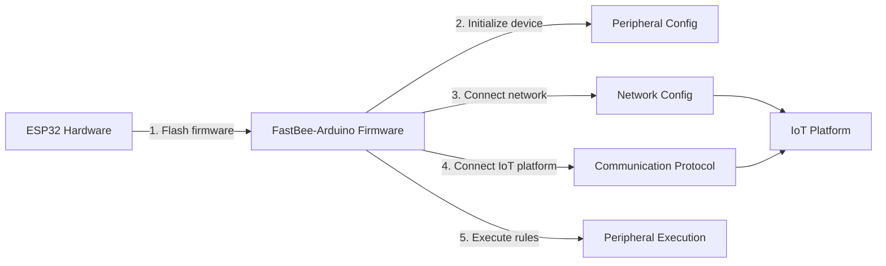

[简体中文](./README.md) | [English](./README.en.md)

<h1 align="center">FastBee-Arduino</h1>

<p align="center">
  <strong>Zero-Code, Visual Configuration — Turn Your ESP32 into a Versatile IoT Device in Minutes.</strong>
</p>

<p align="center">
  
  
  
  
  
</p>

<p align="center">
  Flash &amp; Go · No Programming Required · Visual Web Configuration · Multi-Protocol &amp; Multi-Peripheral
</p>

---

FastBee-Arduino is an **open-source IoT firmware framework** for the ESP32 chip family. Without writing a single line of code, the built-in Web management UI lets you configure peripherals, connect protocols, orchestrate rules, and maintain devices remotely — **a true "flash and go" experience**.

Whether you're a maker rapidly prototyping a hardware idea or a product team deploying at scale, just flash the firmware, open a browser, and turn any ESP32 dev board into a fully functional IoT endpoint.

---

## ✨ Four Core Advantages

### 🎛️ Zero-Code Visual Configuration

- **Fully Web-Based**: Peripherals, protocols, and rules are all configured through point-and-click in the browser — no programming
- **35+ Peripheral Types + Auto Pin Mapping**: GPIO / PWM / ADC / I2C / SPI / RS485 / UART, with built-in ESP32 / S3 / C3 pin conflict detection
- **Rule Engine**: 5 trigger types × 20+ actions — orchestrate conditional automations on the fly

### 🌐 Out-of-the-Box Management UI

- **8 Functional Pages + 80+ REST APIs**: Dashboard, Device Control, Network, Protocol, Peripheral Setup, Peripheral Execution, Rule Scripts, System Admin
- **Device Dashboard**: Real-time view of sensor data and Modbus register values; remotely control relays, PWM, motors and more
- **2,500+ i18n Keys (CN/EN) + SSE Real-Time Push + Service Worker Offline Cache**

### 📡 Full ESP32 Family + Smart Networking

- **Three Chip Variants**: ESP32 (dual-core 240 MHz), ESP32-S3 (AI acceleration), ESP32-C3 (low-cost RISC-V)
- **AP+STA Dual-Mode Auto-Switching**: Falls back to AP when STA fails, switches back to STA after configuration — the device is always reachable
- **mDNS Local Discovery**: Reach the device via `fastbee.local` — no IP scanning needed

### 🔌 Industrial-Grade Protocols + Security

- **MQTT Dual Auth + Modbus RTU Master/Slave**: MQTT supports QoS 0-2 / TLS / AES-CBC-128; Modbus supports raw HEX passthrough, compatible with non-standard slaves
- **Enterprise Security**: RBAC with 3 roles & 24 permissions, cookie sessions, MD5+Salt password hashing
- **Scriptable Rule Engine**: Built-in JavaScript engine for custom rule scripts — dynamically loadable without re-flashing
- **OTA Remote Updates + Four-Level Memory Guard (MemGuard) + End-to-End Debug Logging**

---

## 🔄 Usage Workflow

From flashing to cloud-ready in just 5 steps — turn an ESP32 into a controllable IoT endpoint:



| Step | Stage | What to do | Web Page |
|------|-------|------------|----------|
| 1️⃣ | **Flash Firmware** | Use PlatformIO to flash FastBee-Arduino firmware onto ESP32 | — |
| 2️⃣ | **Peripheral Setup** | Pick peripheral types and assign GPIO pins via Web UI to finish hardware init | Peripheral Setup |
| 3️⃣ | **Network Config** | Enter WiFi SSID & password — AP+STA dual-mode auto-switches online | Network Config |
| 4️⃣ | **Protocol Setup** | Configure MQTT / Modbus and connect to the IoT platform | Protocol Manager |
| 5️⃣ | **Peripheral Execution** | Define triggers & actions to build automation rules (button-to-light, schedules, sensor linkage, …) | Peripheral Execution / Rule Scripts |

> Zero programming required: flash firmware → open browser → click & configure → the device is live.

---

## 📦 Hardware Product

<p align="center">
  
</p>

### Core Specifications

| Parameter | Details |
|-----------|---------|
| Chip | ESP32-WROOM-32U |
| CPU | Dual-core Xtensa LX6 @ 240 MHz |
| Flash | 4 MB SPI Flash |
| SRAM | 520 KB |
| Wireless | WiFi 802.11 b/g/n + Bluetooth 4.2 + BLE |
| Power Supply | DC 9-36V |
| Features | External antenna, USB programming port, config button |

### Terminal Block Pinout

| Terminal | Function | GPIO |
|----------|----------|------|
| A/L | RS485-A (TX) | GPIO17 |
| B/H | RS485-B (RX) | GPIO16 |
| VCC | Power positive | DC 9-36V |
| GND | Power ground | — |
| DGND | Digital ground (isolated GND) | — |
| EGND | Protective earth (device enclosure) | — |
| IO/L | Isolated digital I/O low-side | GPIO21 |
| IO/H | Isolated digital I/O high-side | GPIO22 |

### Indicators & Button

| Name | Type | Description |
|------|------|-------------|
| POWER | LED | Power indicator, steady on when powered |
| STATE | LED (GPIO5) | Status indicator, active low |
| DATA | LED | Communication indicator, blinks on data transfer |
| BOOT | Button (GPIO0) | Long press to enter configuration mode |

---

## 🚀 Quick Start

### 1. Prerequisites

Install [VSCode](https://code.visualstudio.com/) with the [PlatformIO extension](https://platformio.org/install/ide?install=vscode).

### 2. Clone & Build

```bash
# Clone the repository
git clone https://gitee.com/beecue/fastbee-arduino.git
cd fastbee-arduino

# Compress frontend assets (optional — prebuilt files included)
node scripts/gzip-www.js

# Upload filesystem image (default env: esp32dev)
pio run -e esp32dev --target uploadfs

# Compile and flash firmware
pio run -e esp32dev --target upload

# Open serial monitor (115200 baud)
pio device monitor -b 115200
```

### 3. Access the Device

- On first boot (no WiFi configured) the device enters **AP mode** — connect to `fastbee-ap`
- Open `192.168.4.1` or `http://fastbee.local` in your browser
- Default credentials: `admin` / `admin123`
- Fill in the WiFi SSID / password in the Web UI under "Network" — the device automatically switches to STA mode; if STA fails, it falls back to AP mode

> After flashing, zero code needed! Open your browser to visually configure WiFi, peripherals, protocols, rules, and everything else.
> **Note**: The standalone BLE provisioning and AP provisioning wizards have been removed. Network onboarding is now handled uniformly through the AP+STA dual-mode auto-switching mechanism.

---

## 📸 Screenshots

<table>
  <tr>
    <td></td>
    <td></td>
  </tr>
  <tr>
    <td></td>
    <td></td>
  </tr>
  <tr>
    <td></td>
    <td></td>
  </tr>
  <tr>
    <td></td>
    <td></td>
  </tr>
  <tr>
    <td></td>
    <td></td>
  </tr>
  <tr>
    <td></td>
     <td></td>
  </tr>
</table>

---

## 📋 Technical Specifications

### Supported Chips

| Chip | Core | Frequency | PSRAM | Highlights |
|------|------|-----------|-------|------------|
| ESP32 | Dual-core Xtensa LX6 | 240 MHz | 2 MB | Classic & stable, BT 4.2 + BLE |
| ESP32-S3 | Dual-core Xtensa LX7 | 240 MHz | 8 MB | USB-CDC, AI vector acceleration |
| ESP32-C3 | Single-core RISC-V | 160 MHz | 2 MB | Low cost, BLE 5.0 |

### Protocol Support

FastBee-Arduino focuses on the two communication protocols most widely used in industrial scenarios:

| Protocol | Features |
|----------|----------|
| MQTT | Dual auth (simple / AES-CBC-128), QoS 0/1/2, TLS, exponential-backoff reconnect, ring-buffer queue, unified `RX ▼ / TX ▲` debug logs |
| Modbus RTU | Industrial RS485 bus, master & slave, 8 function codes, up to 16 slaves, 5 device types, **raw HEX passthrough** |

### 🏭 Industrial Modbus RTU Protocol

Via the RS485 bus, FastBee-Arduino seamlessly integrates with PLCs, VFDs, temperature/humidity transmitters, power meters, and other industrial equipment.

| Feature | Description |
|---------|-------------|
| Bus | RS485 half-duplex with hardware UART + automatic DE/RE flow control |
| Operating Modes | **Master** (active polling) + **Slave** (passive response), each independently toggled via compile switches |
| Standard Function Codes | FC01 Read Coils, FC02 Read Discrete Inputs, FC03 Read Holding Registers, FC04 Read Input Registers, FC05 Write Single Coil, FC06 Write Single Register, FC0F Write Multiple Coils, FC10 Write Multiple Registers |
| Sub-Device Management | Up to **16 slave nodes**, 5 device types: Relay, PWM, PID Controller, Motor, Sensor |
| Register Mapping | JSON-configured register offset → sensor ID, supports uint16/int16/uint32/int32/float32 data types with configurable scale factor & decimal places |
| OneShot Priority Control | One-time read/write requests independent of periodic polling, with higher priority than regular poll tasks |
| Continuous Timeout Protection | Auto frequency reduction or skip when a slave is unresponsive, preventing bus congestion |
| Data Change Detection | Hash-based change detection — reports only when data changes, reducing unnecessary communication |
| Dead Zone & Dynamic Frequency | Register value changes below the dead-zone threshold are suppressed; polling frequency adjusts dynamically based on communication quality |
| Passthrough Mode | **`transferType=1`** when enabled: platform sends raw HEX → auto-detect & strip trailing CRC → `sendRawFrameOnce` re-appends CRC and transmits → raw response frame reported directly as HEX via `/property/post`, compatible with non-standard slaves (requires platform-side JS script for parsing) |
| Compile Switches | `FASTBEE_ENABLE_MODBUS` (master), `FASTBEE_MODBUS_SLAVE_ENABLE` (slave) — enable as needed |

---

## 📁 Project Structure

```
FastBee-Arduino/
├── include/                  # Header files
│   ├── core/                 # Core framework (FastBeeFramework, peripherals, rule engine)
│   ├── network/              # Networking (WiFi, web server, OTA, route handlers)
│   ├── protocols/            # Protocol engine (MQTT, Modbus)
│   ├── security/             # Security (user / role / auth / crypto)
│   ├── systems/              # System services (logger, scheduler, health, config storage)
│   └── utils/                # Utilities
├── src/                      # Source implementation (~15K lines C++)
├── data/                     # Filesystem image
│   ├── www/                  # Web frontend (~260 KB gzip, 8 functional pages)
│   ├── config/               # JSON configuration files
│   └── logs/                 # Log directory
├── web-src/                  # Web frontend source (development)
├── lib/                      # Local libraries (ESPAsyncWebServer)
├── scripts/                  # Build scripts (compress, bundle, i18n validation)
├── test/                     # Unit tests + mocks
├── docs/                     # Technical documentation
├── platformio.ini            # PlatformIO multi-env config
└── fastbee.csv               # Custom partition table
```

---

## 💬 Community

Hardware discussion QQ group: **875651514**


---

## 📜 License

This project is licensed under the **AGPL-3.0** License — see the [LICENSE](./LICENSE) file for details.

---

## 🔗 Links

- 📖 [Wiki & Docs](https://gitee.com/beecue/fastbee-arduino/wikis)
- 🐛 [Issue Tracker](https://gitee.com/beecue/fastbee-arduino/issues)
- 🏠 [Gitee Repository](https://gitee.com/beecue/fastbee-arduino)

---

<p align="center">
  <sub>If you find this project useful, please give it a ⭐ Star!</sub>
</p>
