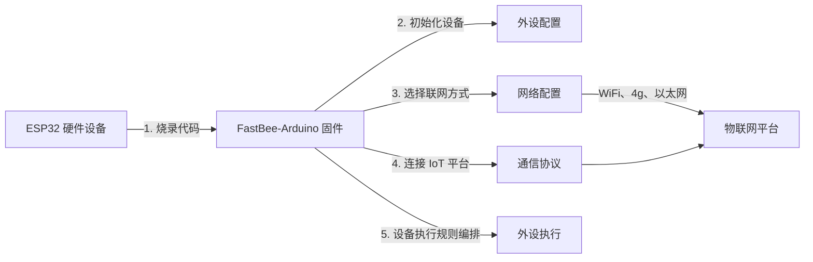

[简体中文](./README.md) | [English](./README.en.md)

<h1 align="center">FastBee-Arduino</h1>

<p align="center">
  <strong>零代码、可视化配置，让 ESP32 像搭积木一样秒变全能物联网设备。</strong>
</p>

<p align="center">
  
  
  
  
</p>

FastBee-Arduino 烧录后即可通过浏览器完成网络、设备、协议、外设和规则配置，适合 ESP32 节点、轻量网关和现场采集控制终端，是面向 ESP32 全系列的零代码 Web 物联网固件。无论你是零基础还是专业开发者，FastBee-Arduino 都能帮你快速、轻松地完成物联网设备的开发与量产。

支持芯片：`ESP32`、`ESP32-S3`、`ESP32-C3`、`ESP32-C6`。

## 预定义环境

| PlatformIO 环境 | 版本 | 芯片 | Flash | PSRAM |
| --- | --- | --- | --- | --- |
| `esp32c3-F4R0` | Lite | ESP32-C3 | 4MB | 无 |
| `esp32c6-F4R0` | Lite | ESP32-C6 | 4MB | 无 |
| `esp32-F4R0` | Standard | ESP32 | 4MB | 无 |
| `esp32s3-F8R0` | Standard | ESP32-S3 | 8MB | 无 |
| `esp32-F8R4` | Full | ESP32 | 8MB | 4MB |
| `esp32s3-F8R4` | Full | ESP32-S3 | 8MB | 4MB |
| `esp32s3-F16R8` | Full | ESP32-S3 | 16MB | 8MB |

> 版本选择的核心依据是 **Flash 容量**和**是否有 PSRAM**。
1. Flash ≥8MB 的环境均支持 OTA 升级（4MB 环境受空间限制不支持）。
2. 带 PSRAM 的模组（如 ESP32-WROVER、ESP32-S3-N8R2/N16R8）均可使用 Full 版。
3. 预定义的环境不满足可以platformio中新增，配置合适flash、psram和需要支持的外设

> 功能对比详表与分区表见 [版本对比](https://fastbee.cn/doc/device/getting-started/edition-comparison.html)。

## 快速烧录

### 在线烧录（推荐体验）

无需安装任何工具，打开浏览器即可一键烧录固件体验系统：👉 **[在线烧录工具](https://fastbee.cn/doc/device/esp32-flasher.html)**

### 从源码构建烧录

1. 安装 VSCode + PlatformIO，或安装 PlatformIO CLI。
2. 连接开发板，确认串口号，例如 `COM6`。
3. 在项目根目录执行：

```powershell
# Windows
powershell -ExecutionPolicy Bypass -File scripts\deploy.ps1 -Env esp32-F4R0 -Port COM6

# Linux / macOS（需安装 PowerShell Core: pwsh）
pwsh -File scripts/deploy.ps1 -Env esp32-F4R0 -Port /dev/ttyUSB0
```

**deploy.ps1 参数**：

| 参数 | 说明 |
|------|------|
| `-Env` | PlatformIO 构建环境，如 `esp32-F4R0`，见上方预定义环境表 |
| `-Port` | 串口号，如 `COM6` |
| `-Monitor` | 烧录完成后自动打开串口监视器 |
| `-BuildOnly` | 仅编译不烧录，用于 CI 或快速验证 |
| `-SkipFs` | 跳过文件系统（LittleFS）上传 |
| `-SkipFirmware` | 跳过固件烧录，仅上传文件系统 |
| `-SkipDoctor` | 跳过环境诊断检查 |
| `-SkipWeb` | 跳过 Web 资源自动生成（`.gz` 文件已存在时不生效） |

## 快速上手

设备首次启动或未配置 WiFi 时会进入 AP 模式：

| 项目 | 默认值 |
| --- | --- |
| WiFi 热点 | `fastbee-ap` |
| 浏览器地址 | `http://192.168.4.1` 或 `http://fastbee.local` |
| 用户名 | `admin` |
| 密码 | `admin123` |



| 步骤 | 环节 | 做什么 | 对应页面 |
|------|------|--------|----------|
| 1 | **烧录固件** | 用 PlatformIO 把 FastBee-Arduino 固件烧录到 ESP32 | [在线烧录工具](https://fastbee.cn/doc/device/esp32-flasher.html) |
| 2 | **网络配置** | 选择联网方式（WiFi / 以太网 / 4G），填写参数后保存 | 网络配置 |
| 3 | **外设配置** | 在 Web 界面勾选外设类型、分配引脚，完成硬件初始化 | 外设配置 |
| 4 | **外设执行** | 配置触发条件与动作，实现按键控灯、定时联动、传感器联控等 | 外设执行 |
| 5 | **通信协议** | 配置 MQTT / Modbus RTU 等协议，接入物联网平台 | 通信协议 |

> 全程无需编程：烧录固件 → 打开浏览器 → 点选配置 → 设备即刻投入使用。

## 功能截图

<table>
  <tr>
    <td></td>
    <td></td>
  </tr>
  <tr>
    <td></td>
    <td></td>
  </tr>
</table>

## 项目结构

```text
src/              固件源码
include/          头文件和功能开关
data/             LittleFS 默认配置与 Web 产物
web-src/          Web 前端源码
scripts/          构建、烧录、测试、发布脚本
test/             PlatformIO native 测试
test/browser/     Playwright 浏览器自动化测试（18 套件 / 625 用例）
docs/             测试方案与功能设计文档
```

📖 **完整在线文档**：https://fastbee.cn/doc/device/
