[简体中文](./README.md) | [English](./README.en.md)

**FastBee-Arduino是一个基于ESP32-Arduino平台构建的、功能完整的嵌入式物联网设备开发框架。**

---

### 项目介绍
FastBee-Arduino 是ESP32平台上功能全面的嵌入式物联网开发框架，零代码、可视化配置初始化硬件外设和外设的执行处理（例如初始化GPIO1脚为低电平，定时/条件触发后输出高电平）。通过模块化设计和企业级功能，帮助企业快速制作产品原型，降低开发成本；同时也是个人开发者/创客快速学习和使用的工具。


---

### 功能模块
* **Web配置管理：** 完整的用户管理、角色权限管理、会话管理，响应式单页面应用设计，原生Web技术实现，支持中英文切换、深色/浅色主题切换
* **Web前端优化：** HTML动态模块拆分（骨架+按需加载）、i18n引擎与语言包分离、Service Worker离线缓存、骨架屏加载提示、资源预加载、Gzip压缩（81.6%压缩率）
* **网络通信：** WiFi STA/AP/AP+STA三种模式、STA失败自动降级AP+STA模式、mDNS本地域名访问、网络状态监测、WiFi扫描与连接（两列网格布局）、TCP连接优化（12连接/64队列）
* **配网功能：** AP热点配网、蓝牙BLE配网（NimBLE）、配网超时自动关闭
* **协议支持：** MQTT协议接入（发布/订阅主题配置）、Modbus RTU/TCP、TCP服务器/客户端、HTTP客户端、CoAP
* **实时推送：** SSE（Server-Sent Events）实时状态推送，设备数据变化即时广播到Web前端
* **远程维护：** 固件OTA升级、文件系统OTA升级、在线日志查看、远程重启、恢复出厂设置、设备状态实时上报
* **数据存储：** LittleFS文件系统、NVS Preferences双存储、JSON配置文件管理、Gzip压缩优化（81.6%压缩率）
* **外设管理：** RS485串口配置、数字输入/输出、模拟输入、PWM输出、I2C/SPI接口、可视化GPIO引脚配置
* **外设执行：** 规则引擎支持平台触发/设备触发/定时触发，可执行GPIO操作、系统功能、命令脚本
* **设备控制：** 继电器/PWM/PID设备类型支持、自由拖拽定位布局、寄存器模式延时控制、Modbus信号量分离优化
* **规则脚本：** 自定义数据处理脚本，支持MQTT/Modbus/HTTP等多种协议的数据格式转换
* **健康监测：** CPU/内存/存储实时监测、网络连接状态、任务运行状态、异常告警
* **日志系统：** 分级日志（DEBUG/INFO/WARN/ERROR）、文件存储、Web在线查看、日志轮转
* **任务调度：** 定时任务管理、异步事件处理、优先级调度
* **安全认证：** 用户登录认证、基于角色的权限控制(RBAC)、会话管理、记住登录

[脚本使用文档 >> ](https://gitee.com/beecue/fastbee-arduino/wikis)

---

### 硬件产品
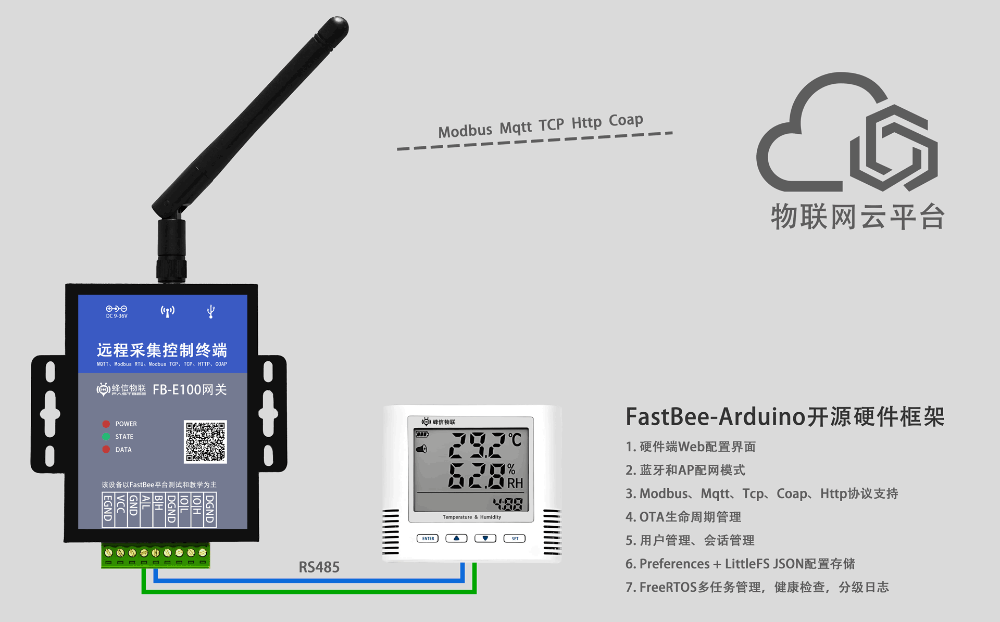

* **芯片：** ESP32-WROOM-32U
* **CPU：** 240 MHz
* **Flash：** 4MB SPI Flash
* **SRAM：‌** 520 kB
* **无线：** WiFi 802.11 b/g/n + Bluetooth 4.2 + BLE
* **供电电压：** DC 9-36V，带外置天线，USB烧录口和配置按键
* **接线端子说明：**
  * A/L：RS485-A（TX），GPIO17
  * B/H：RS485-B（RX），GPIO16
  * VCC：供电正极，DC 9-36V
  * GND：供电负极
  * DGND：数字地（隔离GND）
  * EGND：保护地（连接设备外壳）
  * IO/L：隔离型数字输入/输出低端，GPIO21
  * IO/H：隔离型数字输入/输出高端，GPIO22
* **指示灯说明：**
  * POWER：电源指示灯（常亮表示供电正常）
  * STATE：状态指示灯，GPIO5（低电平点亮）
  * DATA：通讯指示灯（数据收发闪烁）
* **按键：** GPIO0（长按进入配置模式）

---

### 开发环境
* **开发工具：** VSCode + PlatformIO
* **目标芯片：** ESP32（ESP32-WROOM-32/32U/32D）
* **Flash要求：** 4MB及以上
* **框架版本：** Arduino-ESP32 2.0.x
* **依赖库：**
  * ArduinoJson @ 7.4.2 - JSON解析
  * PubSubClient @ 2.8 - MQTT客户端
  * NimBLE-Arduino @ 1.4.1 - 蓝牙BLE配网
  * ESPAsyncWebServer @ 3.9.2 - 异步Web服务器（lib目录）

---

### 使用流程
1. **环境准备**：安装VSCode和PlatformIO插件
2. **克隆项目**：`git clone https://gitee.com/beecue/fastbee-arduino.git`
3. **压缩前端资源（可选）**：`node scripts/gzip-www.js`
4. **上传文件系统**：`pio run --target uploadfs`
5. **上传固件**：`pio run --target upload`
6. **访问设备**：
   - 首次启动自动进入AP配网模式，连接热点 `fastbee-ap`，通过地址 192.168.4.1 访问配置页面
   - 后续根据配置的网络模式（AP、STA、AP+STA）采用mDNS访问：http://fastbee.local 或者 192.168.4.1 访问
   - 默认账号：`admin` / `admin123`
7. **网络配置**：在Web界面配置WiFi连接信息（可视化配置网络连接）
8. **外设配置**：配置RS485、GPIO等硬件接口（可视化初始硬件外设）
9. **外设执行**：配置触发规则和执行动作（可视化外设执行动作，例如GPIO输出高低电平）
10. **协议对接**：配置MQTT/Modbus等协议（连接物联网平台）

---

### 硬件交流群：875651514


### 项目结构

```
FastBee-Arduino/
├── include/                       # 头文件目录
│   ├── core/                      # 核心框架
│   │   ├── FastBeeFramework.h     # 主框架类
│   │   ├── ConfigDefines.h        # 配置常量
│   │   ├── SystemConstants.h      # 系统常量
│   │   ├── PeripheralManager.h    # 外设管理
│   │   ├── PeriphExecManager.h    # 外设执行管理
│   │   ├── RuleScriptManager.h    # 规则脚本管理
│   │   └── FeatureFlags.h         # 功能开关
│   ├── network/                   # 网络模块
│   │   ├── NetworkManager.h       # 网络连接管理
│   │   ├── WiFiManager.h          # WiFi管理
│   │   ├── WebConfigManager.h     # Web配置服务
│   │   ├── OTAManager.h           # OTA升级
│   │   ├── handlers/              # 路由处理器
│   │   │   ├── SSERouteHandler.h  # SSE实时推送
│   │   │   ├── ModbusRouteHandler.h
│   │   │   └── ...                # 其他API处理器
│   │   └── DNSServer.h            # DNS服务
│   ├── protocols/                 # 协议模块
│   │   ├── ProtocolManager.h      # 协议管理器
│   │   ├── MQTTClient.h           # MQTT客户端
│   │   ├── ModbusHandler.h        # Modbus处理
│   │   ├── TCPHandler.h           # TCP处理
│   │   └── HTTPClientWrapper.h    # HTTP客户端
│   ├── security/                  # 安全模块
│   │   ├── UserManager.h          # 用户管理
│   │   ├── RoleManager.h          # 角色管理
│   │   ├── AuthManager.h          # 认证授权
│   │   └── CryptoUtils.h          # 加密工具
│   ├── systems/                   # 系统服务
│   │   ├── LoggerSystem.h         # 日志系统
│   │   ├── TaskManager.h          # 任务调度
│   │   ├── HealthMonitor.h        # 健康监测
│   │   └── ConfigStorage.h        # 配置存储
│   └── utils/                     # 工具类
├── src/                           # 源代码目录
│   ├── core/                      # 核心实现
│   ├── network/                   # 网络实现
│   ├── protocols/                 # 协议实现
│   ├── security/                  # 安全实现
│   ├── systems/                   # 系统实现
│   ├── utils/                     # 工具实现
│   └── main.cpp                   # 主入口
├── data/                          # 文件系统
│   ├── www/                       # Web前端资源
│   │   ├── index.html             # SPA骨架页面
│   │   ├── sw.js                  # Service Worker离线缓存
│   │   ├── pages/                 # 动态加载页面模块
│   │   ├── css/                   # 样式文件
│   │   ├── js/                    # JavaScript
│   │   └── assets/                # 静态资源
│   ├── config/                    # 配置文件
│   └── logs/                      # 日志目录
├── web-src/                       # Web前端源码
│   └── modules/                   # JS模块（admin/runtime）
├── lib/                           # 本地库
│   └── ESPAsyncWebServer/         # 异步Web服务器
├── scripts/                       # 构建脚本
│   ├── gzip-www.js                # 前端压缩
│   ├── build-web-modules.js       # 模块构建
│   └── filter_littlefs.py         # 文件过滤
├── docs/                          # 文档目录
│   ├── modbus_usage_guide.md      # Modbus使用指南
│   ├── periph_exec_flow.md        # 外设执行流程
│   └── script-guide.md            # 脚本指南
├── test/                          # 单元测试
│   ├── mocks/                     # Mock对象
│   └── helpers/                   # 测试辅助
├── tests/                         # 集成测试
├── platformio.ini                 # PlatformIO配置
├── fastbee.csv                    # 分区表
└── README.md                      # 项目说明
```

---

### 部分截图

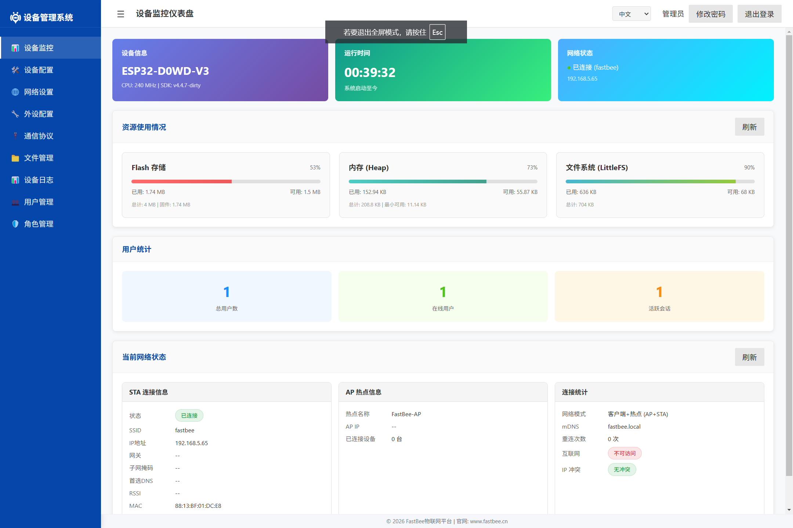

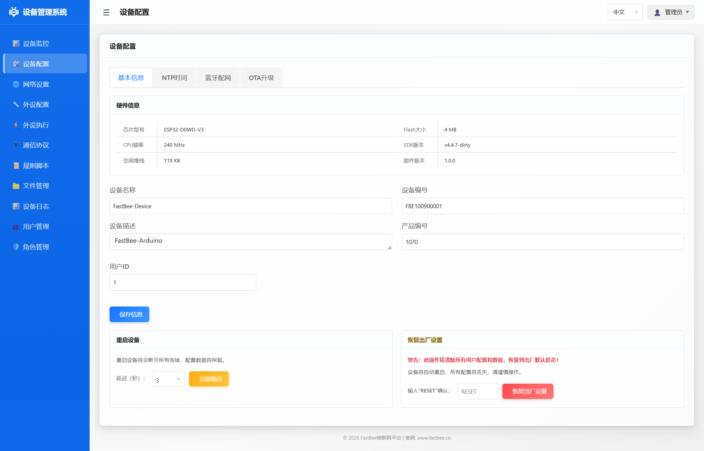

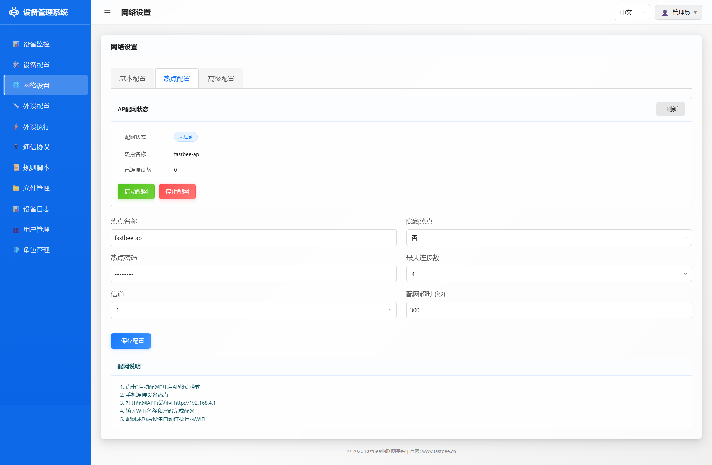

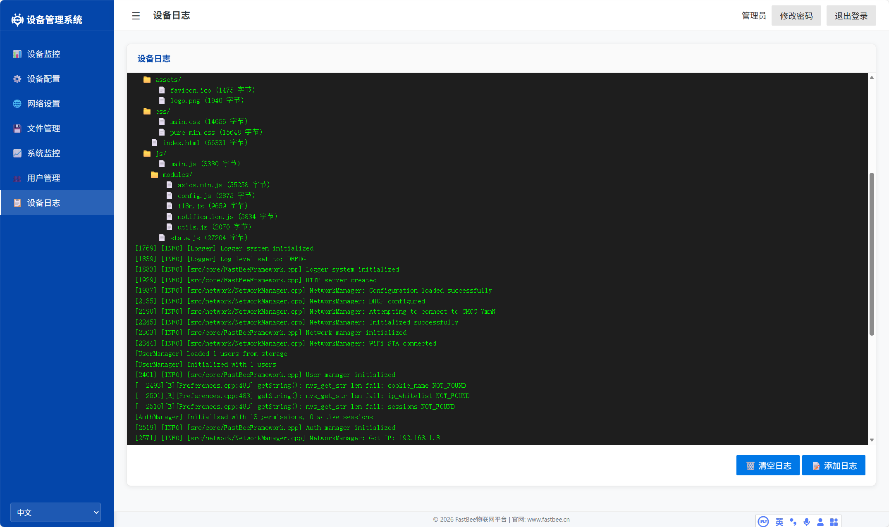

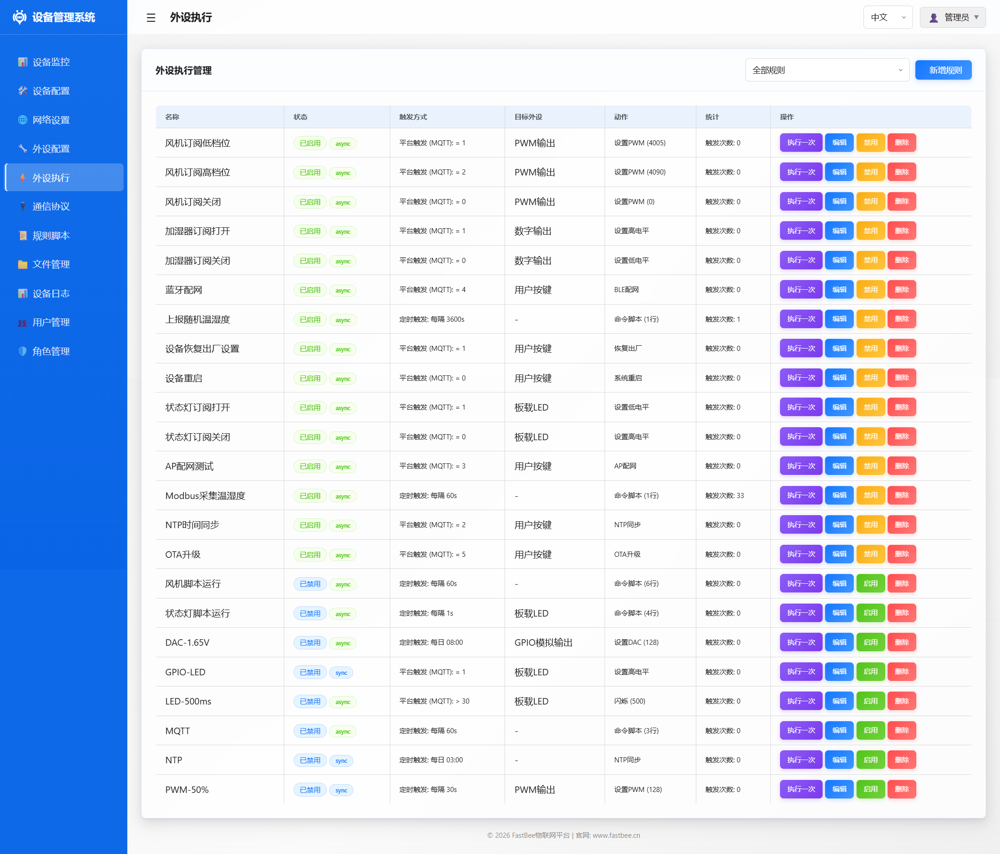

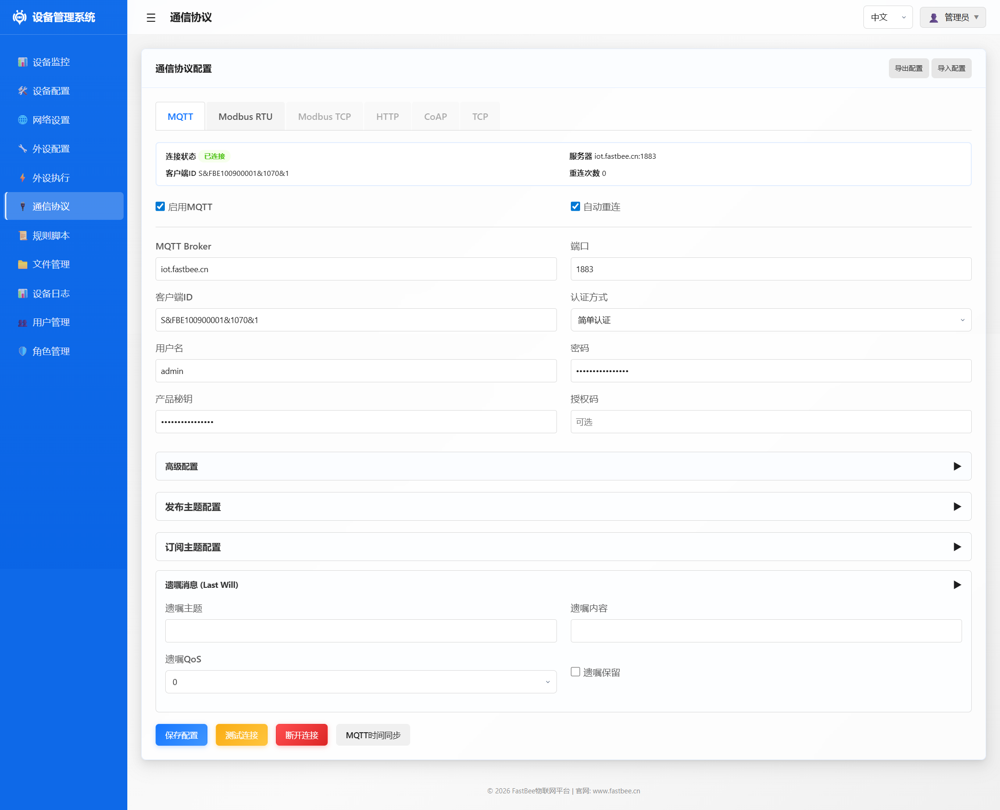

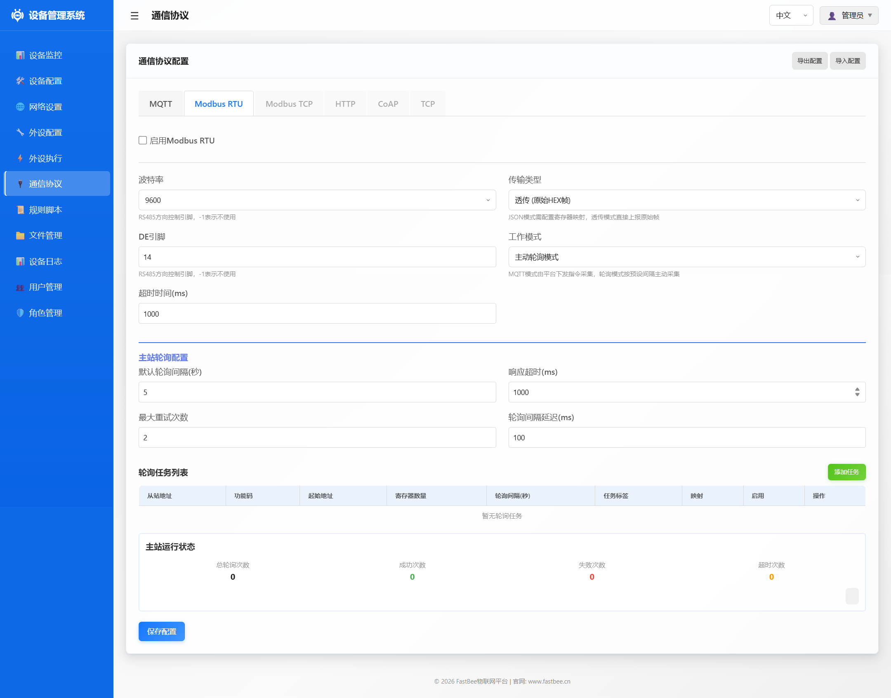

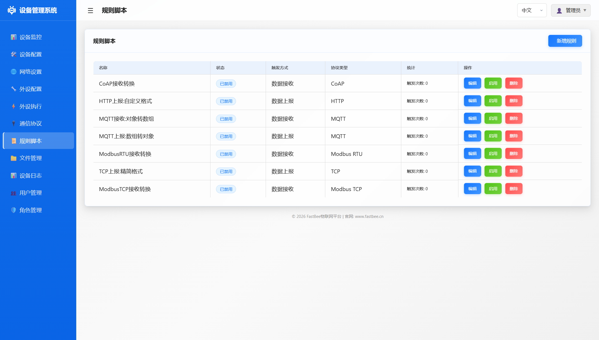

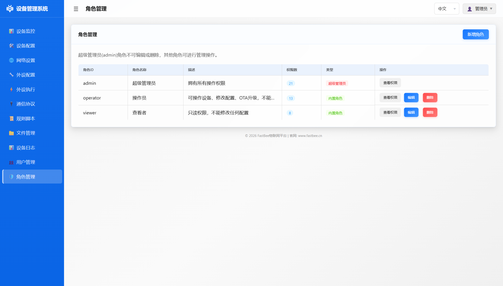

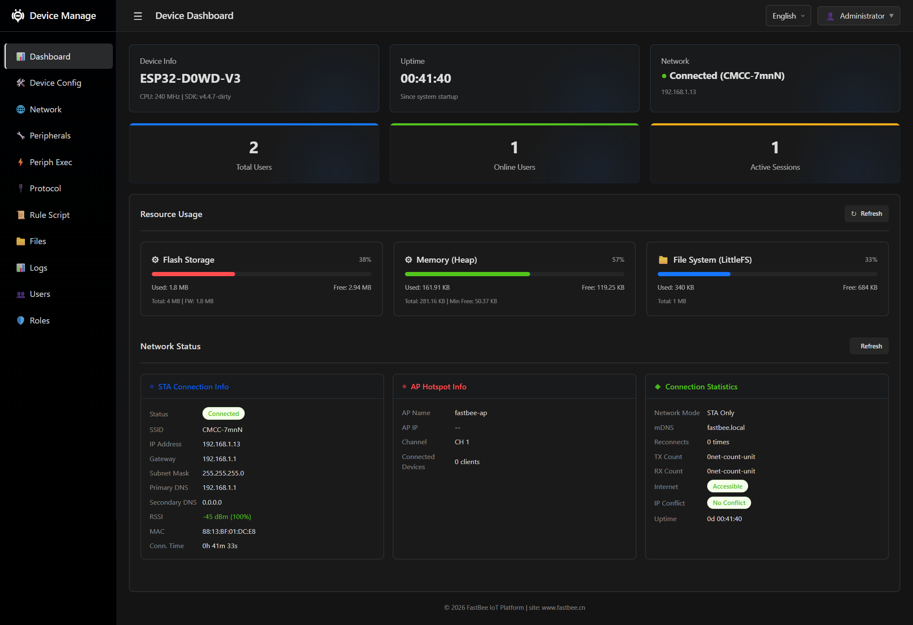

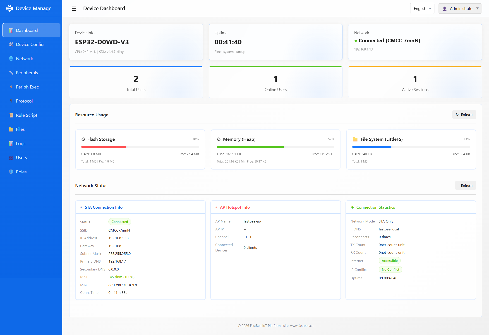

---

### 许可证
本项目采用 MIT 许可证，详见 [LICENSE](./LICENSE) 文件。

---

