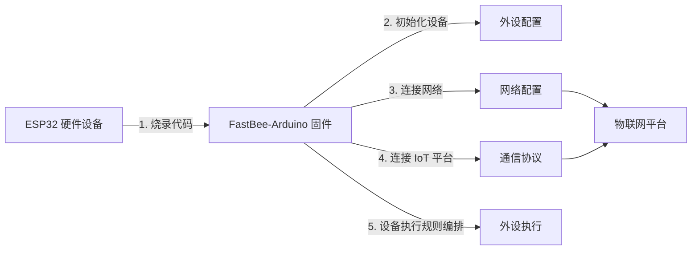

[简体中文](./README.md) | [English](./README.en.md)

<h1 align="center">FastBee-Arduino</h1>

<p align="center">
  <strong>零代码、可视化配置，让 ESP32 像搭积木一样秒变全能物联网设备。</strong>
</p>

<p align="center">
  
  
  
  
  
</p>

<p align="center">
  烧录即用 · 无需编程 · Web 可视化配置 · 多协议多外设
</p>

---

FastBee-Arduino 是一个面向 ESP32 系列芯片的**开源物联网固件框架**。无需编写一行代码，通过内置的 Web 管理界面即可完成外设配置、协议对接、规则编排和远程维护——**真正实现"烧录即用"**。

无论你是快速验证硬件方案的创客，还是需要批量部署的产品团队，只需烧录固件、打开浏览器，就能把一块 ESP32 开发板变成功能完备的物联网终端。

---

## ✨ 四大核心亮点

### 🎛️ 零代码可视化配置

- **Web 全程可视化**：外设、协议、规则全部通过浏览器点选完成，无需编程
- **35+ 外设类型 + 自动引脚适配**：GPIO / PWM / ADC / I2C / SPI / RS485 / UART 等，内置 ESP32 / S3 / C3 引脚冲突检测
- **规则引擎**：5 种触发类型 × 20+ 动作，条件联动随手编排

### 🌐 开箱即用的管理界面

- **8 个功能页面 + 80+ REST API**：仪表板、设备控制、网络、协议、外设、外设执行、规则脚本、系统管理
- **设备大屏**：实时查看传感器数据与 Modbus 寄存器值，远程控制继电器、PWM、电机等外设
- **2500+ 翻译键中英双语 + SSE 实时推送 + Service Worker 离线缓存**

### 📡 ESP32 全系列 + 智能网络

- **三大芯片**：ESP32（双核 240MHz）、ESP32-S3（AI 加速）、ESP32-C3（低成本 RISC-V）
- **AP+STA 双模自动切换**：STA 失败自动回退 AP，配置完成自动切回 STA，设备始终可访问
- **mDNS 本地发现**：通过 `fastbee.local` 直接访问，无需 IP 扫描

### 🔌 工业级协议 + 安全体系

- **MQTT 双认证 + Modbus RTU 主从双模**：MQTT 支持 QoS 0-2 / TLS / AES-CBC-128；Modbus 支持透传 HEX 直报，兼容非标从站
- **企业级安全**：RBAC 三角色 24 权限点、Cookie 会话、MD5+Salt 密码加密
- **脚本化规则引擎**：内置 JS 引擎支持自定义规则脚本，可动态加载不重编固件
- **OTA 远程升级 + 四级内存保护（MemGuard）+ 全链路调试日志**

---

## 🔄 使用流程

从烧录到上云，只需 5 步即可让 ESP32 变成可控的物联网终端：



| 步骤 | 环节 | 做什么 | 对应页面 |
|------|------|--------|----------|
| 1️⃣ | **烧录固件** | 用 PlatformIO 把 FastBee-Arduino 固件烧录到 ESP32 | — |
| 2️⃣ | **外设配置** | 在 Web 界面勾选外设类型、分配引脚，完成硬件初始化 | 外设管理 |
| 3️⃣ | **网络配置** | 填写 WiFi 账号密码，AP+STA 双模自动切换上线 | 网络配置 |
| 4️⃣ | **通信协议** | 配置 MQTT / Modbus 等协议，接入物联网平台 | 协议管理 |
| 5️⃣ | **外设执行** | 配置触发条件与动作，实现按键控灯、定时联动、传感器联控等 | 外设执行 |

> 全程无需编程：烧录固件 → 打开浏览器 → 点选配置 → 设备即刻投入使用。

---

## 📦 硬件产品

<p align="center">
  
</p>

### 核心规格

| 参数 | 说明 |
|------|------|
| 芯片 | ESP32-WROOM-32U |
| CPU | 双核 Xtensa LX6 @ 240 MHz |
| Flash | 4 MB SPI Flash |
| SRAM | 520 KB |
| 无线 | WiFi 802.11 b/g/n + Bluetooth 4.2 + BLE |
| 供电电压 | DC 9-36V |
| 特性 | 外置天线、USB 烧录口、配置按键 |

### 接线端子说明

| 端子 | 功能 | 引脚 |
|------|------|------|
| A/L | RS485-A（TX） | GPIO17 |
| B/H | RS485-B（RX） | GPIO16 |
| VCC | 供电正极 | DC 9-36V |
| GND | 供电负极 | — |
| DGND | 数字地（隔离 GND） | — |
| EGND | 保护地（连接设备外壳） | — |
| IO/L | 隔离型数字输入/输出低端 | GPIO21 |
| IO/H | 隔离型数字输入/输出高端 | GPIO22 |

### 指示灯与按键

| 名称 | 类型 | 说明 |
|------|------|------|
| POWER | 指示灯 | 电源指示灯，常亮表示供电正常 |
| STATE | 指示灯 (GPIO5) | 状态指示灯，低电平点亮 |
| DATA | 指示灯 | 通讯指示灯，数据收发时闪烁 |
| BOOT | 按键 (GPIO0) | 长按进入配置模式 |

---

## 🚀 快速开始

### 1. 环境准备

安装 [VSCode](https://code.visualstudio.com/) 和 [PlatformIO 插件](https://platformio.org/install/ide?install=vscode)。

### 2. 克隆与编译

```bash
# 克隆项目
git clone https://gitee.com/beecue/fastbee-arduino.git
cd fastbee-arduino

# 一键构建前端资源（构建 + Gzip 压缩）
node scripts/gzip-www.js

# 上传文件系统
pio run -e esp32dev --target uploadfs

# 编译并烧录固件（默认 standard 预设）
pio run -e esp32dev --target upload

# 打开串口监视器
pio device monitor -e esp32dev
```

### 3. 访问设备

- 首次启动（未配置 WiFi）自动进入 **AP 模式**，连接热点 `fastbee-ap`
- 浏览器访问 `192.168.4.1` 或 `http://fastbee.local`
- 默认账号：`admin` / `admin123`
- 在 Web 界面「网络配置」中填写 WiFi 账号密码后，设备自动切换至 STA 模式；若 STA 连接失败会自动回退 AP 模式

> 烧录完成后，零代码！打开浏览器即可可视化配置 WiFi、外设、协议、规则等所有参数。
> **注意**：项目已移除独立的蓝牙 BLE 配网与 AP 配网向导流程，统一通过 AP+STA 双模自动切换实现入网。

---

## 📸 功能截图

<table>
  <tr>
    <td></td>
    <td></td>
  </tr>
  <tr>
    <td></td>
    <td></td>
  </tr>
  <tr>
    <td></td>
    <td></td>
  </tr>
  <tr>
    <td></td>
    <td></td>
  </tr>
  <tr>
    <td></td>
    <td></td>
  </tr>
  <tr>
    <td></td>
     <td></td>
  </tr>
</table>

---

## 📋 技术规格

### 芯片支持

| 芯片 | 核心 | 主频 | PSRAM | 特点 |
|------|------|------|-------|------|
| ESP32 | 双核 Xtensa LX6 | 240 MHz | 2 MB | 经典稳定，BT 4.2 + BLE |
| ESP32-S3 | 双核 Xtensa LX7 | 240 MHz | 8 MB | USB-CDC，AI 向量加速 |
| ESP32-C3 | 单核 RISC-V | 160 MHz | 2 MB | 低成本，BLE 5.0 |

### 协议支持

FastBee-Arduino 在工业现场最常用的两类通信协议上做了重点打磨：

| 协议 | 特性 |
|------|------|
| MQTT | 双认证（简单 / AES-CBC-128 加密）、QoS 0/1/2、TLS、断线指数退避重连、环形缓冲队列、统一的 `RX ▼ / TX ▲` 收发调试日志 |
| Modbus RTU | 工业级 RS485 总线、主从双模、8 种功能码、最多 16 个从站、5 种设备类型、**透传模式 HEX 直报** |

### 🏭 工业 Modbus RTU 协议详解

通过 RS485 总线无缝对接 PLC、变频器、温湿度变送器、电表等工业设备。

| 特性 | 说明 |
|------|------|
| 通信总线 | RS485 半双工，硬件 UART + DE/RE 自动流控 |
| 工作模式 | **主站（Master）** 主动轮询 + **从站（Slave）** 被动响应，编译开关可独立裁剪 |
| 标准功能码 | FC01 读线圈、FC02 读离散输入、FC03 读保持寄存器、FC04 读输入寄存器、FC05 写单线圈、FC06 写单寄存器、FC0F 写多线圈、FC10 写多寄存器 |
| 子设备管理 | 最多 **16 个从站**，5 种设备类型：继电器、PWM、PID 控制器、电机、传感器 |
| 寄存器映射 | JSON 配置寄存器偏移 → 传感器标识，支持 uint16/int16/uint32/int32/float32 五种数据类型，可配缩放因子与小数位 |
| OneShot 优先控制 | 独立于周期轮询的一次性读写请求，优先级高于常规轮询任务 |
| 连续超时保护 | 从站连续无响应时自动降频或跳过，避免总线阻塞 |
| 数据变化检测 | 基于 Hash 的数据变化检测，仅在数据变化时上报，减少无效通信 |
| 死区与动态降频 | 寄存器值变化低于死区阈值时不触发上报；轮询频率可根据通信质量动态调整 |
| 透传模式 | **transferType=1** 开启后：平台下发原始 HEX → 自动检测并剥离尾部 CRC → `sendRawFrameOnce` 重新追加 CRC 发送 → 原始响应帧直接 HEX 上报 `/property/post`，兼容非标从站（需平台侧 JS 脚本解析） |
| 编译开关 | `FASTBEE_ENABLE_MODBUS`（主站）、`FASTBEE_MODBUS_SLAVE_ENABLE`（从站），按需启用 |

---

## 📁 项目结构

```
FastBee-Arduino/
├── include/                  # 头文件
│   ├── core/                 # 核心框架（FastBeeFramework、外设管理、规则引擎）
│   ├── network/              # 网络模块（WiFi、Web 服务、OTA、路由处理器）
│   ├── protocols/            # 协议引擎（MQTT、Modbus）
│   ├── security/             # 安全模块（用户/角色/认证/加密）
│   ├── systems/              # 系统服务（日志、任务调度、健康监控、配置存储）
│   └── utils/                # 工具类
├── src/                      # 源代码实现（~15K 行 C++）
├── data/                     # 文件系统镜像
│   ├── www/                  # Web 前端（~260KB gzip，含 8 个功能页面）
│   ├── config/               # JSON 配置文件
│   └── logs/                 # 日志目录
├── web-src/                  # Web 前端源码（开发用）
├── lib/                      # 本地库（ESPAsyncWebServer）
├── scripts/                  # 构建脚本（压缩、模块构建、i18n 校验）
├── test/                     # 单元测试 + Mock
├── docs/                     # 技术文档
├── platformio.ini            # PlatformIO 多环境配置
└── fastbee.csv               # 自定义分区表
```

---

## 💬 交流群

硬件交流 QQ 群：**875651514**


---

## 📜 许可证

本项目采用 **AGPL-3.0** 许可证，详见 [LICENSE](./LICENSE) 文件。

---

## 🔗 相关链接

- 📖 [Wiki 文档](https://gitee.com/beecue/fastbee-arduino/wikis)
- 🐛 [问题反馈](https://gitee.com/beecue/fastbee-arduino/issues)
- 🏠 [Gitee 仓库](https://gitee.com/beecue/fastbee-arduino)

---

<p align="center">
  <sub>如果这个项目对你有帮助，欢迎 ⭐ Star 支持！</sub>
</p>
