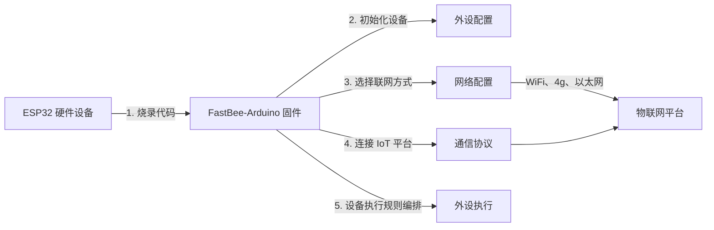

[简体中文](./README.md) | [English](./README.en.md)

<h1 align="center">FastBee-Arduino</h1>

<p align="center">
  <strong>零代码、可视化配置，让 ESP32 像搭积木一样秒变全能物联网设备。</strong>
</p>

<p align="center">
  
  
  
  
</p>

FastBee-Arduino 烧录后即可通过浏览器完成网络、设备、协议、外设和规则配置，适合 ESP32 节点、轻量网关和现场采集控制终端，是面向 ESP32 全系列的零代码 Web 物联网固件。无论你是零基础还是专业开发者，FastBee-Arduino 都能帮你快速、轻松地完成物联网设备的开发与量产。

支持芯片：`ESP32`、`ESP32-S3`、`ESP32-C3`、`ESP32-C6`。

## 预定义环境

| PlatformIO 环境 | 版本 | 芯片 | Flash | PSRAM |
| --- | --- | --- | --- | --- |
| `esp32c3-F4R0` | Lite | ESP32-C3 | 4MB | 无 |
| `esp32c6-F4R0` | Lite | ESP32-C6 | 4MB | 无 |
| `esp32-F4R0` | Standard | ESP32 | 4MB | 无 |
| `esp32s3-F8R0` | Standard | ESP32-S3 | 8MB | 无 |
| `esp32-F8R4` | Full | ESP32 | 8MB | 4MB |
| `esp32s3-F8R4` | Full | ESP32-S3 | 8MB | 4MB |
| `esp32s3-F16R8` | Full | ESP32-S3 | 16MB | 8MB |

> 版本选择的核心依据是 **Flash 容量**和**是否有 PSRAM**。Flash ≥8MB 的环境均支持 OTA 升级（4MB 环境受空间限制不支持）。带 PSRAM 的模组（如 ESP32-WROVER、ESP32-S3-N8R2/N16R8）均可使用 Full 版。

### Lite / Standard / Full 功能对比

| 功能分类 | 功能 | Lite | Standard | Full |
| --- | --- | :---: | :---: | :---: |
| **网络** | WiFi (AP/STA)、MQTT、mDNS | ✅ | ✅ | ✅ |
| | 以太网 (W5500)、4G (EC801E) | ❌ | ✅ | ✅ |
| | LoRa、BLE 配网 | ❌ | ❌ | ✅ |
| **协议** | MQTT 协议 | ✅ | ✅ | ✅ |
| | Modbus RTU 主站 | ❌ | ✅ | ✅ |
| | Modbus 从站、TCP、HTTP、CoAP | ❌ | ❌ | ✅ |
| **外设** | GPIO、DHT11/22、DS18B20 | ✅ | ✅ | ✅ |
| | OLED、TM1637 数码管 | ✅ | ✅ | ✅ |
| | NeoPixel / WS2812B | ✅ | ✅ | ✅ |
| | Command Script 命令脚本 | ❌ | ✅ | ✅ |
| | I2C 传感器 (BMP280/MPU6050) | ❌ | ✅ | ✅ |
| | RFID (MFRC522)、红外遥控 | ❌ | ✅ | ✅ |
| | Rule Script 规则脚本引擎 | ❌ | ❌ | ✅ |
| **执行引擎** | 定时 / 按键 / 条件 / MQTT 触发 | ✅ | ✅ | ✅ |
| | GPIO / 显示 / 延时动作 | ✅ | ✅ | ✅ |
| | Modbus 读写动作 | ❌ | ✅ | ✅ |
| **Web 管理** | 设备仪表盘、外设 / 协议 / 网络配置 | ✅ | ✅ | ✅ |
| | SSE 实时推送、配置导入导出 | ✅ | ✅ | ✅ |
| | 多用户管理、文件管理器、日志查看 | ❌ | ❌ | ✅ |
| | 多语言 (i18n) | ❌ | ❌ | ✅ |
| **系统** | 健康监控、内存门控、任务管理器 | ✅ | ✅ | ✅ |
| | NTP 时间同步、DNS 服务 | ✅ | ✅ | ✅ |
| | OTA 固件 / 文件系统升级 | ❌ | ⚠️ | ✅ |
| | 文件日志 | ❌ | ❌ | ✅ |
| **配置上限** | 最大外设数 | 16 | 24 | 32 |
| | 推荐执行规则数 | 12 | 16 | 32 |

> Standard 版 OTA 仅 `esp32s3-F8R0`（8MB Flash）支持，`esp32-F4R0`（4MB Flash）受空间限制不含 OTA。更详细的功能差异参见 [版本对比](docs/system/edition-comparison.md)。

### 分区表

| 分区文件 | Flash | App 槽位 | OTA | FS | 适用环境 |
| --- | --- | --- | --- | --- | --- |
| `fastbee.csv` | 4MB | 2.88MB × 1 | 否 | 1MB | `esp32c3-F4R0`、`esp32c6-F4R0`、`esp32-F4R0` |
| `fastbee-8MB.csv` | 8MB | 3.5MB × 2 | 是 | 960KB | `esp32s3-F8R0`、`esp32-F8R4`、`esp32s3-F8R4` |
| `fastbee-16MB.csv` | 16MB | 4MB × 2 | 是 | 7.9MB | `esp32s3-F16R8` |

## 快速烧录

### 从源码构建烧录

1. 安装 VSCode + PlatformIO，或安装 PlatformIO CLI。
2. 连接开发板，确认串口号，例如 `COM6`。
3. 在项目根目录执行：

```powershell
cd D:\project\gitee\FastBee-Arduino
powershell -ExecutionPolicy Bypass -File scripts\doctor.ps1 -Port COM6
powershell -ExecutionPolicy Bypass -File scripts\deploy.ps1 -Env esp32-F4R0 -Port COM6
```

常用烧录命令：

```powershell
# ESP32 标准版 (4MB Flash)
powershell -ExecutionPolicy Bypass -File scripts\deploy.ps1 -Env esp32-F4R0 -Port COM6

# ESP32 全功能版 (8MB Flash + 4MB PSRAM)
powershell -ExecutionPolicy Bypass -File scripts\deploy.ps1 -Env esp32-F8R4 -Port COM6

# ESP32-S3 标准版 (8MB Flash)
powershell -ExecutionPolicy Bypass -File scripts\deploy.ps1 -Env esp32s3-F8R0 -Port COM6

# ESP32-S3 全功能版 (16MB Flash + 8MB PSRAM)
powershell -ExecutionPolicy Bypass -File scripts\deploy.ps1 -Env esp32s3-F16R8 -Port COM6

# 部署完成后自动打开串口监视器
powershell -ExecutionPolicy Bypass -File scripts\deploy.ps1 -Env esp32s3-F16R8 -Port COM6 -Monitor

# 只编译，不烧录
powershell -ExecutionPolicy Bypass -File scripts\deploy.ps1 -Env esp32s3-F16R8 -BuildOnly
```

`deploy.ps1` 会先上传与 `-Env` 匹配的 LittleFS Web 文件系统，再烧录固件。加 `-Monitor` 可在部署完成后自动打开串口监视器查看启动日志。脚本启动时会自动清理残留的 esptool/python 进程，避免"文件被占用"错误。

### 直接烧录发布包

仓库保留 `dist/firmware/all-latest/` 下的合并固件，适合不想本地编译的用户直接烧录。合并镜像已经包含 bootloader、分区表、应用固件和 LittleFS Web 文件系统，烧录地址固定为 `0x0`。

| 固件文件 | 目标硬件 |
| --- | --- |
| `fastbee-esp32-F4R0.bin` | ESP32 4MB Flash |
| `fastbee-esp32-F8R4.bin` | ESP32 8MB Flash + 4MB PSRAM |
| `fastbee-esp32c3-F4R0.bin` | ESP32-C3 4MB Flash |
| `fastbee-esp32c6-F4R0.bin` | ESP32-C6 4MB Flash |
| `fastbee-esp32s3-F8R0.bin` | ESP32-S3 8MB Flash |
| `fastbee-esp32s3-F8R4.bin` | ESP32-S3 8MB Flash + 4MB PSRAM |
| `fastbee-esp32s3-F16R8.bin` | ESP32-S3 16MB Flash + 8MB PSRAM |

命令行烧录示例：

```powershell
# 可选：先擦除整片 Flash
esptool.py --chip auto --port COM6 erase_flash

# ESP32 标准版合并镜像，从 0x0 写入
esptool.py --chip auto --port COM6 --baud 921600 write_flash -z 0x0 dist\firmware\all-latest\fastbee-esp32-F4R0.bin

# ESP32-S3 全功能版合并镜像，必须使用 16MB Flash + PSRAM 硬件
esptool.py --chip auto --port COM6 --baud 921600 write_flash -z 0x0 dist\firmware\all-latest\fastbee-esp32s3-F16R8.bin

# ESP32 全功能版合并镜像，必须使用 8MB Flash + 4MB PSRAM 硬件
esptool.py --chip auto --port COM6 --baud 921600 write_flash -z 0x0 dist\firmware\all-latest\fastbee-esp32-F8R4.bin
```

也可以使用 Espressif Flash Download Tool：选择对应 `.bin` 文件，地址填 `0x0`，先 `ERASE` 再 `START`。如果烧录后页面异常，优先确认固件文件与实际芯片/Flash/PSRAM 规格一致。

## 首次访问

设备首次启动或未配置 WiFi 时会进入 AP 模式：

| 项目 | 默认值 |
| --- | --- |
| WiFi 热点 | `FastBee-XXXX` |
| 浏览器地址 | `http://192.168.4.1` 或 `http://fastbee.local` |
| 用户名 | `admin` |
| 密码 | `admin123` |

登录后按顺序完成：

1. 在“网络配置”中配置 WiFi、以太网或 4G。
2. 在“设备配置”中确认设备编号、产品编号和时间配置。
3. 在“通信协议”中配置 MQTT、Modbus RTU 等协议。
4. 在“外设配置”中添加并启用实际接线的外设。
5. 在“外设执行”中配置定时、事件或传感器联动规则。

默认外设模板和执行规则都是安全禁用状态，首次接线后请先确认引脚、供电和外设 ID，再逐项启用。

## 🔄 使用流程

从烧录到上云，只需 5 步即可让 ESP32 变成可控的物联网终端：



| 步骤 | 环节 | 做什么 | 对应页面 |
|------|------|--------|----------|
| 1 | **烧录固件** | 用 PlatformIO 把 FastBee-Arduino 固件烧录到 ESP32 | — |
| 2 | **外设配置** | 在 Web 界面勾选外设类型、分配引脚，完成硬件初始化 | 外设配置 |
| 3 | **网络配置** | 选择联网方式（WiFi / 以太网 / 4G），填写参数后保存，AP+STA 双模自动切换上线 | 网络配置 |
| 4 | **通信协议** | 配置 MQTT / Modbus RTU 等协议，接入物联网平台 | 通信协议 |
| 5 | **外设执行** | 配置触发条件与动作，实现按键控灯、定时联动、传感器联控等 | 外设执行 |

> 全程无需编程：烧录固件 → 打开浏览器 → 点选配置 → 设备即刻投入使用。

## 📸 功能截图

<table>
  <tr>
    <td></td>
    <td></td>
  </tr>
  <tr>
    <td></td>
    <td></td>
  </tr>
</table>

---

## 验证测试

本项目提供统一测试入口，用于保证不同芯片、不同版本和 Web 页面产物可用。

```powershell
# 提交前快速检查：配置、i18n、Web 资源、全芯片编译
powershell -ExecutionPolicy Bypass -Command ".\scripts\test-all.ps1 -Checks static,build"

# 本地完整矩阵，不访问真实设备
powershell -ExecutionPolicy Bypass -Command ".\scripts\test-all.ps1 -Checks static,native,build,artifacts"

# 烧录真实设备后的 API 冒烟
powershell -ExecutionPolicy Bypass -File scripts\smoke-test-device.ps1 -BaseUrl http://192.168.4.1 -Profile standard

# 长时间稳定性测试，输出 CSV
powershell -ExecutionPolicy Bypass -File scripts\soak-test-device.ps1 -BaseUrl http://设备IP -Profile full -Rounds 100
```

设备测试按 `lite`、`standard`、`full` 档位检查登录、系统、网络、设备配置、协议、MQTT、外设、外设执行和 Full 管理接口。Web 静态冒烟会检查 gzip 资源、页面/模块完整性、JS 语法和首屏资源预算，避免页面访问变慢或资源缺失。

## 发布产物

一次生成所有版本合并固件：

```powershell
powershell -ExecutionPolicy Bypass -File scripts\build-all-artifacts.ps1 -CleanOutput
```

输出目录：

```text
dist/firmware/all-latest/
```

产物是包含 bootloader、分区表、应用固件和 LittleFS 的合并镜像，适合量产烧录工具使用。

## 项目结构

```text
src/          固件源码
include/      头文件和功能开关
data/         LittleFS 默认配置与 Web 产物
web-src/      Web 前端源码
scripts/      构建、烧录、测试、发布脚本
test/         PlatformIO native 测试
docs/         使用、部署、测试和功能文档
```

## 常用文档

| 文档 | 内容 |
| --- | --- |
| [快速开始](docs/quick-start.md) | 从烧录到创建第一条规则 |
| [部署与版本验证](docs/deployment.md) | 固件、LittleFS、发布包和真实设备验证 |
| [测试与版本验证](docs/testing.md) | 静态检查、native、全芯片编译、冒烟和稳定性测试 |
| [版本对比](docs/system/edition-comparison.md) | Lite、Standard、Full 功能差异 |
| [项目结构](docs/project-structure.md) | 目录、模块和构建产物说明 |
| [用户手册](docs/user-manual.md) | Web 页面和功能操作说明 |
| [支持模块清单](docs/peripherals/supported-sensors-and-modules.md) | 各版本支持的模块、传感器和接入方式 |
| [外设文档](docs/peripherals/README.md) | GPIO、传感器、显示、RFID、Modbus 外设 |
| [外设执行](docs/periph-exec/README.md) | 触发器、动作和联动规则 |
| [示例教程](docs/examples/README.md) | LED、继电器、传感器、显示屏和 Modbus 示例 |
| [商用授权](docs/commercial-license.md) | AGPL 协议与商用授权说明 |

## 许可证

本项目采用 [AGPL-3.0](LICENSE) 开源协议，个人免费使用，商用需购买授权。详见 [商用授权](docs/commercial-license.md)。
