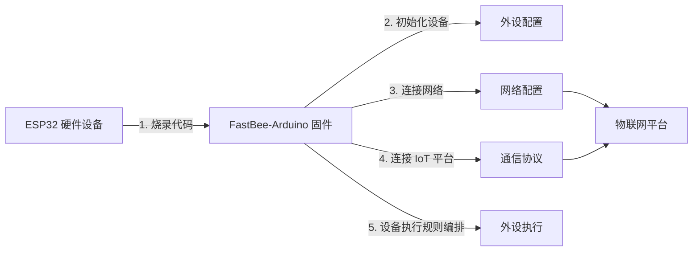

[简体中文](./README.md) | [English](./README.en.md)

<h1 align="center">FastBee-Arduino</h1>

<p align="center">
  <strong>零代码、可视化配置，让 ESP32 像搭积木一样秒变全能物联网设备。</strong>
</p>

<p align="center">
  
  
  
  
  
  
</p>

<p align="center">
  烧录即用 · 无需编程 · Web 可视化配置 · 多协议多外设
</p>

---

FastBee-Arduino 是一个面向 ESP32 系列芯片的**开源物联网固件框架**。无需编写一行代码，通过内置的 Web 管理界面即可完成外设配置、协议对接、规则编排和远程维护，真正实现“烧录即用”。

**无论你是零基础还是专业开发者，FastBee-Arduino 都能帮你快速、轻松地完成物联网设备的开发与量产。**

本项目支持 **ESP32 全系列芯片**（ESP32 / ESP32-S3 / ESP32-C3 / ESP32-C6 / ESP32-S2），基于 **Arduino-ESP32 3.x**（ESP-IDF 5.1+）构建。按硬件资源和功能需求划分为**精简版 (Lite)**、**标准版 (Standard)** 和**全功能版 (Full)** 三个层级：精简版面向 C3/C6/S2 低成本节点，标准版面向 ESP32/S3 通用开发，全功能版面向 S3 旗舰级网关。详见 [版本对比指南](docs/system/edition-comparison.md)。

---

## 系统特点

FastBee-Arduino 是为资源受限 ESP32 全系列芯片打磨的本地 Web 物联网固件：烧录后通过浏览器完成联网、外设、协议和执行规则配置，适合从样机验证到轻量现场终端部署。

- **全系列芯片支持**：ESP32、ESP32-S3、ESP32-C3、ESP32-C6、ESP32-S2 全面覆盖，从 ¥9 入门到旗舰级方案一套代码搞定。
- **Arduino 3.x 生态**：基于 Arduino-ESP32 3.x（ESP-IDF 5.1+），搭配 ESPAsyncWebServer 3.x、NimBLE 2.x 等最新库，长期维护有保障。
- **浏览器即控制台**：设备监控、设备大屏、网络配置、设备配置、缓存管理、配置导入/导出和外设执行都在本地 Web 界面完成。
- **多联网方式**：默认 WiFi；标准版/全功能版支持以太网（W5500 SPI）和 4G 蜂窝（TinyGSM），全功能版支持 LoRa 网关透传（E22-400T22D）。
- **协议与外设一体化**：内置 MQTT；标准版/全功能版支持 Modbus RTU 主站、寄存器映射、子设备控制，并提供 GPIO、传感器、显示屏、数码管、RS485/UART 等常用外设能力。
- **面向现场稳定性**：AP/STA 入网、mDNS 访问、按需加载、轻量化首屏请求、多文件/分片配置导入，降低 ESP32 在浏览器并发访问下的内存压力。
- **三层版本体系**：精简版（C3/C6/S2）→ 标准版（ESP32/S3）→ 全功能版（S3），通过编译开关裁剪，配置文件通用，无缝升级。

---

## 🔄 使用流程

从烧录到上云，只需 5 步即可让 ESP32 变成可控的物联网终端：



| 步骤 | 环节 | 做什么 | 对应页面 |
|------|------|--------|----------|
| 1 | **烧录固件** | 用 PlatformIO 把 FastBee-Arduino 固件烧录到 ESP32 | — |
| 2 | **外设配置** | 在 Web 界面勾选外设类型、分配引脚，完成硬件初始化 | 外设配置 |
| 3 | **网络配置** | 填写 WiFi 账号密码，AP+STA 双模自动切换上线 | 网络配置 |
| 4 | **通信协议** | 配置 MQTT / Modbus RTU 等协议，接入物联网平台 | 通信协议 |
| 5 | **外设执行** | 配置触发条件与动作，实现按键控灯、定时联动、传感器联控等 | 外设执行 |

> 全程无需编程：烧录固件 → 打开浏览器 → 点选配置 → 设备即刻投入使用。

---

## 📦 硬件产品

<p align="center">
  
</p>

### 核心规格

| 参数 | 说明 |
|------|------|
| 芯片 | ESP32-WROOM-32U |
| CPU | 双核 Xtensa LX6 @ 240 MHz |
| Flash | 4 MB SPI Flash |
| SRAM | 520 KB |
| 无线 | WiFi 802.11 b/g/n + Bluetooth 4.2 + BLE |
| 供电电压 | DC 9-36V |
| 特性 | 外置天线、USB 烧录口、配置按键 |

### 接线端子说明

| 端子 | 功能 | 引脚 |
|------|------|------|
| A/L | RS485-A（TX） | GPIO17 |
| B/H | RS485-B（RX） | GPIO16 |
| VCC | 供电正极 | DC 9-36V |
| GND | 供电负极 | — |
| DGND | 数字地（隔离 GND） | — |
| EGND | 保护地（连接设备外壳） | — |
| IO/L | 隔离型数字输入/输出低端 | GPIO21 |
| IO/H | 隔离型数字输入/输出高端 | GPIO22 |

### 指示灯与按键

| 名称 | 类型 | 说明 |
|------|------|------|
| POWER | 指示灯 | 电源指示灯，常亮表示供电正常 |
| STATE | 指示灯 (GPIO5) | 状态指示灯，低电平点亮 |
| DATA | 指示灯 | 通讯指示灯，数据收发时闪烁 |
| BOOT | 按键 (GPIO0) | 长按进入配置模式 |

---

## 📸 功能截图

以下截图覆盖精简版核心页面和 `esp32s3-full` 全功能版能力。不同构建环境会按版本层级裁剪菜单和功能：精简版（C3/C6/S2）展示核心页面，标准版（ESP32/S3）增加以太网、4G、Modbus、I2C/RFID/IR 支持，全功能版保留文件、日志、用户角色、RuleScript、OTA 和中英文切换等能力。

<table>
  <tr>
    <td></td>
    <td></td>
  </tr>
  <tr>
    <td></td>
    <td></td>
  </tr>
  <tr>
    <td></td>
    <td></td>
  </tr>
  <tr>
    <td></td>
    <td></td>
  </tr>
  <tr>
    <td></td>
    <td></td>
  </tr>
  <tr>
    <td></td>
    <td></td>
  </tr>
</table>

---

## 快速开始

### 1. 环境准备

安装 VSCode 和 PlatformIO，或直接使用 PlatformIO CLI。

### 2. 构建并上传 Web 文件系统

```powershell
cd D:\project\gitee\FastBee-Arduino
node scripts/gzip-www.js --web-slim --no-monitor
```

该命令会生成 slim Web 资源、gzip 压缩、组装干净 staging 镜像，并使用 `platformio.ini` 中的默认 `esp32` 环境上传 LittleFS 文件系统。

如只想生成镜像不上传：

```powershell
node scripts/gzip-www.js --web-slim --no-upload --no-monitor
```

生成后的镜像位于：

```text
.pio/fs-staging/run-*/www
```

### 3. 编译并烧录固件

```powershell
pio run -e esp32 --target upload
```

ESP32-S3 标准版：

```powershell
pio run -e esp32s3 --target upload
```

ESP32-S3 全功能版：

```powershell
pio run -e esp32s3-full --target upload
```

### 4. 打开串口监视器

```powershell
pio device monitor -e esp32 -b 115200
```

### 5. 访问设备

- 首次启动或 WiFi 未配置时，设备进入 AP 模式。
- 浏览器访问 `http://192.168.4.1` 或 `http://fastbee.local`。
- 默认账号：`admin`
- 默认密码：`admin123`

---

## 构建环境

| 环境 | 目标硬件 | 版本层级 | 说明 |
|------|----------|----------|------|
| `esp32` | ESP32-WROOM / ESP32-WROVER | 标准版 | 默认推荐，经典双核方案 |
| `esp32c3` | ESP32-C3 | 精简版 | RISC-V 低成本方案（¥9-12） |
| `esp32c6` | ESP32-C6 | 精简版 | WiFi 6 + BLE 5.3 新一代低成本方案 |
| `esp32s2` | ESP32-S2 | 精简版 | Xtensa 单核，WiFi only（无 BLE） |
| `esp32s3` | ESP32-S3 | 标准版 | 高性能双核，I2C/RFID/IR 扩展 |
| `esp32s3-full` | ESP32-S3 | 全功能版 | OTA + 多用户 + BLE 配网 + 全协议 |
| `native` | PC | 测试 | 本机单元测试 |

PlatformIO 不会根据串口连接自动切换构建环境，目标由命令中的 `-e` 环境名决定。未显式指定 `-e` 时按 `default_envs = esp32` 构建。

```powershell
# 精简版
pio run -e esp32c3        # ESP32-C3
pio run -e esp32c6        # ESP32-C6（需 pioarduino 平台）
pio run -e esp32s2        # ESP32-S2

# 标准版
pio run -e esp32          # 经典 ESP32（默认）
pio run -e esp32s3        # ESP32-S3

# 全功能版
pio run -e esp32s3-full   # ESP32-S3 全功能
```

实际部署建议 classic ESP32 优先使用 `esp32`，ESP32-S3 先使用 `esp32s3` 标准版，确认资源余量后再切换 `esp32s3-full`。Web 文件系统和固件需要配套烧录；`data/www` 只保留上传硬件用的压缩产物，部署时以 `.pio/fs-staging/run-*/www` 生成的干净镜像为准。

> **注意**：ESP32-C6 环境需使用 [pioarduino](https://github.com/pioarduino/platform-espressif32) 社区平台，详见 [版本对比指南](docs/system/edition-comparison.md#esp32-c6-特别说明)。

---

## 项目结构

```text
FastBee-Arduino/
├── include/                  # 头文件
│   ├── core/                 # 框架、外设、执行调度
│   ├── network/              # WiFi、Web 服务、路由处理器、多联网适配器
│   ├── protocols/            # MQTT、Modbus
│   ├── security/             # 认证、session、单管理员模式
│   └── systems/              # 健康监控、配置存储、日志系统
├── src/                      # C++ 实现
│   └── network/              # 含 EthernetAdapter / CellularAdapter / LoRaAdapter
├── web-src/                  # Web 前端源码，页面/样式/模块都从这里维护
│   ├── css/                  # 共享样式源码
│   ├── js/                   # 启动、状态、请求调度源码
│   ├── modules/              # 页面运行时模块源码
│   └── pages/                # 页面和页面片段源码
├── data/
│   ├── config/               # 默认 JSON 配置
│   └── www/                  # Web 发布产物，仅保留上传硬件用压缩文件和静态图片
│       ├── assets/           # logo、favicon 等静态二进制资源
│       ├── css/*.css.gz      # 由 web-src/css 生成的压缩样式
│       ├── js/**/*.js.gz     # 由 web-src/js、web-src/modules 生成的压缩脚本
│       └── pages/**/*.html.gz # 由 web-src/pages 生成的压缩页面
├── scripts/                  # Web 构建、gzip、manifest、校验脚本
├── test/                     # 单元测试与 mock
├── docs/                     # 项目文档
├── platformio.ini            # 精简后的 PlatformIO 环境矩阵
└── fastbee.csv               # 分区表
```

## 许可证

本项目采用 **AGPL-3.0** 许可证，详见 [LICENSE](./LICENSE)。

---

## 相关文档

> 📚 **完整文档索引**: [docs/README.md](docs/README.md)

### 📘 新手入门
- [项目概述](docs/overview.md) - 项目背景、目标、特性、技术栈
- [快速开始](docs/quick-start.md) - 5步完成首次配置 ⭐
- [用户手册](docs/user-manual.md) - 完整操作手册、排错指南

### 📗 进阶学习
- [架构设计](docs/architecture.md) - 系统架构和模块关系
- [核心框架](docs/core-framework.md) - 主要组件和关键类
- [开发指南](docs/development-guide.md) - 环境搭建和贡献规范

### 📙 配置参考
- [外设配置指南](docs/peripherals/peripheral-configuration-guide.md) - 所有外设类型详解(610行)
- [外设执行指南](docs/periph-exec/periph-exec-configuration-guide.md) - 触发器与动作详解(694行)
- [Modbus使用指南](docs/protocols/modbus_usage_guide.md) - Modbus协议详解(1158行)
- [OLED使用指南](docs/peripherals/oled_usage_guide.md) - OLED显示详解(430行)
- [脚本使用指南](docs/periph-exec/script-guide.md) - 命令脚本完整说明(1096行)
- [配置导入导出](docs/system/device-config.md) - 配置备份和迁移
- [外设执行流程](docs/periph-exec/periph_exec_flow.md) - 底层架构和任务调度(1457行)

### 📕 示例教程
- [示例文档](docs/examples/README.md) - 48个典型应用示例
- [传感器完整指南](docs/peripherals/sensor-guide-complete.md) - 40+种传感器参考手册
- [应用场景](docs/scenarios/README.md) - 完整应用场景方案

### 📓 系统文档
- [系统管理](docs/system/README.md) - 设备/网络/用户/文件管理
- [配置导入导出](docs/system/device-config.md) - 备份和恢复配置
- [固件版本说明](docs/system/firmware-version-profiles.md) - Lite/Standard/Full 版本功能差异
- [版本对比指南](docs/system/edition-comparison.md) - 精简版/标准版/全功能版对比

### 🔗 外部资源
- [Wiki 文档](https://gitee.com/beecue/fastbee-arduino/wikis)
- [问题反馈](https://gitee.com/beecue/fastbee-arduino/issues)
- [Gitee 仓库](https://gitee.com/beecue/fastbee-arduino)
