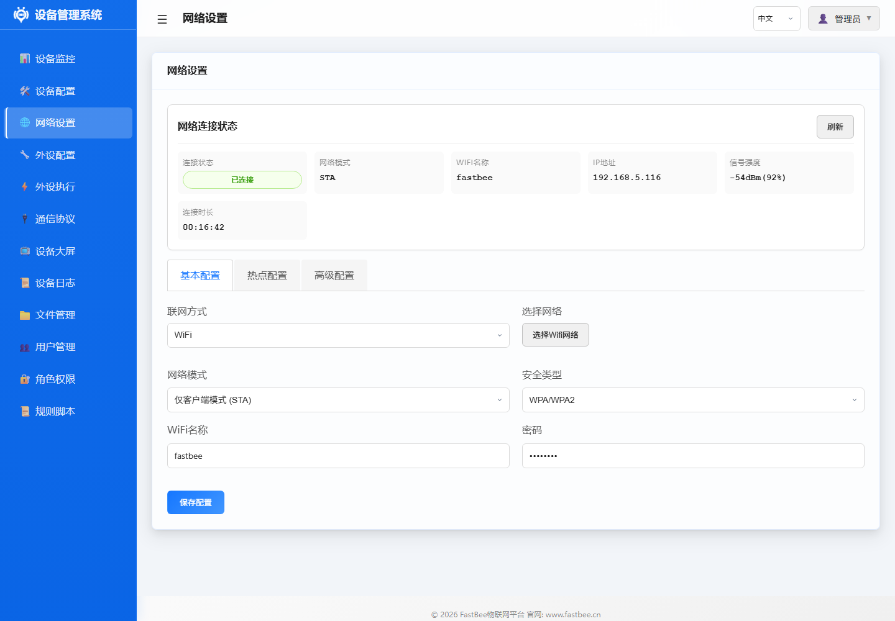
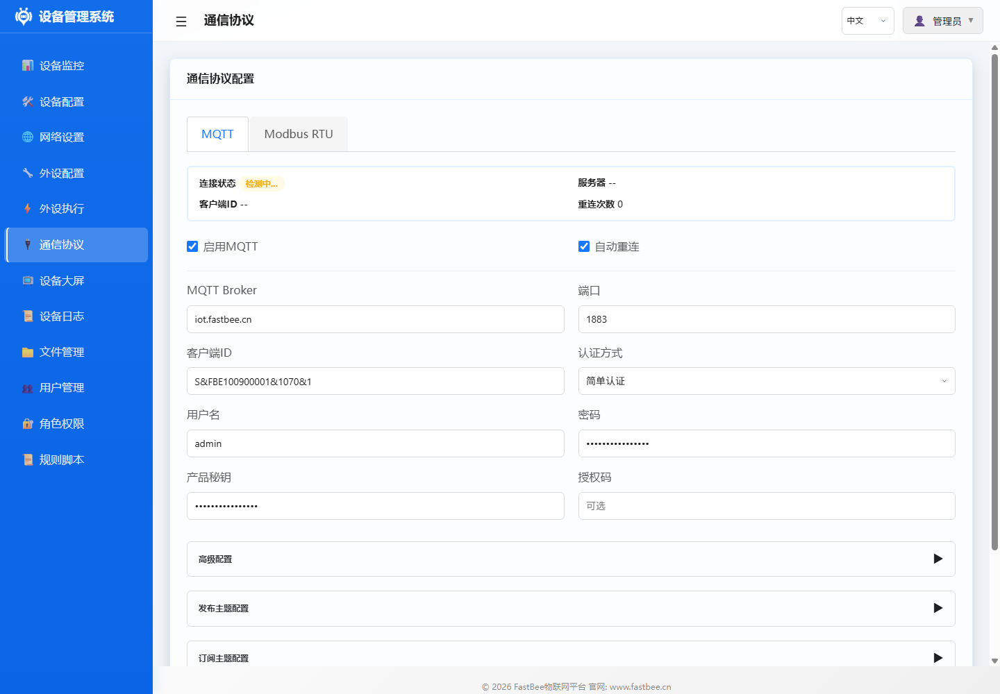
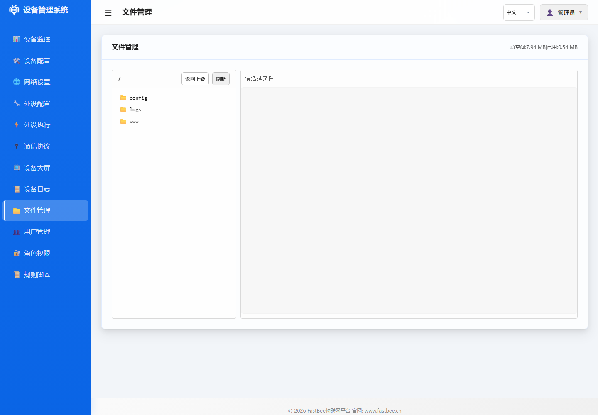

# FastBee-Arduino 完整文档索引

> 📅 更新日期：2026-06-04  
> 📚 文档体系：6大核心文档 + 50个示例 + 25个外设手册 + 支持清单 + 完整配置指南

---

## 图文导览

下面截图来自一台已烧录 `esp32s3-F16R8` 的实际设备，访问地址为 `http://192.168.5.116/`。读者可以先看登录页和仪表台，确认 Web 管理界面的整体布局，再进入对应功能文档查看细节。


| 功能界面 | 截图 | 说明 |
|---|---|---|
| 网络设置 |  | 查看当前 WiFi、IP、信号强度，并配置 STA/AP、高级网络参数。 |
| 外设配置 |  | 管理 GPIO、ADC、传感器、Modbus 子设备等硬件抽象对象。 |
| 外设执行 |  | 查看和维护自动化规则，默认规则保持禁用，现场确认后再启用。 |
| 通信协议 |  | 配置 MQTT、Modbus RTU 等平台对接与现场总线能力。 |
| 文件管理 |  | 查看 LittleFS 文件和配置备份，适合现场维护与迁移。 |

移动端也可以直接访问同一地址，常用于现场巡检或快速查看设备状态：


不同读者可以按学习路径图进入文档：新手先跑通设备，集成者看外设和协议，开发者看架构和核心框架，发布者看部署、测试和稳定性检查。

更多页面截图、验收路径和图片复用说明见 [Web 控制台图文导览](web-console-visual-guide.md)。
图片命名、替换和校验规则见 [文档图片资产维护指南](image-assets.md)。

## 发布稳定性入口

发布、部署和长期运行验证请优先阅读：[稳定性与发布检查清单](stability-release-checklist.md)。

面向轻量版、标准版和全功能版长期稳定运行的关键材料：

- [架构设计](architecture.md)：系统定位、版本稳定性基线、启动与异常恢复链路。
- [通信协议文档](protocols/README.md)：统一 Topic、数据包络、命令响应、状态/故障码、OTA 与远程配置格式。
- [测试与版本验证指南](testing.md)：冒烟测试清单、功能测试矩阵、断网重连、掉电恢复和长稳报告模板。
- [稳定性与发布检查清单](stability-release-checklist.md)：发布流程、长稳执行、故障码与现场排查手册。

## 🚀 快速导航

**我想...**

| 目标 | 阅读文档 | 预计时间 |
|------|---------|----------|
| 了解项目是什么 | [项目概述](overview.md) | 5分钟 |
| 快速上手使用 | [快速开始](quick-start.md) | 15分钟 |
| 部署和验证固件 | [部署与版本验证指南](deployment.md) | 10分钟 |
| 完整测试各版本 | [测试与版本验证指南](testing.md) | 15分钟 |
| 了解目录和文件 | [项目目录与文件说明](project-structure.md) | 10分钟 |
| 选择固件版本 | [版本对比指南](system/edition-comparison.md) | 5分钟 |
| 选择支持的模块/传感器 | [支持清单](peripherals/supported-sensors-and-modules.md) | 5分钟 |
| 配置传感器/外设 | [示例文档](examples/README.md) | 10分钟/个 |
| 创建自动化规则 | [外设执行配置](periph-exec/README.md) | 20分钟 |
| 理解系统架构 | [架构设计](architecture.md) | 30分钟 |
| 参与开发贡献 | [开发指南](development-guide.md) | 40分钟 |
| 排查问题 | [用户手册](user-manual.md) | 按需查阅 |

---

## 📖 核心文档（必读）

### 📘 入门系列
| 文档 | 说明 | 适合人群 |
|------|------|----------|
| [项目概述](overview.md) | 项目背景、目标、特性、技术栈、版本对比 | 所有人 |
| [快速开始](quick-start.md) | 5步完成首次配置，烧录到联动规则 | 新手用户 |
| [部署与版本验证](deployment.md) | 一键烧录、冒烟测试、发布产物和长期稳定建议 | 运维/开发者 |
| [测试与版本验证](testing.md) | 静态检查、native、全版本编译、设备 smoke/soak 测试矩阵 | 开发者/测试人员 |
| [项目目录与文件说明](project-structure.md) | 顶层目录、源码模块、脚本、测试和生成产物说明 | 开发者/维护者 |
| [用户手册](user-manual.md) | 完整操作手册、高级功能、排错指南 | 所有用户 |

### 📗 进阶系列
| 文档 | 说明 | 适合人群 |
|------|------|----------|
| [架构设计](architecture.md) | 整体架构图、模块职责、数据流、设计模式 | 进阶用户/开发者 |
| [核心框架](core-framework.md) | FastBeeFramework、规则引擎、外设管理详解 | 开发者 |
| [开发指南](development-guide.md) | 环境搭建、编码规范、测试流程、扩展开发 | 贡献者 |

---

## 📚 文档分类导航

### 1️⃣ 快速入门（7个）

> 适合第一次使用 FastBee 的用户，按顺序阅读效果最佳

| 序号 | 文档 | 说明 | 必读 |
|------|------|------|------|
| 1 | [项目概述](overview.md) | 项目背景、目标、特性、技术栈 | ⭐ |
| 2 | [快速开始](quick-start.md) | 5步完成首次配置 | ⭐ |
| 3 | [部署与版本验证](deployment.md) | 一键烧录、版本发布、设备冒烟测试 | ⭐ |
| 4 | [用户手册](user-manual.md) | 完整操作手册、排错指南 | ⭐ |
| 5 | [架构设计](architecture.md) | 系统架构和模块关系 | 推荐 |
| 6 | [核心框架](core-framework.md) | 主要组件和关键类 | 开发者 |
| 7 | [开发指南](development-guide.md) | 环境搭建和贡献规范 | 开发者 |

### 2️⃣ 示例文档（50个）- [examples/](examples/README.md)

#### LED与显示（8个）
| 序号 | 文档 | 说明 |
|------|------|------|
| 01 | [LED首次使用](examples/01-led-first.md) | LED基础配置 |
| 02 | [LED闪烁](examples/02-led-blink.md) | LED闪烁控制 |
| 03 | [流水灯](examples/03-led-flowing.md) | 流水灯效果 |
| 03b | [流水灯-脚本](examples/03b-led-flowing-command-script.md) | 脚本实现流水灯 |
| 11 | [PWM呼吸灯](examples/11-pwm-breathing.md) | PWM调光 |
| 14 | [RGB灯带](examples/14-rgb-neopixel.md) | NeoPixel控制 |
| 15 | [数码管显示](examples/15-seven-segment.md) | TM1637数码管 |
| 23 | [OLED显示](examples/23-oled-display.md) | OLED屏幕 |

#### 电机控制（3个）
| 序号 | 文档 | 说明 |
|------|------|------|
| 07 | [直流电机](examples/07-dc-motor.md) | DC电机控制 |
| 08 | [步进电机](examples/08-stepper-motor.md) | 步进电机控制 |
| 22 | [舵机SG90](examples/22-servo-sg90.md) | 舵机角度控制 |

#### 传感器（25个）
详见 [示例文档完整列表](examples/README.md)

#### 通信与控制（7个）
详见 [示例文档完整列表](examples/README.md)

#### Modbus应用（5个）
详见 [示例文档完整列表](examples/README.md)

### 3️⃣ 应用场景（4个）- [scenarios/](scenarios/README.md)
| 文档 | 说明 |
|------|------|
| [OLED显示温度](scenarios/display-temperature-oled.md) | 温度传感器+OLED |
| [数码管显示温度](scenarios/display-temperature-tm1637.md) | 温度传感器+数码管 |
| [Modbus控制设备](scenarios/modbus-control-devices.md) | Modbus远程控制 |
| [Modbus传感器设备](scenarios/modbus-sensor-devices.md) | Modbus数据采集 |

### 4️⃣ 外设执行 - [periph-exec/](periph-exec/README.md)

#### 触发器（4个）- [triggers/](periph-exec/triggers/)
| 文档 | 说明 |
|------|------|
| [平台触发](periph-exec/triggers/platform-trigger.md) | MQTT平台指令触发 |
| [定时触发](periph-exec/triggers/timer-trigger.md) | 时间间隔触发 |
| [事件触发](periph-exec/triggers/event-trigger.md) | 系统事件触发 |
| [轮询触发](periph-exec/triggers/poll-trigger.md) | 条件轮询触发 |

#### 动作类型（8个）- [actions/](periph-exec/actions/)
| 文档 | 说明 |
|------|------|
| [GPIO动作](periph-exec/actions/gpio-actions.md) | 高/低电平/闪烁 |
| [PWM动作](periph-exec/actions/pwm-actions.md) | PWM控制/呼吸灯 |
| [传感器读取](periph-exec/actions/sensor-actions.md) | 数据采集 |
| [显示动作](periph-exec/actions/display-actions.md) | OLED/数码管显示 |
| [Modbus动作](periph-exec/actions/modbus-actions.md) | Modbus读写（标准版/全功能版） |
| [脚本动作](periph-exec/actions/script-actions.md) | 命令脚本（标准版/全功能版） |
| [事件控制](periph-exec/actions/event-actions.md) | 事件触发/规则控制 |
| [系统动作](periph-exec/actions/system-actions.md) | 重启/OTA/NTP |

#### 执行场景（6个）- [scenarios/](periph-exec/scenarios/)
| 文档 | 说明 |
|------|------|
| [温湿度报警](periph-exec/scenarios/temperature-alarm.md) | 温控系统 |
| [烟雾报警](periph-exec/scenarios/smoke-alarm.md) | 烟雾检测报警 |
| [光控灯](periph-exec/scenarios/light-control.md) | 光照自动开关灯 |
| [按键控制](periph-exec/scenarios/button-control.md) | 按键多功能 |
| [Modbus监控](periph-exec/scenarios/modbus-monitor.md) | Modbus数据采集 |
| [超声波报警](periph-exec/scenarios/ultrasonic-alarm.md) | 距离过近报警 |

### 5️⃣ 外设参考手册 - [peripherals/](peripherals/README.md)

#### GPIO与PWM（4个）
| 文档 | 类型 | 说明 |
|------|------|------|
| [GPIO输出](peripherals/gpio-output.md) | type:12 | LED/继电器/蜂鸣器 |
| [GPIO输入](peripherals/gpio-input.md) | type:11/13/14 | 按键/传感器数字输入 |
| [PWM输出](peripherals/pwm-output.md) | type:17 | LED调光/电机调速 |
| [ADC输入](peripherals/adc-input.md) | type:15/26 | 模拟信号采集 |

#### 电机控制（2个）
| 文档 | 类型 | 说明 |
|------|------|------|
| [舵机](peripherals/servo.md) | type:41 | SG90/MG996R角度控制 |
| [步进电机](peripherals/stepper-motor.md) | type:42 | 28BYJ-48精确定位 |

#### 显示设备（3个）
| 文档 | 类型 | 说明 |
|------|------|------|
| [OLED显示](peripherals/display-oled.md) | type:36 | SSD1306/SH1106 |
| [TM1637数码管](peripherals/display-tm1637.md) | type:47 | 4位7段数码管 |
| [LCD1602](peripherals/display-lcd1602.md) | type:36 | 字符屏（占位） |

#### 温湿度传感器（4个）
| 文档 | 类型 | 说明 |
|------|------|------|
| [DHT11/DHT22](peripherals/sensor-dht.md) | type:38 | 单总线温湿度 |
| [DS18B20](peripherals/sensor-ds18b20.md) | type:38 | OneWire温度 |
| [AHT20](peripherals/sensor-aht20.md) | type:38 | I2C温湿度 |
| [SHT31](peripherals/sensor-sht31.md) | type:38 | I2C高精度温湿度 |

#### 环境传感器（4个）
| 文档 | 类型 | 说明 |
|------|------|------|
| [超声波](peripherals/sensor-ultrasonic.md) | type:38 | HC-SR04测距 |
| [BMP280](peripherals/sensor-bmp280.md) | type:38 | 气压/温度/海拔 |
| [MPU6050](peripherals/sensor-mpu6050.md) | type:38 | 六轴陀螺仪 |
| [BH1750](peripherals/sensor-bh1750.md) | type:38 | 光照强度 |

#### 通信设备（3个）
| 文档 | 类型 | 说明 |
|------|------|------|
| [Modbus设备](peripherals/modbus-device.md) | type:51 | RS485从站控制（标准版/全功能版） |
| [红外遥控](peripherals/ir-remote.md) | type:38 | NEC/RC5解码 |
| [RFID读卡器](peripherals/rfid-mfrc522.md) | type:38 | MFRC522射频卡 |

#### 其他外设（3个）
| 文档 | 类型 | 说明 |
|------|------|------|
| [NeoPixel](peripherals/neopixel.md) | type:45 | WS2812B灯带 |
| [旋转编码器](peripherals/encoder.md) | type:43 | AB相计数 |
| [SD卡](peripherals/storage-sd-card.md) | type:37 | 数据存储（占位） |

### 6️⃣ 完整配置指南

| 文档 | 说明 | 链接 |
|------|------|------|
| 外设配置指南 | 所有外设类型详解(610行) | [peripherals/peripheral-configuration-guide.md](peripherals/peripheral-configuration-guide.md) |
| 外设执行指南 | 触发器与动作详解(694行) | [periph-exec/periph-exec-configuration-guide.md](periph-exec/periph-exec-configuration-guide.md) |
| 脚本使用指南 | 命令脚本完整说明，Lite 默认不可用 | [periph-exec/script-guide.md](periph-exec/script-guide.md) |
| Modbus使用指南 | Modbus协议详解，需标准版/全功能版 | [protocols/modbus_usage_guide.md](protocols/modbus_usage_guide.md) |
| OLED使用指南 | OLED显示详解(430行) | [peripherals/oled_usage_guide.md](peripherals/oled_usage_guide.md) |
| 配置导入导出 | 配置备份和迁移 | [system/device-config.md](system/device-config.md) |
| 外设执行流程 | 底层架构和任务调度(1457行) | [periph-exec/periph_exec_flow.md](periph-exec/periph_exec_flow.md) |
| 硬件覆盖检查 | 源码覆盖率分析(60行) | [system/hardware-coverage-check.md](system/hardware-coverage-check.md) |

### 7️⃣ 系统与协议 - [system/](system/README.md)

#### 系统管理（12个）
| 分类 | 文档数量 | 说明 |
|------|---------|------|
| 设备管理 | 3个 | 仪表台、设备配置、日志 |
| 网络配置 | 2个 | WiFi、以太网/4G/LoRa、固件版本与版本差异 |
| 用户权限 | 2个 | 用户管理、角色管理 |
| 文件管理 | 1个 | LittleFS操作、配置导入导出 |
| 外设管理 | 2个 | 外设配置、外设执行 |
| 其他 | 2个 | 规则脚本、固件版本 |

#### 协议配置（3个）- [protocols/](protocols/README.md)
| 文档 | 说明 |
|------|------|
| [MQTT配置](protocols/mqtt-config.md) | MQTT服务器连接、主题格式、认证方式 |
| [Modbus RTU](protocols/modbus-rtu.md) | 串口配置、从站扫描、寄存器映射 |
| [协议概述](protocols/README.md) | 协议概述和多网络传输支持 |

---

## 🎯 文档使用路径

### 新手用户路径
```
项目概述 → 快速开始 → 示例文档 → 外设配置指南
```

### 进阶用户路径
```
架构设计 → 核心框架 → 外设执行指南 → 传感器完整指南
```

### 开发者路径
```
开发指南 → 架构设计 → 核心框架 → 外设执行流程 → 源码
```

### 排错路径
```
用户手册(排错章节) → 设备日志 → 相关示例文档 → 串口监视器
```

---

## 📊 文档统计

| 类别 | 数量 | 说明 |
|------|------|------|
| 核心文档 | 6个 | 必读文档 |
| 示例教程 | 50个 | 实际应用示例 |
| 外设手册 | 25个 | 外设类型详解 |
| 执行文档 | 18个 | 触发器/动作/场景 |
| 系统文档 | 12个 | 功能模块说明 |
| 协议文档 | 3个 | MQTT/Modbus/概述 |
| 场景文档 | 4个 | 完整应用场景 |
| **总计** | **116个** | **完整文档体系** |

---

## 🔗 相关链接

- [GitHub仓库](https://github.com/wisroot/FastBee-Arduino)
- [FastBee物联网平台](https://gitee.com/FastBee/FastBee)
- [ESP32文档](https://docs.espressif.com/projects/esp-idf/en/latest/esp32/)

---

**文档版本**: v4.0 (整合版)  
**最后更新**: 2026-06-04  
**维护者**: FastBee团队
