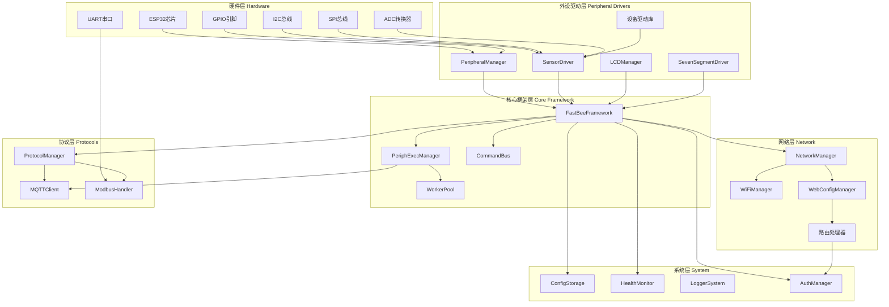

# 架构设计

本文档描述 FastBee-Arduino 的整体架构、模块职责、数据流和关键设计模式,帮助开发者深入理解系统设计。

## 整体架构

FastBee-Arduino 采用分层架构设计,从硬件到应用层清晰划分职责,降低模块耦合度。



## 模块职责

### 核心框架层 Core Framework

#### FastBeeFramework
**职责**: 系统初始化、模块协调、生命周期管理

**关键方法**:
- `getInstance()`: 单例模式获取实例
- `setup()`: 系统启动,按序加载所有模块
- `loop()`: 主循环,处理定时任务和事件
- `getPeripheralManager()`: 获取外设管理器
- `getPeriphExecManager()`: 获取规则引擎

**初始化流程**:
```
1. loadConfig()           // 加载 JSON 配置
2. initPeripherals()      // 初始化外设
3. initNetwork()          // 启动网络服务
4. initProtocols()        // 初始化协议
5. initPeriphExec()       // 启动规则引擎
6. startHealthMonitor()   // 启动健康监控
```

#### PeriphExecManager
**职责**: 规则引擎、触发-动作执行、异步调度

**核心功能**:
- 规则 CRUD (创建/读取/更新/删除)
- 4种触发器评估 (平台/定时/事件/轮询)
- 27种动作执行 (GPIO/PWM/传感器/显示/系统)
- 异步任务调度 (Worker池管理)
- 配置持久化 (LittleFS)

**设计约束**:
| 约束项 | 值 | 说明 |
|--------|-----|------|
| 每规则最大触发器数 | 3 | MAX_TRIGGERS_PER_RULE |
| 每规则最大动作数 | 4 | MAX_ACTIONS_PER_RULE |
| 最大并发异步任务 | 3 | MAX_ASYNC_TASKS |
| 异步任务最小堆内存 | 30KB | MIN_HEAP_FOR_ASYNC |
| 普通任务栈大小 | 4KB | SIMPLE_TASK_STACK |
| 脚本任务栈大小 | 8KB | SCRIPT_TASK_STACK |

#### CommandBus
**职责**: 命令分发、脚本执行总线

**功能**:
- 接收命令脚本 (PERIPH/DELAY/LOOP)
- 解析并执行命令序列
- 支持条件分支和循环

### 外设管理层 Peripheral Drivers

#### PeripheralManager
**职责**: 外设CRUD、硬件初始化、引脚分配

**核心流程**:
1. 验证引脚合法性 (避开 Flash 引脚 GPIO6-11)
2. 检查引脚冲突 (同一引脚不能重复分配)
3. 配置引脚模式 (input/output/ADC/PWM)
4. 初始化外设驱动 (调用对应 Driver)
5. 注册到外设列表 (内存映射)

**支持的外设类型**: 25+ 种,涵盖 GPIO/ADC/PWM/I2C/SPI/SENSOR 等

#### SensorDriver
**职责**: 传感器数据采集

**支持的传感器**:
- DHT11/DHT22 (温湿度)
- DS18B20 (单总线温度)
- HC-SR04 (超声波测距)
- SHT31/AHT20 (I2C温湿度)
- BH1750 (I2C光照)
- BMP280 (I2C气压, full版)
- MPU6050 (I2C陀螺仪, full版)

#### LCDManager
**职责**: 显示屏驱动

**支持类型**:
- SSD1306 OLED (I2C)
- SH1106 OLED (I2C)
- LCD1602 (待扩展)

#### SevenSegmentDriver
**职责**: TM1637 数码管驱动

**功能**:
- 数字显示
- 温度/湿度轮换显示
- 亮度调节

### 网络通信层 Network

#### NetworkManager
**职责**: 网络适配、多联网方式管理

**支持方式**:
- WiFi (所有版本)
- 以太网 W5500 (full版)
- 4G EC801E (full版)
- LoRa E22 (full版)

**统一接口**: 通过 Arduino Client 抽象层,上层协议无需感知底层网络

#### WiFiManager
**职责**: WiFi AP/STA模式、连接管理

**功能**:
- AP 模式: 首次配网,热点名称 `FastBee-XXXX`
- STA 模式: 连接路由器
- 自动切换: AP+STA 双模并发
- 断线重连: 指数退避策略
- mDNS: `fastbee.local` 域名访问

#### WebConfigManager
**职责**: HTTP服务器、RESTful API路由

**技术栈**: ESPAsyncWebServer (异步非阻塞)

**路由分类**:
- 静态资源: HTML/CSS/JS (支持 gzip)
- 设备API: `/api/device/*`
- 外设API: `/api/peripherals/*`
- 执行API: `/api/periph-exec/*`
- 协议API: `/api/protocol/*`
- 系统API: `/api/system/*`

### 协议处理层 Protocols

#### ProtocolManager
**职责**: 协议配置、数据映射、统一调度

**功能**:
- 加载协议配置 (protocol.json)
- 初始化协议实例
- 数据上报调度
- 命令下发处理

#### MQTTClient
**职责**: MQTT连接、主题管理、消息上报

**核心功能**:
- TLS/非TLS 连接
- 自定义主题前缀
- 遗嘱消息 (LWT)
- 自动重连与指数退避
- QoS 0/1 支持

**主题格式**:
```
{prefix}/property   // 属性上报
{prefix}/event      // 事件上报
{prefix}/command    // 命令下发
```

#### ModbusHandler
**职责**: Modbus RTU主站、寄存器轮询

**功能**:
- UART0/1/2 端口配置
- 自动从站扫描与发现
- 寄存器批量轮询
- 读取结果映射到外设通道
- 支持功能码: 01/02/03/04/05/06/15/16

### 系统管理层 System

#### ConfigStorage
**职责**: JSON配置读写、LittleFS持久化

**配置文件**:
```
/config/
  ├── device.json       # 设备配置
  ├── network.json      # 网络配置
  ├── peripherals.json  # 外设配置
  ├── periph_exec.json  # 执行规则
  ├── protocol.json     # 协议配置
  ├── roles.json        # 角色配置 (full版)
  └── users.json        # 用户配置 (full版)
```

**存储策略**:
- LittleFS 文件系统
- ArduinoJson 序列化
- 原子写入 (防止断电损坏)
- 配置导入/导出 API

#### HealthMonitor
**职责**: 内存监控、系统健康检查

**监控指标**:
- 空闲堆内存 (每5秒)
- 最大可分配块
- WiFi连接状态
- MQTT连接状态
- 系统运行时间

**告警机制**:
| 堆内存阈值 | 动作 |
|-----------|------|
| < 20KB | WARN 日志 |
| < 10KB | 关闭 SSE 连接 |
| < 5KB | 降低日志级别 |

**WDT看门狗**: 10秒超时 (防止文件I/O阻塞)

#### LoggerSystem
**职责**: 日志分级、串口输出

**日志级别**:
- ERROR: 严重错误
- WARN: 警告信息
- INFO: 关键流程
- DEBUG: 调试信息 (full版)

#### AuthManager
**职责**: 认证授权、Session管理

**功能**:
- Session/Cookie 认证
- 3级角色权限 (admin/operator/viewer)
- 单管理员模式 (slim版)
- 密码加密存储

## 数据流

### 传感器数据采集流程

```
定时触发器 → PeriphExecManager
         → 读取传感器 (SensorDriver)
         → 写入本地缓存 (sensor_cache)
         → 产生数据事件 (ds:<id>_<field>)
         → 触发联动规则 (EventTrigger)
         → 执行动作 (GPIO/显示/上报)
         → MQTT上报 (MQTTClient)
```

**示例**: 温度超限报警
1. 定时触发器每 10 秒触发
2. PeriphExecManager 调用 DHT11 读取温度
3. 温度值写入本地缓存,产生事件 `ds:dht_01_temperature`
4. 事件触发器评估条件 (温度 > 30°C)
5. 条件满足,执行动作: 拉高继电器引脚
6. 执行结果通过 MQTT 上报到云平台

### Web配置流程

```
浏览器请求 → WebConfigManager (ESPAsyncWebServer)
         → 路由匹配 (RouteHandler)
         → 权限验证 (AuthManager)
         → ConfigStorage 读写 LittleFS
         → 返回 JSON 响应
         → 前端渲染页面
```

**示例**: 添加外设
1. 前端 POST `/api/peripherals`
2. PeripheralRouteHandler 接收请求
3. AuthManager 验证权限
4. PeripheralManager 验证引脚、初始化硬件
5. ConfigStorage 写入 peripherals.json
6. 返回 200 OK,前端刷新列表

### MQTT消息处理流程

```
MQTT消息到达 → MQTTClient.onMessage()
            → ProtocolManager 解析主题
            → PeriphExecManager 平台触发器
            → 条件评估 (evaluateCondition)
            → 执行动作 (dispatchAction)
            → 响应上报 (publish)
```

**示例**: 平台远程控制
1. 云平台发布消息到 `fastbee/device01/command`
2. MQTTClient 接收消息,回调 ProtocolManager
3. PeriphExecManager 匹配平台触发器
4. 评估条件 (如数据值匹配)
5. 执行动作 (如打开继电器)
6. 执行结果上报到 `fastbee/device01/event`

## 关键设计模式

### 单例模式 Singleton

**应用场景**: 全局唯一管理器

**实现**:
```cpp
class FastBeeFramework {
public:
    static FastBeeFramework* getInstance() {
        static FastBeeFramework instance;
        return &instance;
    }
private:
    FastBeeFramework() {}
};
```

**使用实例**:
- FastBeeFramework::getInstance()
- PeriphExecManager::getInstance()
- ConfigStorage::getInstance()
- HealthMonitor::getInstance()

### 观察者模式 Observer

**应用场景**: 事件监听和分发

**实现**:
- 传感器数据事件监听 (`sensor_cache`)
- MQTT消息订阅分发 (topic filter)
- 系统事件广播 (WiFi连接/MQTT状态)

**数据事件格式**:
```
ds:<外设ID>_<字段名>
示例: ds:dht_01_temperature
      ds:bh1750_01_illuminance
```

### 策略模式 Strategy

**应用场景**: 多实现可替换

**实现**:
- 多联网方式适配 (WiFi/Ethernet/4G/LoRa)
  - 统一接口: `NetworkAdapter`
  - 不同实现: `WiFiManager`, `EthernetAdapter`, `CellularAdapter`, `LoRaAdapter`

- 多传感器驱动策略 (DHT/DS18B20/I2C等)
  - 统一接口: `SensorDriver`
  - 不同实现: 各传感器专用驱动

- 多协议处理策略 (MQTT/Modbus/TCP/HTTP)
  - 统一接口: `ProtocolHandler`
  - 不同实现: `MQTTClient`, `ModbusHandler`, `TCPHandler`, `HTTPClientWrapper`

### 命令模式 Command

**应用场景**: 动作封装和执行

**实现**:
- PeriphExec 动作执行 (27种动作类型)
- CommandBus 命令分发 (脚本引擎)
- RuleScript 脚本执行 (full版)

**动作执行流程**:
```
解析 actionType → 匹配执行策略 → 调用对应方法 → 返回执行结果
```

## 内存管理策略

### 内存门控 MEMGUARD

**目标**: 防止内存耗尽导致系统崩溃

**策略**:
1. 定期检测堆内存 (每5秒)
2. 根据阈值降级服务:
   - < 20KB: WARN 日志
   - < 10KB: 关闭 SSE 连接 (释放 ~8KB)
   - < 5KB: 降低日志级别,减少字符串分配
3. 不自动恢复 (避免频繁抖动),需外部干预

### 零拷贝优化

**目标**: 减少内存拷贝和临时对象

**实现**:
- Web响应流式输出 (直接写客户端,不缓冲)
- JSON配置按需加载 (不缓存全量)
- Gzip压缩产物直接使用 (不解压)
- 避免 `std::make_shared<File>` (高碎片率下失败)

### 静态池化

**目标**: 避免运行时动态分配,降低堆碎片化

**实现**:
- Worker池预创建 (3个异步任务)
- 任务栈固定大小 (4KB/8KB)
- 启动时分配,运行期不扩容
- 最小堆内存门控 (30KB 才允许异步任务)

### 编译期优化

**内存释放**:
- 禁用蓝牙控制器 (~30KB): `esp_bt_controller_mem_release()`
- 关闭未使用功能 (OTA/日志/多用户)

**栈优化**:
- 放大 loopTask 栈到 24KB (默认 8KB)
- 防止深度调用链栈溢出

## 相关文档

- [核心框架](core-framework.md) - 主要组件和关键类详解
- [外设执行流程](periph_exec_flow.md) - 规则引擎完整业务逻辑
- [快速开始](quick-start.md) - 5步完成首次配置
- [开发指南](development-guide.md) - 环境搭建和编码规范

---

**文档版本**: v1.0  
**最后更新**: 2026-06-03  
**维护者**: FastBee团队
