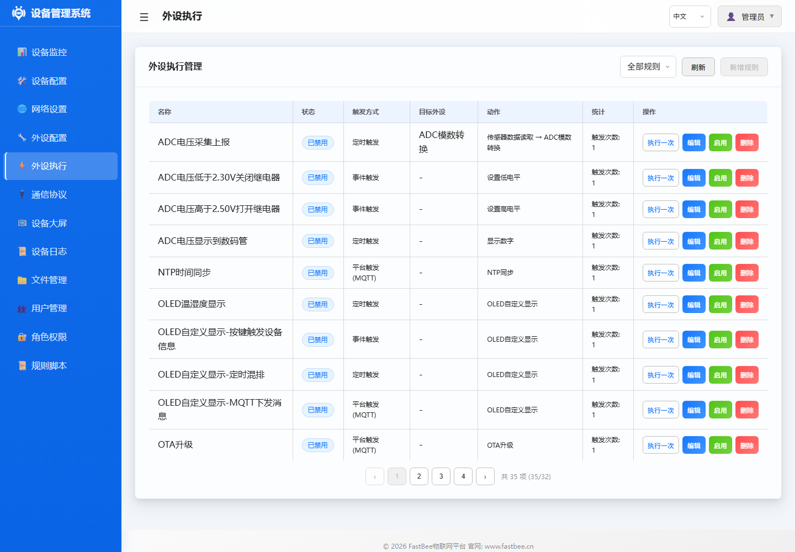

# 扩展实验10：火焰传感器

## 实验概述

火焰传感器通过红外接收管检测火焰发出的特定波长红外线（760nm~1100nm），输出模拟信号表示火焰强度。适用于火灾报警、灭火机器人等安全应用。

## 硬件接线

| 开发板标识 | GPIO引脚 | 连接设备 |
|-----------|---------|---------|
| AO | GPIO34 | 火焰传感器模拟输出 |
| DO | GPIO4 | 火焰传感器数字输出（可选） |

> 检测到火焰时模拟值降低（火焰越大值越小），数字输出变低电平。

## FastBee 外设配置

本实验的 Web 操作入口如下：先在“外设配置”创建硬件对象，再在“外设执行”添加采集、控制或显示规则。新增外设时建议先保持禁用，确认接线后再启用。





### 方式1：Web界面配置（推荐）

#### 步骤1：进入外设管理页面

1. 打开浏览器访问 ESP32 IP 地址
2. 登录后点击左侧菜单 **外设配置**

#### 步骤2：添加火焰传感器

1. 点击 **<i class="fas fa-plus"></i> 新增外设** 按钮
2. 填写配置：

   | 字段 | 填写内容 | 说明 |
   |------|---------|------|
   | **外设ID** | `flame_01` | 火焰传感器 |
   | **名称** | `火焰传感器` | 显示名称 |
   | **外设类型** | **模拟输入** (type: 15) | ADC采集 |
   | **引脚配置** | `34` | AO对应GPIO34 |

3. 点击 **保存**

> ⚠️ **注意**：检测到火焰时模拟值降低（火焰越大值越小）

---

### 方式2：JSON配置文件

## JSON 配置示例

```json
{
  "peripherals": [
    {
      "id": "flame_01",
      "name": "火焰传感器",
      "type": 15,
      "enabled": false,
      "pins": [34],
      "params": {}
    }
  ]
}
```

## 外设执行联动

### 场景：火焰报警（轮询触发）

**功能**：检测到火焰（ADC<1000）时触发蜂鸣器和LED报警

#### Web界面配置步骤

**步骤1：确保已配置报警外设**

- 蜂鸣器：`buzzer_gpio`（GPIO输出）
- LED：`led_d1`（GPIO输出）

**步骤2：创建规则**

1. 点击左侧菜单 **外设配置** → 切换到 **外设执行管理** 标签
2. 点击 **<i class="fas fa-plus"></i> 新增规则** 按钮
3. 填写基础配置：
   - **规则名称**：`火焰报警`
   - **上报数据**：✅ 启用
   - **启用**：✅ 启用

**步骤3：配置触发器（轮询触发）**

1. 点击 **添加触发** 按钮
2. 填写触发器配置：

   | 字段 | 填写内容 | 说明 |
   |------|---------|------|
   | **触发类型** | 选择 **轮询触发** | 定时检测条件 |
   | **目标外设** | 选择 `flame_01` | 火焰传感器 |
   | **轮询间隔** | `500` | 0.5秒（快速响应） |
   | **条件表达式** | `value < 1000` | 火焰阈值 |

**步骤4：配置动作（需要3个动作）**

**动作1：蜂鸣器报警**

1. 点击 **添加动作** 按钮
2. 填写：
   - **动作类型**：选择 **高电平**
   - **目标外设**：选择 `buzzer_gpio`

**动作2：LED报警**

1. 再次点击 **添加动作** 按钮
2. 填写：
   - **动作类型**：选择 **低电平**（共阳LED点亮）
   - **目标外设**：选择 `led_d1`

**动作3：发送报警事件**

1. 第三次点击 **添加动作** 按钮
2. 填写：
   - **动作类型**：选择 **发送事件**
   - **事件类型**：`alarm`
   - **事件消息**：`检测到火焰!`

3. 点击 **保存** 按钮

### 火焰传感器数值说明

| 状态 | ADC值 | 说明 |
|------|-------|------|
| 无火焰 | >2000 | 正常环境 |
| 远处火焰 | 1000-2000 | 微弱火焰 |
| 近处火焰 | <1000 | 明显火焰 |

## 注意事项

1. **检测角度**：传感器检测角度约 60°，需正对火焰方向
2. **检测距离**：有效检测距离约 20-100cm（取决于火焰大小）
3. **误报**：强烈阳光或白炽灯也可能触发，需合理设置阈值
4. **安全距离**：测试时注意防火安全，使用打火机小火焰即可测试
5. **多传感器**：可部署多个传感器覆盖不同方向
