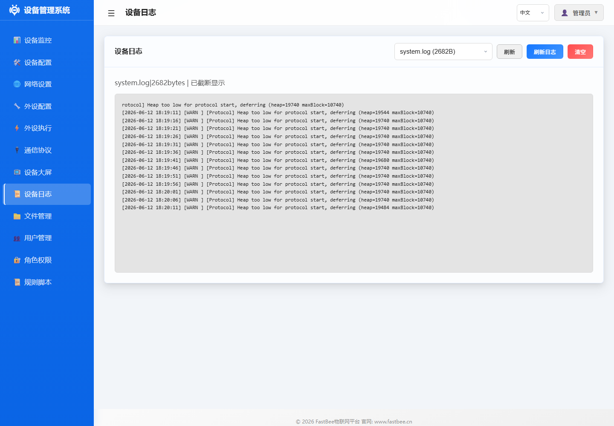

# FastBee Arduino 优化改进文档

## 1. 概述

本文档汇总了 FastBee Arduino 项目在代码审查、测试覆盖、安全性和前端体验方面发现的问题及优化措施。

优化项最终需要回到设备端页面验证：仪表盘观察内存和运行状态，外设执行页验证规则调度，日志页确认告警和错误信息是否可定位。

截图复核建议：

- 仪表盘用于复核优化后的内存余量、运行时间和在线状态。
- 外设执行页面用于复核规则数量、启用状态和手动执行入口是否仍然可用。
- 日志页面用于复核优化后是否还存在频繁告警、初始化失败或接口异常。

每个优化项都按守卫地图闭环记录：问题证据要能复现，修复文件要能定位，测试用例要覆盖边界，真机页面要能验证结果，发布后还要保留观察指标。

---

## 2. 后端架构优化

### 2.1 PeriphExecScheduler — 内存守卫降频机制

**问题**: `shouldSuspendBackgroundPolling()` 仅在 `SEVERE` 级别和碎片率≥65% 时暂停后台轮询，但 `WARN` 级别下即使堆内存已降至危险水平，轮询仍全速运行，可能导致内存进一步恶化。

**修复**: 增加 `WARN` 级别的碎片率检查（≥75%），在内存碎片化严重但总堆尚可时提前介入。

**文件**: `src/core/PeriphExecScheduler.cpp`

### 2.2 PeripheralManager — xTaskCreate 运行时碎片风险

**问题**: `setupPeripheralRuntime()` 中 xTaskCreate 在运行时按需创建/删除，在 ESP32 有限堆空间下可能产生内存碎片。

**修复**: 添加安全守卫 — 当碎片率 ≥60% 或最大连续块 <8KB 时，跳过 xTaskCreate 创建，避免碎片化雪崩。

**文件**: `src/core/PeripheralManager.cpp`

### 2.3 PeripheralManager — 串口外设并发读取锁竞争

**问题**: `readData()` 使用 `pdMS_TO_TICKS(10)` 短超时获取 mutex，多个轮询任务并发读取同一串口外设时，超时后静默返回空数据，不区分"无数据"和"锁竞争"。

**修复**: 获取失败时输出 WARNING 日志并返回 false（区分"无数据"和"锁竞争"），便于上层调度器识别并做退避处理。

**文件**: `src/core/PeripheralManager.cpp`

### 2.4 NetworkConfig — 全局变量 static 声明缺失

**问题**: `currentWifiMode`、`currentIp`、`currentGateway`、`currentSubnet`、`currentDns`、`currentMac` 等 WiFi 状态变量为全局变量，缺少 static 修饰，存在符号污染风险。

**修复**: 全部添加 `static` 修饰，限制符号作用域于当前编译单元。

**文件**: `src/network/NetworkConfig.cpp`

---

## 3. 安全加固

### 3.1 NetworkConfig — MDNS 设备名称输入验证缺失

**问题**: `setupMDNS()` 直接将 WiFiSettings.hostname 传入 `MDNS.begin()` 无任何验证，恶意 hostname（含特殊字符/超长字符串）可能导致 MDNS 崩溃。

**修复**: 增加三级防护：
- 空值检查（使用默认名 "fastbee"）
- 字符白名单过滤（仅允许字母、数字、短横线）
- 长度限制（最大 31 字符）

**文件**: `src/network/NetworkConfig.cpp`

### 3.2 SecurityManager — ACL 文件加载无大小限制

**问题**: `loadAclFromFile()` 读取 JSON 文件时无大小校验，恶意构造的超大文件可能导致内存耗尽。

**修复**: 添加 16KB 文件大小上限校验，超限时拒绝加载并输出警告日志。

**文件**: `src/security/SecurityManager.cpp`

---

## 4. 前端 UI 优化

### 4.1 外设执行 — 动作类型标签缺失

**问题**: `periph-exec.js` 中 `actionLabels` 缺少 actionTypes 13/14/15/16/17/18 的中文映射，导致列表中这些动作类型显示为 `?`。

**修复**: 补充缺失的标签映射：

| ActionType | 修复后标签 |
|---|---|
| 13 | 高电平反转 |
| 14 | 低电平反转 |
| 15 | 命令脚本 |
| 16 | Modbus线圈写入 |
| 17 | Modbus寄存器写入 |
| 18 | Modbus轮询采集 |

**文件**: `web-src/modules/runtime/periph-exec.js`

### 4.2 外设执行表单 — i18n 事件名称错别字

**问题**: `periph-exec-form.js` 中 `_evNameMap` 存在三处按键事件文案错误：
- "按键长战2秒"（错别字）
- "按键长战5秒"（错别字）
- "按键长按 10 秒"（多余空格）

**修复**: 统一修正为 "按键长按2秒"、"按键长按5秒"、"按键长按10秒"。

**文件**: `web-src/modules/runtime/periph-exec-form.js`

---

## 5. 测试覆盖增强

### 5.1 PeriphExecScheduler — shouldSuspendBackgroundPolling 新增场景

**文件**: `test/test_periph_exec.cpp`

新增测试组（Group 3），覆盖以下场景：

| 测试用例 | 覆盖场景 |
|---|---|
| `suspend_poll_warn_fragmented` | WARN 级别 + 碎片率≥75% 时应暂停 |
| `suspend_poll_warn_not_fragmented` | WARN 级别 + 碎片率<75% 时不暂停 |
| `suspend_poll_severe_fragmented` | SEVERE 级别 + 高碎片率时应暂停 |
| `suspend_poll_severe_low_heap` | SEVERE 级别 + 低堆时应暂停 |
| `suspend_poll_normal_fragmented` | NORMAL 级别 + 高碎片率时应暂停 |
| `suspend_poll_critical` | CRITICAL 级别始终暂停 |
| `suspend_poll_boundary_values` | 各阈值边界值精确测试 |
| `suspend_poll_healthy_state` | 健康状态不暂停 |

### 5.2 PeripheralManager — 串口读取锁竞争测试

**文件**: `test/test_periph_exec.cpp`

新增测试组（Group 6），覆盖以下场景：

| 测试用例 | 覆盖场景 |
|---|---|
| `serial_read_success` | 正常读取返回 true + 数据长度 |
| `serial_read_no_data` | 无数据返回 true + 长度 0 |
| `serial_read_disabled` | 外设未启用返回 false |
| `serial_read_null_output` | 空指针参数返回 false |
| `serial_read_mutex_timeout` | 互斥锁超时记录 WARNING 日志 |

### 5.3 SecurityManager — ACL 文件大小限制测试

**文件**: `test/test_security_auth.cpp`

新增 ACL 文件大小校验测试：

| 测试用例 | 覆盖场景 |
|---|---|
| `acl_file_size_limit_accept_normal` | 正常大小文件（<16KB）接受加载 |
| `acl_file_size_limit_reject_oversized` | 超大文件（>16KB）拒绝加载 |

测试覆盖完成后，需要回到真机执行 smoke/soak 和 Web 页面复核；仅通过 host 单元测试还不能证明内存、串口、文件系统和前端交互在 ESP32 运行时都稳定。

---

## 6. 修复文件汇总

| 文件路径 | 改动类型 | 改动摘要 |
|---|---|---|
| `src/core/PeriphExecScheduler.cpp` | 修复 | 增加 WARN 级别碎片率检查 |
| `src/core/PeripheralManager.cpp` | 修复 + 安全 | 运行时碎片守卫 + 串口读取日志 |
| `src/network/NetworkConfig.cpp` | 修复 + 安全 | static 声明 + MDNS 输入验证 |
| `src/security/SecurityManager.cpp` | 安全 | ACL 文件大小限制 |
| `web-src/modules/runtime/periph-exec.js` | UI 修复 | 补充 6 个缺失动作类型标签 |
| `web-src/modules/runtime/periph-exec-form.js` | UI 修复 | 修正 3 处 i18n 错别字 |
| `test/test_periph_exec.cpp` | 测试 | 新增 2 个测试组共 13 个用例 |
| `test/test_security_auth.cpp` | 测试 | 新增 ACL 文件大小限制测试 |

---

## 7. 遗留观察项

以下为审查中发现但暂未修复的问题，建议后续迭代中评估处理：

1. **PeriphExecScheduler 硬编码阈值**: 内存阈值（18432 字节等）为硬编码 magic number，建议迁移到头文件常量
2. **Modbus 轮询无总超时**: `executeModbusPollAction()` 遍历多个轮询任务时，无整体超时限制，极端场景下可能累积耗时过长
3. **OTA 分块大小无限制**: 接收端未限制分块大小，恶意大包可能导致缓冲区问题
4. **CommandScript 无嵌套深度限制**: `if` 嵌套最多 2 层为硬编码检查，无递归深度限制
5. **MQTT 回调队列无背压机制**: 队列满时直接丢弃消息无告警
