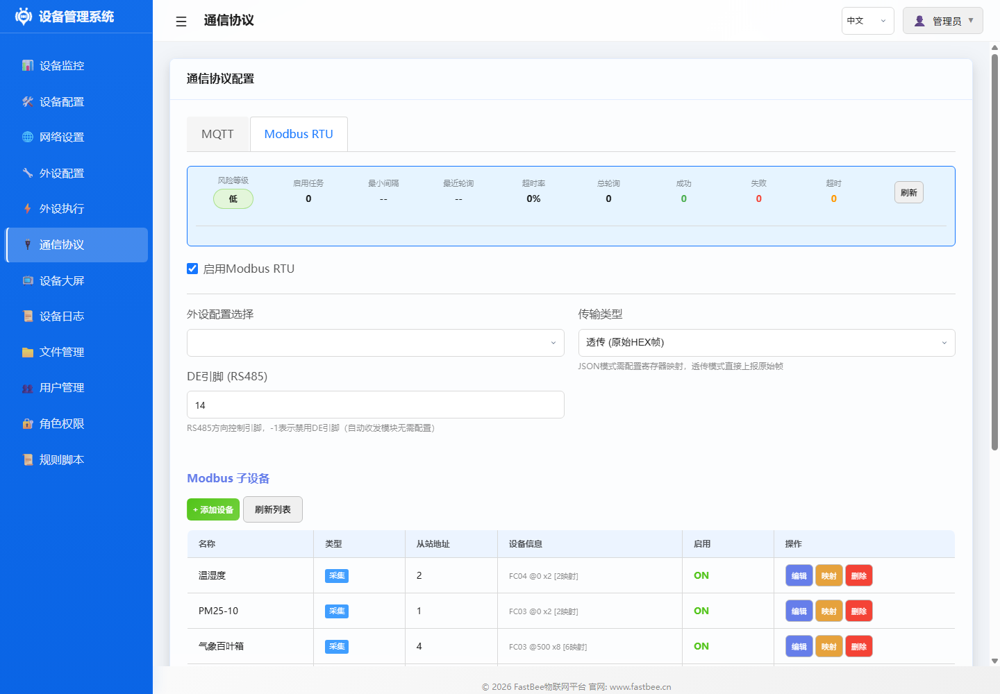

# Modbus 动作

## 动作类型

| 动作 | actionType | 说明 |
|------|------------|------|
| ACTION_MODBUS_COIL_WRITE | 16 | 写线圈 (FC05) |
| ACTION_MODBUS_REG_WRITE | 17 | 写寄存器 (FC06) |
| ACTION_MODBUS_POLL | 18 | 轮询采集 |

## 配置示例

### 方式1：Web界面配置（推荐）

外设执行页面和 Modbus RTU 配置页如下。Modbus 动作配置时重点核对串口参数、从站地址、功能码、寄存器或线圈地址。




#### 示例1：写线圈（控制继电器开关）

**场景**：打开Modbus继电器的第1路（通道0）

**配置步骤**：

1. 在外设执行管理页面编辑规则
2. 点击 **添加动作** 按钮
3. 填写动作配置：

   | 字段 | 填写内容 | 说明 |
   |------|---------|------|
   | **动作类型** | 选择 **Modbus写线圈** | FC05 |
   | **目标外设** | 选择 `mb_relay` | Modbus继电器 |
   | **通道号** | `0` | 基于coilBase偏移 |
   | **值** | `1` | 1=ON, 0=OFF |

4. 点击 **保存** 按钮

> 💡 **提示**：通道号基于外设配置的coilBase偏移，查设备手册确认

---

#### 示例2：写寄存器（设置PWM值）

**场景**：向Modbus PWM模块写入寄存器值512

**配置步骤**：

1. 编辑规则，添加动作
2. 填写：
   - **动作类型**：选择 **Modbus写寄存器**
   - **目标外设**：选择 `mb_pwm`
   - **寄存器地址**：`100`
   - **写入值**：`512`

3. 点击 **保存**

> 💡 **提示**：寄存器地址查设备手册确认

---

#### 示例3：轮询采集（读取传感器数据）

**场景**：轮询Modbus任务0的传感器数据

**配置步骤**：

1. 编辑规则，添加动作
2. 填写：
   - **动作类型**：选择 **Modbus轮询**
   - **目标外设**：填写 `modbus-task:0`（固定格式）
   - **任务索引**：`[0]`（JSON数组格式）
   - **上报数据**：✅ 启用规则的上报数据选项

3. 点击 **保存**

> 💡 **提示**：
> - targetPeriphId格式固定为 `modbus-task:N`，N为设备索引
> - actionValue格式：`{"poll":[0,1,2]}`，数组内为任务索引
> - 启用“上报数据”后采集结果自动通过MQTT上报

---

#### 示例4：多设备轮询

**场景**：一次轮询多个任务（0, 1, 2）

**配置步骤**：

1. 编辑规则，添加动作
2. 填写：
   - **动作类型**：选择 **Modbus轮询**
   - **目标外设**：填写 `modbus-task:0`
   - **任务索引**：`[0,1,2]`

3. 点击 **保存**

> 💡 **提示**：多个任务索引用逗号分隔，系统会按顺序轮询

---

### 方式2：JSON配置文件导入

## 完整规则示例

### 平台控制 Modbus 继电器

```json
{
  "id": "exec_mb_ctrl",
  "name": "远程控制继电器",
  "enabled": false,
  "execMode": 0,
  "triggers": [
    {
      "triggerType": 0,
      "triggerPeriphId": "mb_relay_ch0",
      "operatorType": 0,
      "compareValue": "1",
      "timerMode": 0,
      "intervalSec": 60,
      "timePoint": "",
      "eventId": "",
      "pollResponseTimeout": 1000,
      "pollMaxRetries": 2,
      "pollInterPollDelay": 100
    }
  ],
  "actions": [
    {
      "targetPeriphId": "mb_relay",
      "actionType": 16,
      "actionValue": "{\"ch\":0,\"val\":1}",
      "useReceivedValue": false,
      "syncDelayMs": 0,
      "execMode": 0
    }
  ],
  "protocolType": 0,
  "scriptContent": "",
  "reportAfterExec": true
}
```

## 注意事项

1. **Modbus 可用性**：动作执行前检查 Modbus 通道是否就绪
2. **通信间隔**：多个 Modbus 动作间建议设置 syncDelayMs ≥ 100ms
3. **超时处理**：Modbus 通信超时会记录失败并触发退避机制
4. **数据上报**：MODBUS_POLL 结果在 `reportAfterExec: true` 时自动通过 MQTT 上报
