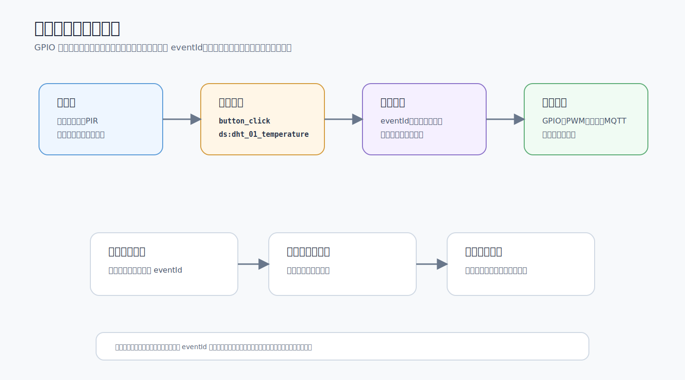

# 事件触发 (EVENT_TRIGGER)

## 概述

事件触发适合已经由按键状态机、传感器缓存、系统状态或其他规则产生的事件。它不负责主动采集数据，而是在事件出现时做条件判断和动作执行。

事件触发（triggerType = 4）用于响应系统内部事件。当指定事件发生时自动执行规则。支持系统事件（WiFi/MQTT/NTP/按键等）和自定义事件（外设执行完成/设备事件）。

配置事件触发时，先确认事件源已经产生明确的 `eventId`，再配置 `triggerPeriphId` 和动作；如果规则没有触发，优先查日志中的事件名称。

## 字段说明

| 字段 | 类型 | 说明 |
|------|------|------|
| triggerType | 4 | 事件触发 |
| eventId | String | 事件 ID（匹配 STATIC_EVENTS 或动态规则 ID） |
| triggerPeriphId | String | 事件源外设 ID（按键事件时指定具体按键，为空则匹配任意） |

## 可用系统事件列表

### WiFi 事件

| eventId | 说明 |
|---------|------|
| wifi_connected | WiFi 连接成功 |
| wifi_disconnected | WiFi 断开连接 |
| wifi_conn_failed | WiFi 连接失败 |

### MQTT 事件

| eventId | 说明 |
|---------|------|
| mqtt_connected | MQTT 连接成功 |
| mqtt_disconnected | MQTT 断开连接 |
| mqtt_conn_failed | MQTT 连接失败 |
| mqtt_enabled | MQTT 协议启用 |

### 系统事件

| eventId | 说明 |
|---------|------|
| ntp_synced | NTP 时间同步完成 |
| ota_start | OTA 升级开始 |
| ota_success | OTA 升级成功 |
| ota_failed | OTA 升级失败 |
| system_boot | 系统启动 |
| system_ready | 系统就绪 |

### 按键事件

| eventId | 说明 |
|---------|------|
| button_click | 按键单击 |
| button_double_click | 按键双击 |
| button_long_press_2s | 按键长按 2 秒 |
| button_long_press_5s | 按键长按 5 秒 |
| button_long_press_10s | 按键长按 10 秒 |
| button_press | 按键按下 |
| button_release | 按键释放 |

### 数据事件

| eventId | 说明 |
|---------|------|
| data_receive | 数据接收（协议数据到达） |
| data_report | 数据上报（协议数据发送） |

### 外设执行事件

| eventId | 说明 |
|---------|------|
| periph_exec_completed | 外设执行规则完成 |
| (规则ID) | 指定规则执行完成（用于链式联动） |

## 配置示例

### 方式1：Web界面配置（推荐）

外设执行页面如下。事件触发配置时重点核对事件 ID、比较条件和数据源是否已经由外设动作产生。

#### 示例1：WiFi 连接成功时触发

**场景**：WiFi连接成功后执行某些动作

**配置步骤**：

1. 点击左侧菜单 **外设配置** → 切换到 **外设执行管理** 标签
2. 点击 **<i class="fas fa-plus"></i> 新增规则** 按钮
3. 填写基础配置：
   - **规则名称**：`WiFi连接后执行`
   - **上报数据**：根据需求启用
   - **启用**：✅ 启用

4. 配置触发器：
   - **触发类型**：选择 **事件触发**
   - **事件ID**：选择 `wifi_connected`（WiFi连接成功）

5. 配置动作：添加需要执行的动作

6. 点击 **保存** 按钮

---

#### 示例2：按键单击触发（指定按键）

**场景**：指定按键btn1单击时触发

**配置步骤**：

1. 创建规则，名称：`按键单击动作`
2. 触发器配置：
   - **触发类型**：选择 **事件触发**
   - **事件ID**：选择 `button_click`（按键单击）
   - **目标外设ID**：填写 `btn1`（指定按键）

3. 配置动作
4. 点击 **保存**

> 💡 **提示**：指定triggerPeriphId后，只有该按键才会触发

---

#### 示例3：按键单击触发（任意按键）

**场景**：任意按键单击都触发

**配置步骤**：

1. 创建规则，名称：`任意按键单击`
2. 触发器配置：
   - **触发类型**：选择 **事件触发**
   - **事件ID**：选择 `button_click`
   - **目标外设ID**：留空（匹配任意按键）

3. 配置动作
4. 点击 **保存**

---

#### 示例4：链式联动（规则A完成后触发规则B）

**场景**：规则A执行完成后自动触发规则B

**配置步骤**：

1. 创建规则B，名称：`规则B-链式触发`
2. 触发器配置：
   - **触发类型**：选择 **事件触发**
   - **事件ID**：填写规则A的ID（如 `exec_1234567`）
   - **说明**：在规则A的ID输入框中复制

3. 配置动作
4. 点击 **保存**

> 💡 **提示**：
> - 规则ID格式为 `exec_XXXXXXX`
> - 避免形成A→B→A的循环触发
> - 可在规则列表中查看规则ID

---

### 方式2：JSON配置文件导入

## 注意事项

1. **去重间隔**：同一事件最小触发间隔 1 秒，防止快速重复触发
2. **按键外设ID**：`triggerPeriphId` 为空时匹配任意按键事件，指定时仅该按键触发
3. **NTP 前提**：部分事件（如 ntp_synced）仅在特定条件下触发
4. **链式循环**：避免规则 A→B→A 形成无限循环
5. **启动顺序**：system_boot 在 PeriphExecManager 初始化完成后触发
