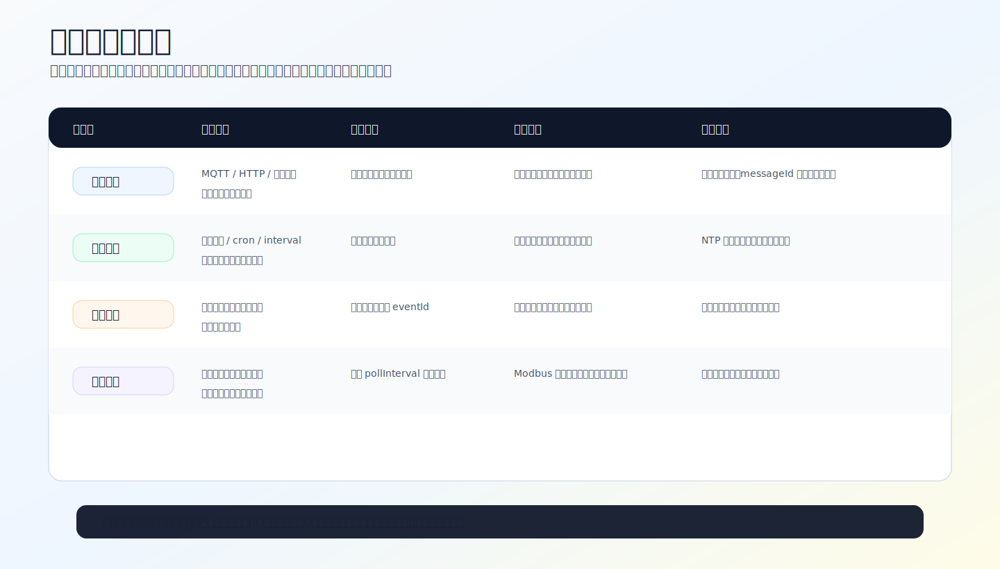

# 轮询触发 (POLL_TRIGGER)

## 概述

轮询触发（triggerType = 5）用于本地数据源的周期性条件评估。主要应用于 Modbus 从站传感器数据采集，也支持本地传感器缓存数据的条件判断。



轮询触发会主动消耗外设、串口或总线资源。配置前先确认是否已有事件源可用；只有没有事件源或必须周期采样时，再使用轮询触发。

## 触发机制

1. 按照 `intervalSec` 间隔周期性触发
2. 执行动作列表中的数据采集动作（如 MODBUS_POLL、SENSOR_READ）
3. 采集到的数据与触发器的 `compareValue` 进行条件评估
4. 条件满足则完成本次触发并上报数据

## 字段说明

| 字段 | 类型 | 说明 |
|------|------|------|
| triggerType | 5 | 轮询触发 |
| timerMode | 0 | 间隔模式（轮询触发仅支持间隔） |
| intervalSec | uint32 | 轮询间隔秒数 |
| pollResponseTimeout | uint16 | Modbus 响应超时(ms)，默认 1000 |
| pollMaxRetries | uint8 | 最大重试次数，默认 2 |
| pollInterPollDelay | uint16 | 两次请求间最小间隔(ms)，默认 100 |

## 与定时触发的区别

| 特性 | TIMER_TRIGGER | POLL_TRIGGER |
|------|---------------|--------------|
| triggerType | 1 | 5 |
| 条件评估 | 不评估条件 | 可评估采集数据 |
| 通信参数 | 无 | 超时/重试/间隔 |
| 适用场景 | 简单定时 | Modbus/传感器轮询 |

## 配置示例

### 方式1：Web界面配置（推荐）

外设执行页面如下。轮询触发配置时重点核对目标数据源、比较值、轮询间隔和执行动作的耗时。


#### 示例1：Modbus 传感器轮询（每 5 分钟）

**场景**：每5分钟采集一次Modbus传感器数据

**配置步骤**：

1. 点击左侧菜单 **外设配置** → 切换到 **外设执行管理** 标签
2. 点击 **<i class="fas fa-plus"></i> 新增规则** 按钮
3. 填写基础配置：
   - **规则名称**：`Modbus环境数据采集`
   - **上报数据**：✅ 启用（自动上报采集结果）
   - **启用**：✅ 启用

4. 配置触发器：
   - **触发类型**：选择 **轮询触发**
   - **轮询间隔**：填写 `300`（300秒=5分钟）
   - **响应超时**：填写 `1000`（1000毫秒，默认值）
   - **最大重试**：填写 `2`（默认值）
   - **请求间隔**：填写 `100`（100毫秒，默认值）

5. 配置动作：
   - **动作类型**：选择 **Modbus轮询**
   - **目标外设**：选择对应的Modbus任务

6. 点击 **保存** 按钮

---

#### 示例2：带条件评估的轮询

**场景**：轮询采集的数据 > 500 时才上报

**配置步骤**：

1. 创建规则，名称：`烟雾超标报警`
2. 触发器配置：
   - **触发类型**：选择 **轮询触发**
   - **目标外设ID**：填写 `smoke_sensor`
   - **运算符**：选择 `大于 (>)`
   - **阈值**：填写 `500`
   - **轮询间隔**：填写 `60`（60秒）
3. 配置动作：
   - **动作1**：选择 **传感器读取**，目标 `smoke_sensor`
   - **动作2**：选择报警相关动作
4. 点击 **保存**

> 💡 **提示**：条件评估会在数据采集后自动进行，只有满足条件才执行后续动作

---

### 方式2：JSON配置文件导入

## 完整规则示例

### Modbus 环境数据采集

```json
{
  "id": "exec_env_poll",
  "name": "采集环境质量",
  "enabled": false,
  "execMode": 0,
  "triggers": [
    {
      "triggerType": 5,
      "triggerPeriphId": "",
      "operatorType": 0,
      "compareValue": "",
      "timerMode": 0,
      "intervalSec": 300,
      "timePoint": "",
      "eventId": "",
      "pollResponseTimeout": 1000,
      "pollMaxRetries": 2,
      "pollInterPollDelay": 100
    }
  ],
  "actions": [
    {
      "targetPeriphId": "modbus-task:0",
      "actionType": 18,
      "actionValue": "{\"poll\":[0]}",
      "useReceivedValue": false,
      "syncDelayMs": 0,
      "execMode": 0
    },
    {
      "targetPeriphId": "modbus-task:1",
      "actionType": 18,
      "actionValue": "{\"poll\":[1]}",
      "useReceivedValue": false,
      "syncDelayMs": 200,
      "execMode": 0
    }
  ],
  "protocolType": 0,
  "scriptContent": "",
  "reportAfterExec": true
}
```

## 通信参数调优

| 场景 | pollResponseTimeout | pollMaxRetries | pollInterPollDelay |
|------|--------------------:|---------------:|-------------------:|
| 近距离RS485 | 500 | 1 | 50 |
| 长距离RS485 | 2000 | 3 | 200 |
| 多设备总线 | 1000 | 2 | 150 |

## 注意事项

1. **Modbus 可用性**：轮询触发检查 Modbus 是否可用，不可用时跳过
2. **运行中保护**：前一次轮询尚未完成时跳过本次触发
3. **失败退避**：执行失败后进入 30 秒退避期，避免频繁重试
4. **资源保护**：重资源规则（脚本/Modbus/多动作）在系统资源不足时会被跳过而非降级同步
5. **数据上报**：`reportAfterExec: true` 时，MODBUS_POLL 和 SENSOR_READ 结果自动通过 MQTT 上报
