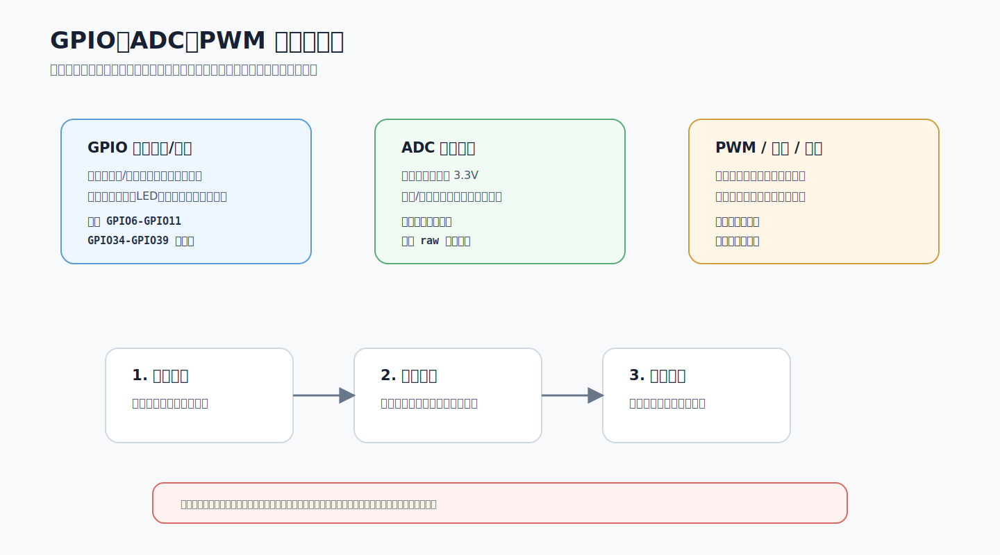
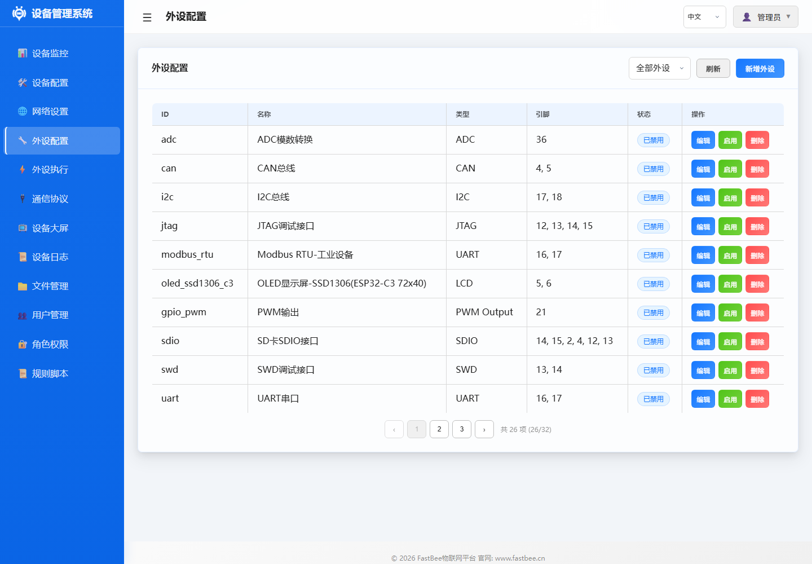
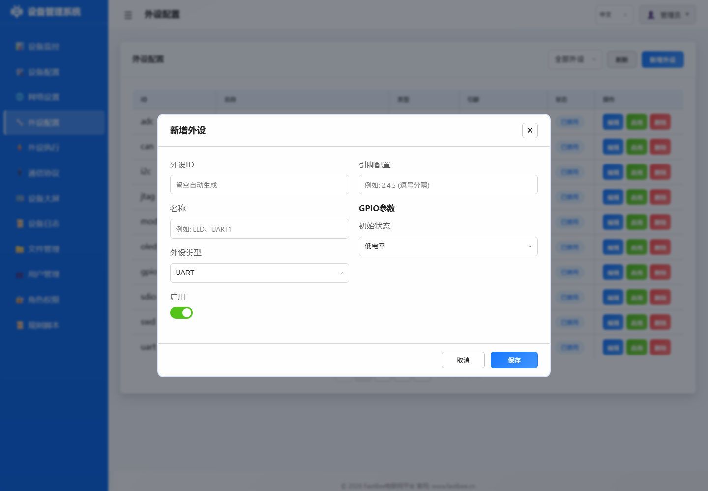

# 电流型传感器配置指南（ACS712 等）

## 1. 功能说明

电流型传感器通过霍尔效应将导线中的电流转换为与之成正比的电压信号，ESP32 通过 ADC 采集该电压，再经线性校准转换为实际电流值。

### 支持的传感器型号

| 型号 | 量程 | 灵敏度 | 零电流输出 |
|------|------|--------|-----------|
| ACS712-5A | ±5A | 185 mV/A | VCC/2 (1.65V@3.3V) |
| ACS712-20A | ±20A | 100 mV/A | VCC/2 (1.65V@3.3V) |
| ACS712-30A | ±30A | 66 mV/A | VCC/2 (1.65V@3.3V) |

### 工作原理
1. ACS712 内部霍尔传感器感应导线电流
2. 输出电压 = VCC/2 + 电流 × 灵敏度
3. ESP32 ADC 采集输出电压（12位，0~4095）
4. 软件转换：`I = (V_adc - V_offset) / sensitivity`

### 特性
- 10 次多采样平均，减少 ADC 噪声
- 200ms 最小读取间隔缓存
- 惰性初始化，首次调用自动配置 ADC
- 支持自定义校准参数（灵敏度、零偏移、参考电压）



电流模块调试时先校准零电流输出，再逐步加载；如果读数漂移，优先检查共地、参考电压、ADC 衰减和采样平均参数。

## 2. 接线说明

```
ACS712 模块           ESP32
┌─────────────┐
│  VCC        │───────── 5V (模块供电)
│  GND        │───────── GND
│  OUT        │───────── GPIO34 (ADC引脚)
│  IP+ / IP-  │───────── 被测电流通过
└─────────────┘

注意：
- ACS712 模块供电需 5V，但 OUT 输出范围 0~VCC
- ESP32 ADC 输入最大 3.3V，若模块供电 5V 需加分压器
- 建议使用 3.3V 供电的 ACS712 模块，或加分压电路
- 推荐使用 GPIO34/35/36/39（仅输入引脚，ADC性能最佳）
```

## 3. 配置方式

### 方式1：Web界面配置（推荐）

外设配置页和新增弹窗的实机界面如下。电流传感器保存前重点核对 ADC 引脚、零点偏移、灵敏度和量程保护。





#### 步骤1：进入外设管理页面

1. 打开浏览器访问 ESP32 IP 地址
2. 登录后点击左侧菜单 **外设配置**

#### 步骤2：添加电流传感器外设

1. 点击 **<i class="fas fa-plus"></i> 新增外设** 按钮
2. 填写配置：

   | 字段 | 填写内容 | 说明 |
   |------|---------|------|
   | **外设ID** | `current_01` | 唯一标识符 |
   | **名称** | `ACS712电流检测` | 显示名称 |
   | **外设类型** | **GPIO模拟输入** (type: 15) | ADC采集 |
   | **引脚配置** | `34` | ADC引脚（推荐34-39） |
   | **衰减系数** | `3` | 11dB(0-3.3V) |
   | **分辨率** | `12` | 12位(0-4095) |

3. 点击 **保存**

#### 步骤3：验证配置

1. 在外设列表中找到刚添加的外设
2. 点击 **启用** 开关
3. 查看实时电流数据

> 💡 **提示**：ACS712模块推荐3.3V供电，5V模块需加分压器

---

### 方式2：JSON配置文件导入

电流传感器使用 `GPIO_ANALOG_INPUT`(类型ID=15) 或 `ADC`(类型ID=26) 类型配置引脚。

### 外设配置示例（ADC引脚）

```json
{
  "id": "current_01",
  "name": "ACS712电流检测",
  "type": 15,
  "enabled": false,
  "pinCount": 1,
  "pins": [34, 255, 255, 255, 255, 255, 255, 255],
  "params": {
    "attenuation": 3,
    "resolution": 12,
    "sampleRate": 5
  }
}
```

### 字段说明

| 字段 | 含义 | 取值 |
|------|------|------|
| type | 外设类型 | 15 (GPIO_ANALOG_INPUT) 或 26 (ADC) |
| pins[0] | ADC 引脚 | 34/35/36/39 (仅输入) 或其他支持ADC的引脚 |
| params.attenuation | 衰减系数 | 0=0dB, 1=2.5dB, 2=6dB, 3=11dB(3.3V) |
| params.resolution | 分辨率 | 9~12 位 |

## 4. 外设执行联动

电流传感器通过 `ACTION_SENSOR_READ`(actionType=19) 配合 `SensorCategory::SENSOR_CURRENT(7)` 进行数据采集。

### Web界面配置步骤

**创建电流采集规则**

1. 切换到 **外设执行管理** 标签
2. 点击 **<i class="fas fa-plus"></i> 新增规则** 按钮
3. 配置定时触发器：
   - 触发类型：**定时触发**
   - 执行间隔：**10** 秒
4. 添加动作：
   - 动作类型：**传感器读取**
   - 目标外设：**current_01**
   - 数据字段：**current**
   - 灵敏度：**0.100**（ACS712-20A）
   - 零偏移：**1.65**
5. 开启 **执行后上报数据**
6. 点击 **保存**

**创建电流过载报警规则**

1. 创建新规则
2. 配置事件触发器：
   - 触发类型：**事件触发**
   - 事件ID：**ds:current_01_current**
   - 比较操作：**大于**
   - 比较值：**15.0**（A）
3. 添加动作：
   - 动作1：关闭继电器
     - 动作类型：**低电平**
     - 目标外设：**relay_01**
   - 动作2：触发过载事件
     - 动作类型：**触发事件**
     - 事件ID：**over_current**
4. 点击 **保存**

> 💡 **提示**：需根据实际传感器型号校准灵敏度和零偏移

---

### JSON配置示例

### 电流采集规则配置

```json
{
  "id": "exec_current_read",
  "name": "电流定时采集",
  "enabled": false,
  "triggers": [
    {
      "triggerType": 1,
      "timerMode": 0,
      "intervalSec": 10
    }
  ],
  "actions": [
    {
      "targetPeriphId": "current_01",
      "actionType": 19,
      "actionValue": "{\"periphId\":\"current_01\",\"sensorCategory\":\"current\",\"dataField\":\"current\",\"sensorLabel\":\"电流\",\"unit\":\"A\",\"decimalPlaces\":3,\"sensitivity\":0.100,\"zeroOffset\":1.65,\"vRef\":3.3,\"adcMax\":4095}"
    }
  ],
  "reportAfterExec": true
}
```

### actionValue 格式

电流传感器的 `actionValue` 使用 JSON 字符串传递读取目标和校准参数：

```json
{
  "periphId": "current_01",
  "sensorCategory": "current",
  "dataField": "current",
  "sensorLabel": "电流",
  "unit": "A",
  "decimalPlaces": 3,
  "sensitivity": 0.100,
  "zeroOffset": 1.65,
  "vRef": 3.3,
  "adcMax": 4095
}
```

| 参数 | 说明 | 示例 |
|------|------|------|
| sensitivity | 灵敏度 (V/A) | 0.100 (ACS712-20A) |
| zeroOffset | 零偏移电压 (V) | 1.65 (VCC/2@3.3V) |
| vRef | ADC参考电压 (V) | 3.3 |
| adcMax | ADC最大值 | 4095 |

### 电流超限报警规则

```json
{
  "id": "exec_current_alarm",
  "name": "电流过载报警",
  "enabled": false,
  "triggers": [
    {
      "triggerType": 4,
      "eventId": "ds:current_01_current",
      "operatorType": 2,
      "compareValue": "15.0"
    }
  ],
  "actions": [
    {
      "targetPeriphId": "relay_01",
      "actionType": 1,
      "actionValue": ""
    },
    {
      "targetPeriphId": "",
      "actionType": 21,
      "actionValue": "over_current"
    }
  ],
  "reportAfterExec": true
}
```

## 5. 校准方法

### 零点校准
1. 断开被测电流（无电流流过）
2. 读取此时的 ADC 值并转换为电压
3. 该电压即为 `offset` 值（理论值 VCC/2）

### 灵敏度校准
1. 通过已知电流（如使用万用表测量）
2. 记录 ADC 读数对应的电压
3. `sensitivity = (V_measured - offset) / I_known`

### 常用校准参数速查

| 传感器型号 | sensitivity | offset | 说明 |
|-----------|-------------|--------|------|
| ACS712-5A @3.3V | 0.185 | 1.65 | 灵敏度最高 |
| ACS712-20A @3.3V | 0.100 | 1.65 | 最常用 |
| ACS712-30A @3.3V | 0.066 | 1.65 | 大电流场景 |
| ACS712-20A @5V+分压 | 0.100 | 1.0 | 需按分压比调整offset |

## 6. 注意事项

1. **ADC 精度**：ESP32 ADC 非线性误差较大，建议通过实际校准确定参数
2. **噪声抑制**：驱动内置 10 次采样平均，可适当增加采样次数
3. **5V 模块**：若模块供电 5V，输出可能超过 3.3V，必须加分压器保护 ESP32
4. **接线距离**：模拟信号线尽量短，远离干扰源
5. **安全隔离**：ACS712 内置隔离，但高压/大电流场景仍需注意安全
6. **上电稳定**：传感器上电后需 5~10ms 稳定，首次读取已在驱动中处理

## 7. 常见问题

**Q: 无电流时读数不为零？**
- ACS712 的零偏移可能因供电电压不精确而偏离理论值
- 通过零点校准获取实际 offset 值

**Q: 读数波动较大？**
- ADC 噪声导致，可增加硬件滤波电容（100nF 在 OUT 和 GND 之间）
- 软件已做 10 次平均，大部分场景足够

**Q: 如何检测交流电流？**
- ACS712 支持 AC/DC 检测
- AC 电流需要在一个完整周期内采样并计算 RMS 值
- 建议采样率 ≥ 20 × 电源频率（50Hz → 1000Hz）
