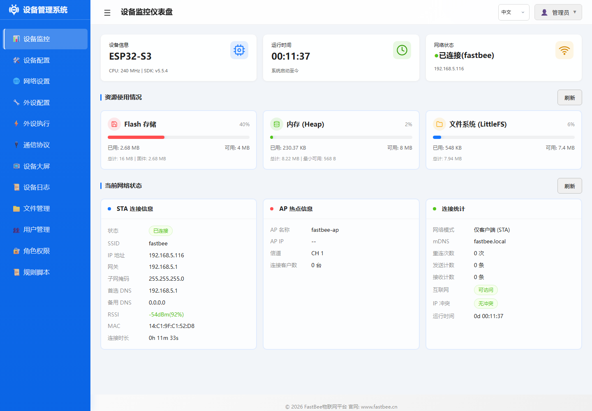
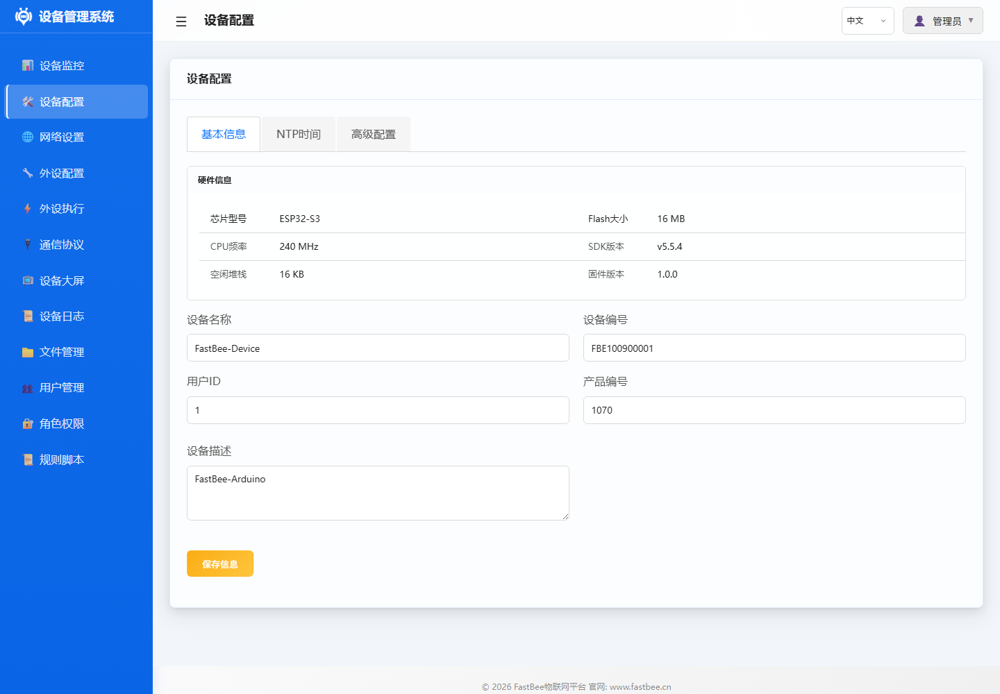

# FastBee 系统功能文档

> **API 接口参考**: FastBee 提供 RESTful API,分为设备管理(`/api/device`)、外设管理(`/api/peripherals`)、规则执行(`/api/periph-exec`)、协议配置(`/api/protocol`)、系统管理(`/api/system`)等类别。所有 API 调用需通过 Session/Cookie 认证,返回 JSON 格式数据。详见各模块文档和源码 `network/handlers/` 目录。

本目录包含FastBee设备Web管理界面各功能模块的使用说明文档。

## 界面截图索引

以下截图来自通过 `http://192.168.5.116/` 访问的 ESP32-S3 实机 Web 控制台，可作为现场配置时的页面对照。

| 页面 | 截图 | 使用重点 |
|------|------|------|
| 仪表台 |  | 先确认设备在线、IP、WiFi、内存和运行时间。 |
| 网络配置 |  | 修改 STA/AP、mDNS、静态 IP 和高级联网参数。 |
| 外设配置 |  | 管理 GPIO、传感器、显示、Modbus 子设备等硬件对象。 |
| 外设执行 |  | 查看规则状态、触发器、动作和手动执行入口。 |
| 通信协议 |  | 配置 MQTT 云平台连接和 Modbus RTU 现场总线。 |
| 设备配置 |  | 修改设备基础信息、时间同步和开发环境功能开关。 |
| 文件管理 |  | 浏览 LittleFS，导入导出配置和维护文件。 |
| 日志/权限 |  | 全功能版用于日志、用户和角色维护。 |

跨页面的截图验收路径见 [Web 控制台图文导览](../web-console-visual-guide.md)。

## 文档列表

| 功能模块 | 文档 | 说明 |
|---------|------|------|
| 设备仪表台 | [dashboard.md](dashboard.md) | 设备状态实时监控、内存/WiFi/运行时间 |
| 设备配置 | [device-config.md](device-config.md) | 设备名称、固件版本、系统设置 |
| 网络配置 | [network-config.md](network-config.md) | WiFi STA/AP模式、mDNS、静态IP、以太网/4G/LoRa 多联网方式 |
| 固件版本档位 | [firmware-version-profiles.md](firmware-version-profiles.md) | ESP32/ESP32-C3/ESP32-S3 精简版与 S3 完整版功能和资源限制 |
| 外设管理 | [peripheral-management.md](peripheral-management.md) | 添加/编辑/删除外设、类型说明 |
| 外设执行 | [periph-exec-management.md](periph-exec-management.md) | 自动化规则编排、触发器/动作配置 |
| 规则脚本 | [rule-script.md](rule-script.md) | 命令脚本语法、变量、执行引擎 |
| 文件管理 | [file-management.md](file-management.md) | LittleFS文件操作、配置导入导出 |
| 设备日志 | [device-log.md](device-log.md) | 日志级别、实时查看、清除 |
| 用户管理 | [user-management.md](user-management.md) | 添加/删除用户、修改密码 |
| 角色管理 | [role-management.md](role-management.md) | 权限角色配置、功能访问控制 |

## 功能架构

FastBee Web管理系统基于ESP32内置HTTP服务器，提供以下核心页面：

- **仪表台**（首页）：设备运行状态总览
- **设备配置**：系统级参数管理
- **网络配置**：WiFi 连接和网络模式管理，支持多联网方式（以太网/4G/LoRa）
- **外设配置**：硬件外设的添加和管理
- **外设执行**：自动化规则的编排和管理
- **通信协议**：MQTT/Modbus等协议配置
- **管理功能**（full版本）：日志、文件、用户、角色管理

## 版本差异

| 功能 | slim版（ESP32/C3/S3） | full版（S3-full） |
|------|---------------------|-----------------|
| 仪表台 | 支持 | 支持 |
| 设备/网络配置 | 支持 | 支持（多联网方式） |
| 外设/执行管理 | 支持 | 支持 |
| 协议配置 | 支持 | 支持 |
| 规则脚本 | 命令脚本 | 完整RuleScript |
| 文件管理 | 不支持 | 支持 |
| 日志查看 | 不支持 | 支持 |
| 多用户/角色 | 单用户模式 | 支持 |
| OTA升级 | 不支持 | 支持 |
