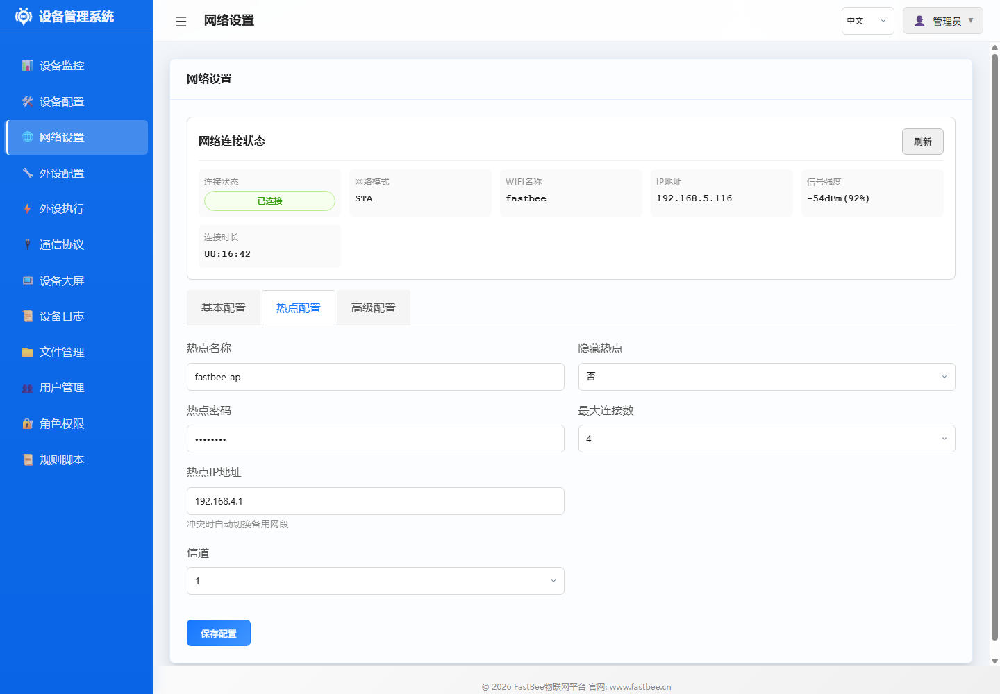
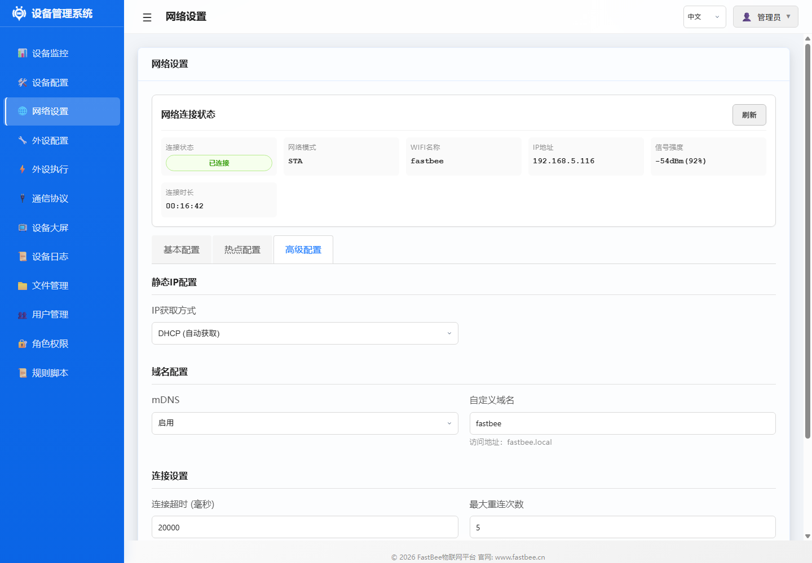
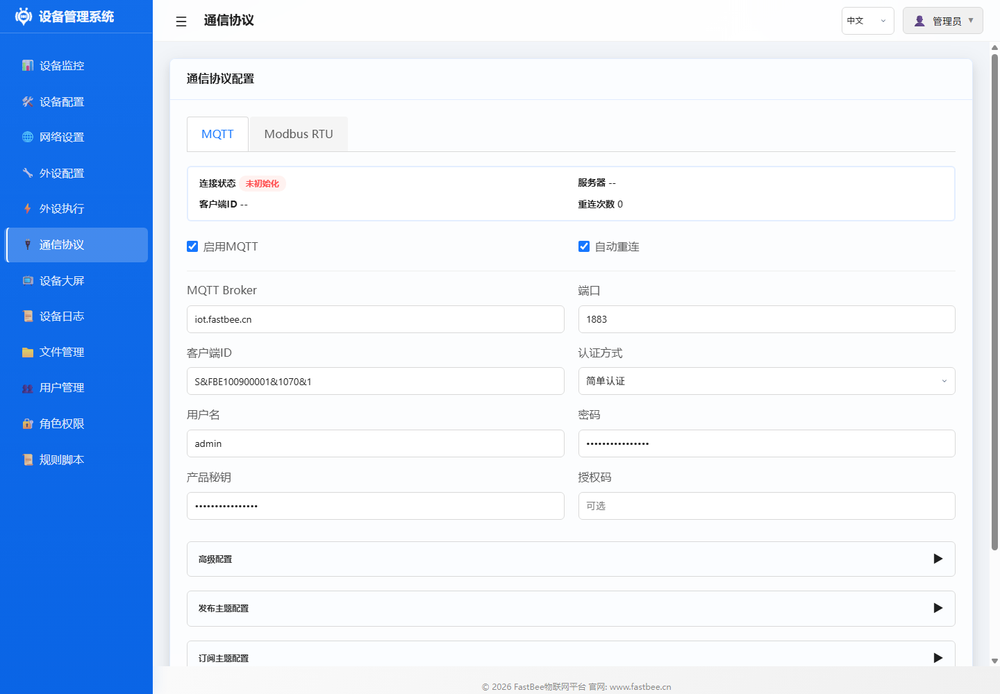
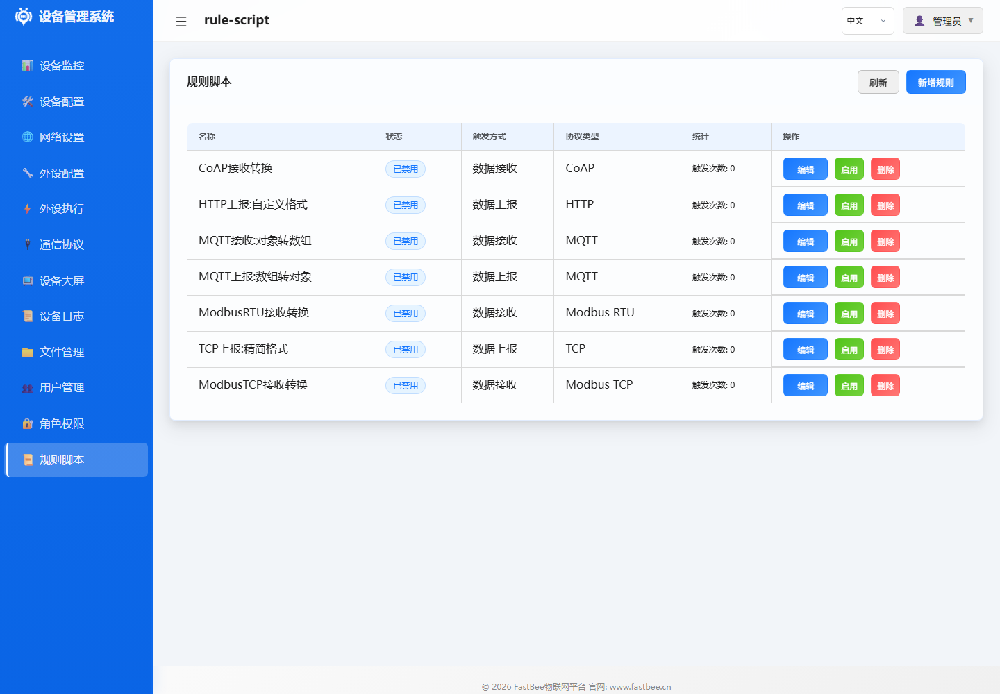

# 系统页面图片目录

本目录存放设备端 Web 控制台各系统页面截图，供 `docs/system/`、`docs/peripherals/`、`docs/periph-exec/`、`docs/examples/` 和场景文档复用。

## 仪表盘与设备维护

| 图片 | 尺寸 | 推荐用途 |
|---|---:|---|
|  `dashboard-overview.png` | `1440x1000` | 系统首页、版本档位、运行状态说明 |
|  `device-config.png` | `1440x1000` | 设备名称、编号、NTP、开发环境开关 |
|  `file-management.png` | `1440x1000` | LittleFS 浏览、配置导入导出、备份维护 |
|  `device-logs.png` | `1440x1000` | 启动、网络、MQTT、外设初始化和规则排障 |

## 网络与协议

| 图片 | 尺寸 | 推荐用途 |
|---|---:|---|
|  `network-settings.png` | `1440x1000` | STA/WiFi 状态、IP、SSID、信号强度 |
|  `network-ap-settings.png` | `1440x1000` | AP 热点、现场维护入口 |
|  `network-advanced-settings.png` | `1440x1000` | mDNS、静态 IP、高级联网参数 |
|  `protocol-config.png` | `1440x1000` | 通信协议页总览 |
|  `protocol-mqtt-config.png` | `1440x1000` | MQTT 服务器、主题、连接状态 |
|  `protocol-modbus-rtu.png` | `1440x1000` | 串口、从站、寄存器和轮询配置 |

## 外设与自动化

| 图片 | 尺寸 | 推荐用途 |
|---|---:|---|
|  `peripheral-management.png` | `1440x1000` | 外设对象、类型、启用状态、运行状态 |
|  `peripheral-add-dialog.png` | `1440x1000` | 新增外设、类型参数、引脚配置 |
|  `periph-exec-management.png` | `1440x1000` | 自动化规则、触发器、动作、手动执行 |
|  `rule-script.png` | `1440x1000` | RuleScript、脚本模板、脚本动作说明 |

## 用户与权限

| 图片 | 尺寸 | 推荐用途 |
|---|---:|---|
|  `user-management.png` | `1440x1000` | 用户创建、密码维护、账号启停 |
|  `role-management.png` | `1440x1000` | admin/operator/viewer 权限边界 |

## 维护建议

- 高复用图片替换后，应复查所有引用它的教程页，尤其是外设和示例文档。
- 若新增弹窗或表单截图，请优先放在本目录，并使用 `对象-动作-状态.png` 命名。
- 具体截图流程和校验方法见 [文档图片资产维护指南](../../image-assets.md)。
