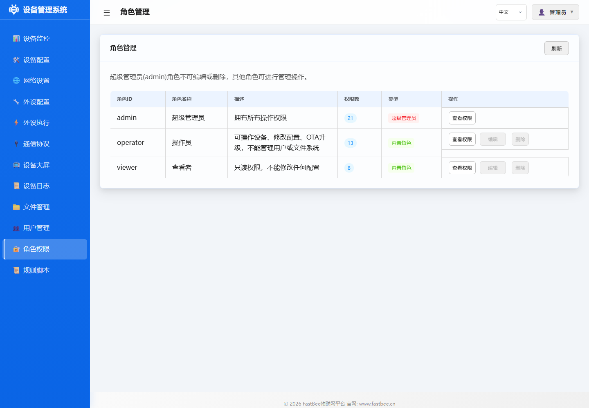

# 角色管理

> **概述**: 角色管理定义了 3 级权限体系(admin/operator/viewer),通过角色分配控制用户对系统功能的访问级别。admin 拥有所有权限,operator 可控制外设但不能修改配置,viewer 仅查看。配置存储在 `/config/roles.json` 中,仅 full 版支持多角色。

## 功能说明

角色管理定义了不同用户的权限范围，通过角色分配控制用户对系统功能的访问级别。

角色配置建议按“谁能修改配置、谁只能操作、谁只读查看”划分，避免普通值守账户误改网络或外设参数。

截图要点：角色页面主要用于核对角色名称、说明和权限范围。现场交付时建议至少保留 `admin`、`operator`、`viewer` 三类职责，并把“能修改网络/MQTT/文件/用户”的权限只留给管理员。

## 操作指南

1. 进入 **角色管理** 页面
2. 查看/编辑现有角色权限
3. 将角色分配给用户

## 参数说明

### 预定义角色

| 角色 | 说明 | 权限范围 |
|------|------|----------|
| admin | 管理员 | 所有功能的完整权限 |
| operator | 操作员 | 外设控制、规则管理，不能修改系统配置 |
| viewer | 观察者 | 仅查看仪表台和日志，不能执行任何操作 |

### 权限矩阵

| 功能 | admin | operator | viewer |
|------|:-----:|:--------:|:------:|
| 仪表台查看 | ✅ | ✅ | ✅ |
| 外设控制 | ✅ | ✅ | ❌ |
| 外设配置修改 | ✅ | ❌ | ❌ |
| 执行规则管理 | ✅ | ✅ | ❌ |
| 网络配置 | ✅ | ❌ | ❌ |
| MQTT 配置 | ✅ | ❌ | ❌ |
| 文件管理 | ✅ | ❌ | ❌ |
| 用户管理 | ✅ | ❌ | ❌ |
| 设备重启 | ✅ | ✅ | ❌ |
| 固件更新 | ✅ | ❌ | ❌ |

## 配置示例

典型部署场景：
- **开发调试**：使用 admin 账户进行全功能配置
- **现场运维**：使用 operator 账户进行日常操控
- **远程监控**：使用 viewer 账户查看设备状态

## 故障排除

| 问题 | 可能原因 | 解决方案 |
|------|---------|---------|
| 操作被拒绝 | 权限不足 | 使用更高权限账户或联系管理员 |
| 无法修改角色 | 非 admin 用户 | 使用 admin 账户操作 |
| admin 被锁 | 密码遗忘 | 串口恢复或重刷固件 |
