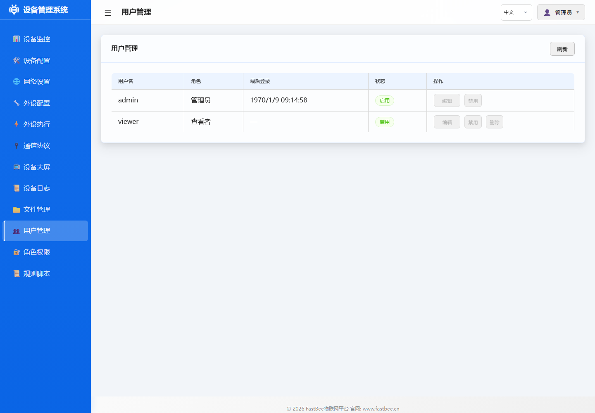

# 用户管理

> **概述**: 用户管理模块负责 Web 界面的认证授权,支持 Session/Cookie 认证、多用户管理和 3 级角色权限(admin/operator/viewer)。slim 版使用单管理员模式,full 版支持多用户。所有配置存储在 `/config/users.json` 和 `/config/roles.json` 中。

## 功能说明

用户管理功能用于管理 Web 界面的登录账户，支持添加用户、修改密码和删除用户。设备支持多用户登录，每个用户可分配不同权限角色。

全功能版可为现场维护、操作和值守人员分别创建账户；精简部署通常保留单管理员账户，并重点修改默认密码。

## 操作指南

### 修改密码
1. 进入 **用户管理** 页面
2. 选择目标用户
3. 输入新密码并确认
4. 保存更改

### 添加用户
1. 点击 **添加用户**
2. 输入用户名和密码
3. 分配角色
4. 保存

## 参数说明

| 字段 | 说明 | 限制 |
|------|------|------|
| 用户名 | 登录账号 | 3-16字符，字母数字 |
| 密码 | 登录密码 | 6-32字符 |
| 角色 | 权限角色 | admin/operator/viewer |

### 默认账户

| 用户名 | 密码 | 角色 |
|--------|------|------|
| admin | admin | 管理员 |

> 首次部署后强烈建议修改默认密码。

## 配置示例

典型多用户配置：
- **admin**：管理员，拥有所有权限
- **operator**：操作员，可控制外设但不能修改配置
- **viewer**：观察者，只读权限

## 故障排除

| 问题 | 可能原因 | 解决方案 |
|------|---------|---------|
| 忘记密码 | 无法登录 | 重刷固件或通过串口重置 |
| 无法添加用户 | 达到用户数上限 | 删除不需要的用户 |
| 登录失败 | 密码错误/Cookie过期 | 清除浏览器缓存重试 |
